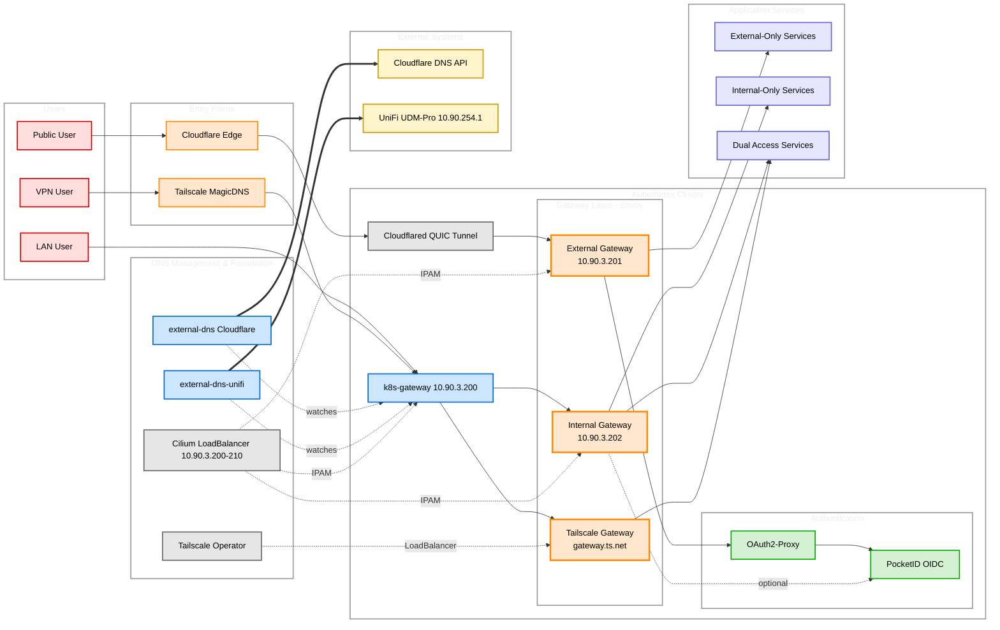

# Network Architecture Diagram - Mermaid Source

This is the Mermaid source code for the network architecture diagram. For the best viewing experience, copy this code and paste it into [Eraser.io](https://app.eraser.io/).

