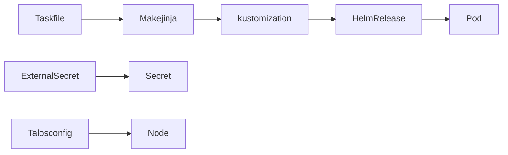
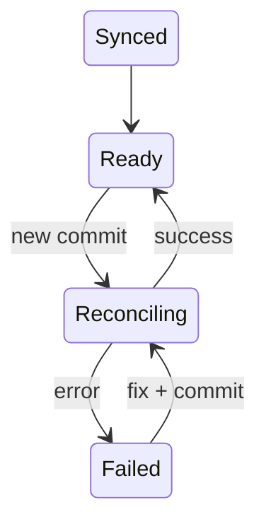
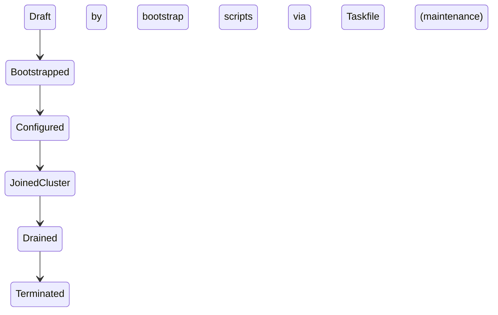

# Homelab Domain Model

## Core Business Rules
### Rule 1: Taskfile + Flux are final authorities
**Rule**: Changes must flow through `task configure` → `git push main` → Flux.
**Why**: Keeps cluster state reproducible from Git.
**Enforced By**: Taskfile tasks, GitHub workflows, and Flux reconciliations.
**Violations**: Manual `kubectl apply` gets reverted on the next Flux sync.

### Rule 2: Secrets stay as placeholders
**Rule**: Use only placeholder keys `${SECRET_DOMAIN}`, `${DB_URI}`, `${MEDIA_SERVER}`, etc., in HelmRelease values and let ExternalSecrets populate them.
**Why**: Repo is public; secrets must reside in private vaults.
**Enforced By**: HelmRelease `envFrom` sections referencing `romm-secret` and other secret names instead of actual creds.
**Exceptions**: Samples or local dev fixtures that never merge.

### Rule 3: Define storage explicitly
**Rule**: Workloads specify PVCs or NFS claims before Flux applies them (see ROMM values in `kubernetes/apps/games/romm/app/helmrelease.yaml`).
**Why**: Prevents pods from pending due to missing volumes.
**Enforced By**: `persistence` sections in HelmReleases.
**Violations**: Workloads remain blocked in `Pending` state until a matching claim exists.

## Entity Relationships

## Aggregates
### Cluster Configuration
**Root**: Taskfile + Flux.
**Includes**: `bootstrap/`, `talosconfig/`, `kubernetes/apps/*`, and `.taskfiles/*`.
**Invariants**:
- Every HelmRelease pins chart/image versions.
- Placeholders documented in `TEMPLATE_GUIDE.md`.
**Transaction Boundary**: Commit + Flux reconciliation.

### Media Workloads
**Root**: ROMM HelmRelease under `kubernetes/apps/games/romm`.
**Includes**: app container, init container, config mounts, NFS/emptyDir/tmpr (existing claim `romm-data`).
**Invariants**:
- Env vars refer to placeholder values (`${SECRET_DOMAIN}`, `TZ`, etc.).
- Storage uses `existingClaim`, `tmpfs`, and NFS sections.
**Transaction Boundary**: HelmRelease upgrade.

## State Machines
### Flux HelmRelease Lifecycle

**Rules**: Only `Ready` indicates the service is available; `Failed` requires investigating `flux logs`.

### Node Provisioning Lifecycle

**Constraints**: All node configs live in `talosconfig/` and are generated via templates referenced by `Taskfile`.

## Value Objects
### ClusterReference
**Properties**: `area` (games, plane), `kustomization`, `namespace`, `releaseName`.
**Immutable**: Updates require editing the corresponding `kustomization.yaml` and HelmRelease.

### MediaMountSpec
**Properties**: `type` (`pvc`, `tmpfs`, `nfs`), `paths`, `placeholders` (`${MEDIA_SERVER}`, `${MEDIA_ROOT}`).
**Validation**: Paths must match what Flux expects (see `advancedMounts` in ROMM values).

## Domain Events
- **FluxReleaseReady**: Triggered when HelmRelease is `Ready` (Flux event). Contains release name and status.
- **ExternalSecretSync**: Triggered when secrets are pulled from the vault; necessary before pods referencing them can start.

## Temporal Rules
- Flux reconciles every 5 minutes plus on Git pushes.
- ExternalSecrets polls vault every 10 minutes; redeploy after secret rotation to pick up new values.

## Business Glossary
- **Flux**: GitOps operator applying `kustomization` overlays.
- **Taskfile**: Task runner orchestrating template rendering, validation, and bootstrapping.
- **HelmRelease**: Flux-managed Helm deployment (see `kubernetes/apps/games/romm/app/helmrelease.yaml`).
- **Talos**: Immutable OS configuration under `talosconfig/`.
- **${SECRET_DOMAIN}**: Placeholder domain suffix used by all external ingresses.

## Evidence
| Claim | Source | Confidence | Details |
|-------|:------:|:----------:|---------|
| Taskfile + Flux orchestrate cluster | `Taskfile.yaml`, `kubernetes/apps/games/romm/app/helmrelease.yaml` | 🟢 | Taskfile renders and validates manifests; HelmRelease defines flux behavior. |
| Secrets use placeholders | `kubernetes/apps/games/romm/app/helmrelease.yaml:65-140` | 🟢 | `${SECRET_DOMAIN}`, `envFrom` referencing `romm-secret`. |
| Storage definitions explicit | `kubernetes/apps/games/romm/app/helmrelease.yaml:102-140` | 🟢 | `persistence` sections define `existingClaim`, `tmpfs`, `media`, and mounts. |
