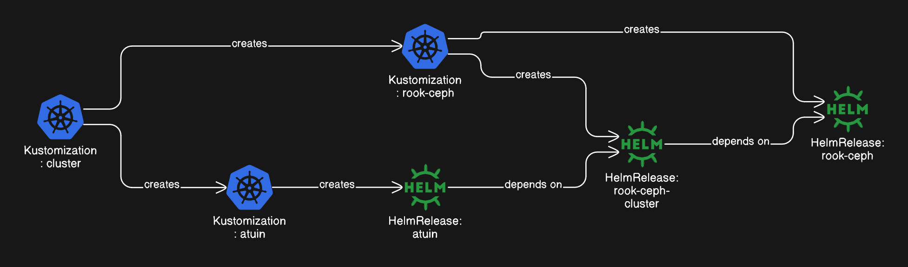
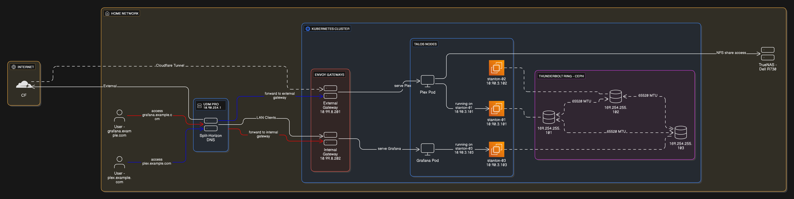

<div align="center">


### My Home Operations Repository :octocat:

_... managed with Flux, Renovate, and GitHub Actions_ 🤖

</div>

<div align="center">

[](https://discord.gg/home-operations)&nbsp;&nbsp;
[](https://talos.dev)&nbsp;&nbsp;
[](https://kubernetes.io)&nbsp;&nbsp;
[](https://fluxcd.io)&nbsp;&nbsp;
[](https://github.com/gavinmcfall/home-ops/actions/workflows/renovate.yaml)

</div>

<div align="center">

[](https://status.nerdz.cloud)&nbsp;&nbsp;
[](https://status.nerdz.cloud)&nbsp;&nbsp;
[](https://status.nerdz.cloud)

</div>

<div align="center">

[](https://github.com/kashalls/kromgo)&nbsp;&nbsp;
[](https://github.com/kashalls/kromgo)&nbsp;&nbsp;
[](https://github.com/kashalls/kromgo)&nbsp;&nbsp;
[](https://github.com/kashalls/kromgo)&nbsp;&nbsp;
[](https://github.com/kashalls/kromgo)&nbsp;&nbsp;
[](https://github.com/kashalls/kromgo)&nbsp;&nbsp;
[](https://github.com/kashalls/kromgo)&nbsp;&nbsp;
[](https://github.com/kashalls/kromgo)

</div>

---

## 📖 Overview

This is a mono repository for my home infrastructure and Kubernetes cluster. I try to adhere to Infrastructure as Code (IaC) and GitOps practices using tools like [Kubernetes](https://kubernetes.io/), [Flux](https://github.com/fluxcd/flux2), [Renovate](https://github.com/renovatebot/renovate), and [GitHub Actions](https://github.com/features/actions).

---

## ⛵ Kubernetes

My Kubernetes cluster is deployed with [Talos](https://www.talos.dev). This is a semi-hyper-converged cluster, workloads and block storage share the same available resources on my nodes while I have a separate server with ZFS for NFS/SMB shares, bulk file storage and backups.

If you want to try and follow along with how I built my cluster please check out the amazing template here:

[](https://github.com/onedr0p/cluster-template)
[](https://github.com/onedr0p/cluster-template)

### Core Components

- **Networking**: [cilium](https://github.com/cilium/cilium) provides eBPF-based networking replacing kube-proxy, [Envoy Gateway](https://gateway.envoyproxy.io/) implements Gateway API for routing, [cloudflared](https://github.com/cloudflare/cloudflared) secures ingress via Cloudflare tunnels, and [external-dns](https://github.com/kubernetes-sigs/external-dns) + [external-dns-unifi-webhook](https://github.com/kashalls/external-dns-unifi-webhook) keeps DNS records in sync automatically.
- **Security & Secrets**: [cert-manager](https://github.com/cert-manager/cert-manager) automates SSL/TLS certificates. [external-secrets](https://github.com/external-secrets/external-secrets) with [1Password Connect](https://github.com/1Password/connect) injects secrets into Kubernetes, and [sops](https://github.com/getsops/sops) manages encrypted secrets in Git.
- **Storage & Data Protection**: [rook](https://github.com/rook/rook) provides distributed block storage via Ceph, [volsync](https://github.com/backube/volsync) handles PVC backups and recovery, and [spegel](https://github.com/spegel-org/spegel) runs a stateless cluster-local OCI image mirror.
- **Automation**: [actions-runner-controller](https://github.com/actions/actions-runner-controller) runs self-hosted GitHub Actions runners in the cluster.

### Installation

My cluster runs on 3x [Minisforum MS-01](https://store.minisforum.com/products/minisforum-ms-01) mini PCs (Intel i9-12900H) provisioned with [Talos](https://www.talos.dev/). The nodes utilize [Thunderbolt ring networking](https://gist.github.com/gavinmcfall/ea6cb1233d3a300e9f44caf65a32d519) for high-speed Ceph storage traffic.

**Talos Extensions:**
- `siderolabs/i915` - Intel GPU microcode binaries and drivers
- `siderolabs/intel-ucode - Intel microcode binaries
- `siderolabs/mei` - Intel Management Engine drivers kernel modules
- `siderolabs/thunderbolt` - Thunderbolt/USB4 drivers kernel modules
- `siderolabs/util-linux-tools` - Linux Utilities

**Talos extraKernelArgs** - Less Security (home-lab its fine) = Greater performance gains
- `intel_iommu=on` - Enables Intel VT-d hardware virtualization support
- `iommu=pt` - Passthrough mode, better performance for devices
- `mitigations=off` - Disables CPU vulnerability patche
- `selinux=0` - Disables SELinux mandatory access control system
- `apparmor=0` - Disables AppArmor mandatory access control system
- `init_on_alloc=0` - Skips zeroing memory when allocating it
- `init_on_free=0` - Skips zeroing memory when freeing it
- `security=none` - Disables all Linux Security Modules entirely
- `talos.auditd.disabled=1` - Disables Talos audit logging daemon service

### GitOps

[Flux](https://github.com/fluxcd/flux2) watches the cluster in my [kubernetes](./kubernetes/) folder and makes changes based on the state of this Git repository.

The way Flux works for me here is it will recursively search the `kubernetes/apps` folder until it finds the most top level `kustomization.yaml` per directory and then apply all the resources listed in it. That `kustomization.yaml` will generally only have a namespace resource and one or many Flux kustomizations (`ks.yaml`). Under the control of those Flux kustomizations there will be a `HelmRelease` or other resources related to the application which will be applied.

[Renovate](https://github.com/renovatebot/renovate) watches my **entire** repository looking for dependency updates, when they are found a PR is automatically created. When some PRs are merged Flux applies the changes to my cluster.

### Flux Workflow

This is a high-level look at how Flux deploys applications with dependencies. A `HelmRelease` can depend on other `HelmRelease`s, a `Kustomization` can depend on other `Kustomization`s, or an app can depend on both. Below shows that `atuin` won't deploy until `rook-ceph-cluster` is healthy.




### Directories

This Git repository contains the following directories:

```sh
📁 kubernetes
├── 📁 apps           # applications
├── 📁 bootstrap      # bootstrap procedures
├── 📁 flux           # core flux configuration
└── 📁 components     # re-useable kustomize components
📁 bootstrap
└── 📁 templates      # Makejinja templates (source files)
```

---

## 💾 Backup Architecture

<details>
  <summary>Click to expand backup strategy</summary>


### Backup Flows

| Flow | Tool | Destinations | Schedule |
|------|------|--------------|----------|
| Application PVCs | VolSync + Kopia | NFS (hourly), B2/R2 (daily) | Hourly/Daily |
| NFS to Cloud | Kopia Server | B2 (2 AM), R2 (3 AM) | Daily |
| PostgreSQL | pgBackRest | B2 (3 AM), R2 (4 AM) | Daily |
| Images | TrueNAS Cloud Sync | B2 | TrueNAS scheduled |

For details, see the [Backup Strategy Guide](./docs/Guides/Storage/Backup-Strategy/README.md).

</details>

---

## 🌐 Networking

<details>
  <summary>Click to expand network architecture</summary>

### Network Topology



### Key Concepts

- **Split-Horizon DNS**: LAN clients resolve to the internal gateway (10.90.3.202), external clients go through Cloudflare
- **Gateway API**: Envoy Gateway provides `external` and `internal` gateways for traffic routing
- **Thunderbolt Ring**: Full-mesh ~26 Gbps connectivity between nodes for Ceph replication traffic

For details on setting up Thunderbolt networking, see my [guide](https://gist.github.com/gavinmcfall/ea6cb1233d3a300e9f44caf65a32d519).

</details>

---

## ☁️ Cloud Dependencies

| Service | Use | Cost (NZD) |
|---------|-----|------|
| [Cloudflare](https://www.cloudflare.com/) | DNS, Tunnel, CDN, R2(Volsync), Domain renewel | ~$25/yr |
| [Backblaze](https://www.backblaze.com/) | B2(Volsync) | ~$30/yr |
| [1Password](https://1password.com/) | Secrets via Connect (Family plan with 5 seats) | ~$135/yr |
| [UptimeRobot](https://uptimerobot.com/) | Status monitoring | ~$80/yr |
| [GitHub](https://github.com/) | Code hosting, Actions | Free |
| [Pushover](https://pushover.net) | Push notifications from Alert Manger and UptimeRobot | $4.99 USD One Time |
| [Migadu](https://migadu.com/) | SMTP for services | ~$40/yr (Micro plan) |

---

## 🔧 Hardware

### Kubernetes Cluster

| Node | CPU | RAM | OS Disk | Ceph Disk | OS | Purpose |
|------|-----|-----|---------|-----------|-----|---------|
| stanton-01 | i9-12900H (14c/20t) | 96GB | 1TB Samsung 990 Pro | 1.92TB Samsung PM9A3 U.2 | Talos | Control + Worker |
| stanton-02 | i9-12900H (14c/20t) | 96GB | 1TB Samsung 990 Pro | 1.92TB Samsung PM9A3 U.2 | Talos | Control + Worker |
| stanton-03 | i9-12900H (14c/20t) | 96GB | 1TB Samsung 990 Pro | 1.92TB Samsung PM9A3 U.2 | Talos | Control + Worker |

**Totals:** 42 cores / 60 threads | 288GB RAM | ~5.76TB Ceph

> *Nodes named after the [Stanton system](https://www.robertsspaceindustries.com/enlist?referral=STAR-6WG5-BTYL) in Star Citizen. See you in the 'verse, citizen! o7*
>
> *— [NZVengeance](https://robertsspaceindustries.com/en/citizens/NZVengeance)*

### Supporting Infrastructure

| Device | Count | Storage | RAM | OS | Purpose |
|--------|-------|---------|-----|-----|---------|
| Dell PowerEdge R730 | 1 | 4x Mirror vdevs (~18TB) + NVMe cache | 128GB | Proxmox/TrueNAS | NAS/Backup |
| Unifi Dream Machine Pro | 1 | - | - | - | Router/Firewall |
| Unifi US-24-250W | 1 | - | - | - | PoE Switch |
| Unifi US-48 | 1 | - | - | - | Primary Switch |
| Unifi U6 Lite | 3 | - | - | - | WiFi APs |
| JetKVM + DC Power Module | 3 | - | - | - | Remote KVM |
| Eaton 5S 850 | 2 | - | - | - | UPS |

---

## ⭐ Stargazers

<a href="https://star-history.com/#gavinmcfall/home-ops&Date">
  <picture>
    <source media="(prefers-color-scheme: dark)" srcset="https://api.star-history.com/svg?repos=gavinmcfall/home-ops&type=Date&theme=dark" />
    <source media="(prefers-color-scheme: light)" srcset="https://api.star-history.com/svg?repos=gavinmcfall/home-ops&type=Date" />
    
  </picture>
</a>

---

## 🤝 Gratitude and Thanks

Thanks to all the people who donate their time in the [Home Operations](https://discord.gg/home-operations) Discord community for all of their support. Special shout out to my friend and colleague [Kevin Durbin](https://github.com/kevindurb).

Check out my [blog](https://blog.nerdz.cloud/) for more homelab content.

Also check out my [Guides](./docs/Guides/)

---

## ☕ Support

If you find this project helpful, consider supporting my work:

[](https://ko-fi.com/gavinmcfall)

---

## 📜 Changelog

See my _awful_ [commit history](https://github.com/gavinmcfall/home-ops/commits/main)

---

## 🔏 License

See [LICENSE](./LICENSE)
