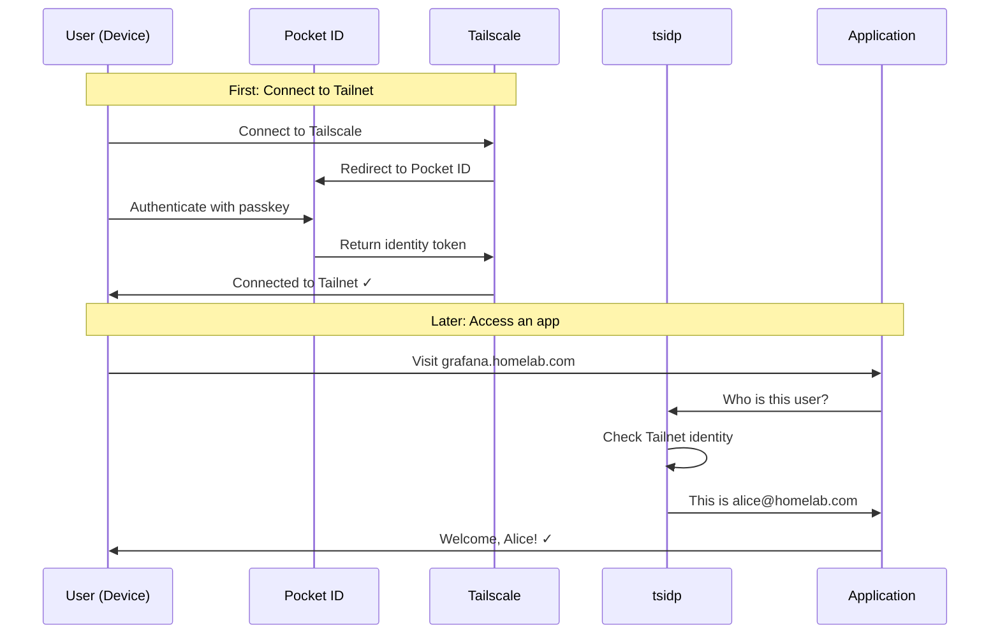

# Pocket ID + Tailscale tsidp: Passwordless SSO for Your Homelab

A step-by-step guide to setting up passwordless single sign-on (SSO) across your entire homelab using passkeys.

---

## What You'll Learn

By the end of this guide, you will:

- ✅ Understand how Pocket ID, Tailscale, and tsidp work together
- ✅ Deploy Pocket ID as your identity provider (GitOps)
- ✅ Configure Tailscale to use Pocket ID for login
- ✅ Deploy tsidp to enable SSO for internal apps
- ✅ Connect applications to use tsidp for authentication

---

## Understanding the Problem

### The Pain of Multiple Logins

In a typical homelab, you might have:
- Grafana for monitoring
- Paperless for documents
- Jellyfin for media
- And many more apps...

Each app has its own login. That means:
- Multiple usernames and passwords to remember
- No central user management
- No easy way to revoke access when needed

### The Solution: Single Sign-On (SSO)

**Single Sign-On** means you log in once, and all your apps recognize you automatically.

This guide sets up a **passwordless** SSO system using:

| Component | What It Does |
|-----------|--------------|
| **Pocket ID** | Stores your identity and handles passkey authentication (FaceID, TouchID, YubiKey) |
| **Tailscale** | Your private network - configured to use Pocket ID for login |
| **tsidp** | A bridge that lets apps inside your Tailnet verify who you are |

---

## How It Works (Simplified)

```
┌─────────────────────────────────────────────────────────────────────┐
│                        ONE-TIME SETUP                               │
│  1. You register a passkey in Pocket ID (your fingerprint/face)     │
│  2. You connect to Tailscale using Pocket ID                        │
└─────────────────────────────────────────────────────────────────────┘
                                  │
                                  ▼
┌─────────────────────────────────────────────────────────────────────┐
│                      EVERY TIME YOU ACCESS AN APP                   │
│  1. You visit grafana.homelab.com                                   │
│  2. Grafana asks tsidp "who is this?"                               │
│  3. tsidp says "this is alice@homelab.com" (you're on the Tailnet)  │
│  4. Grafana lets you in - no password needed!                       │
└─────────────────────────────────────────────────────────────────────┘
```

> [!TIP]
> Think of it like a hotel key card. You check in once (Pocket ID + Tailscale), and then your card (Tailnet identity) opens all the doors (apps) automatically.

---

## Prerequisites

Before starting, make sure you have:

- [ ] A working Kubernetes cluster with Flux GitOps
- [ ] A Tailscale account (free tier works)
- [ ] A domain you control (for Pocket ID)
- [ ] A passkey device (phone with FaceID/TouchID, YubiKey, or similar)
- [ ] PostgreSQL database available in your cluster

> [!NOTE]
> This guide assumes you're using the `bjw-s/app-template` Helm chart pattern common in GitOps homelabs.

---

## Part 1: Deploying Pocket ID

Pocket ID is where your users and passkeys live. It's a self-hosted OIDC identity provider.

### Step 1.1: Plan Your Values

Fill in this table before proceeding:

| Setting | Your Value | Example |
|---------|------------|---------|
| App URL | `https://id.________` | `https://id.homelab.com` |
| Namespace | `________` | `security` |
| Database host | `________` | `postgres17-rw.database.svc.cluster.local` |
| Database name | `________` | `pocket_id` |

### Step 1.2: Create the Secret

Pocket ID needs database credentials. Create an ExternalSecret (or regular Secret) with:

**File: `kubernetes/apps/security/pocket-id/app/externalsecret.yaml`**

```yaml
apiVersion: external-secrets.io/v1
kind: ExternalSecret
metadata:
  name: pocket-id
  namespace: security
spec:
  secretStoreRef:
    kind: ClusterSecretStore
    name: onepassword-connect  # Your secret store
  target:
    name: pocket-id-secret
    template:
      engineVersion: v2
      data:
        # Database init container needs these
        INIT_POSTGRES_DBNAME: pocket_id
        INIT_POSTGRES_HOST: postgres17-rw.database.svc.cluster.local
        INIT_POSTGRES_USER: "{{ .POCKET_ID_POSTGRES_USER }}"
        INIT_POSTGRES_PASS: "{{ .POCKET_ID_POSTGRES_PASSWORD }}"
        INIT_POSTGRES_SUPER_PASS: "{{ .POSTGRES_SUPER_PASS }}"
        # Pocket ID needs this connection string
        DB_CONNECTION_STRING: "postgres://{{ .POCKET_ID_POSTGRES_USER }}:{{ .POCKET_ID_POSTGRES_PASSWORD }}@postgres17-rw.database.svc.cluster.local:5432/pocket_id?sslmode=disable"
  dataFrom:
    - extract:
        key: pocket-id  # Your 1Password item
    - extract:
        key: cloudnative-pg
```

> [!IMPORTANT]
> Store your actual credentials in your secret manager (1Password, Vault, etc.), not in Git!

### Step 1.3: Create the HelmRelease

**File: `kubernetes/apps/security/pocket-id/app/helmrelease.yaml`**

```yaml
apiVersion: helm.toolkit.fluxcd.io/v2
kind: HelmRelease
metadata:
  name: pocket-id
  namespace: security
spec:
  interval: 30m
  chart:
    spec:
      chart: app-template
      version: 4.4.0
      sourceRef:
        kind: HelmRepository
        name: bjw-s
        namespace: flux-system
  values:
    controllers:
      pocket-id:
        annotations:
          reloader.stakater.com/auto: "true"

        # Init container creates the database if needed
        initContainers:
          init-db:
            image:
              repository: ghcr.io/home-operations/postgres-init
              tag: 17.6.0@sha256:86a1992d46273c58fd4ad95b626081dfaabfe16bd56944675169e406d1a660dd
            envFrom:
              - secretRef:
                  name: pocket-id-secret

        containers:
          app:
            image:
              repository: ghcr.io/pocket-id/pocket-id
              tag: v1.16.0@sha256:f8cde808e8e840acda25683fc2168e0206e3f3fb1a48cca89d211aafd87eaeef
            env:
              DB_PROVIDER: postgres
              PUID: 568
              PGID: 568
              APP_URL: https://id.${SECRET_DOMAIN}  # Flux substitutes this
              TRUST_PROXY: true
              TZ: ${TIMEZONE}
            envFrom:
              - secretRef:
                  name: pocket-id-secret
            probes:
              liveness: &probes
                enabled: true
                custom: true
                spec:
                  httpGet:
                    path: /healthz
                    port: 1411
                  initialDelaySeconds: 0
                  periodSeconds: 10
                  timeoutSeconds: 1
                  failureThreshold: 3
              readiness: *probes
            securityContext:
              allowPrivilegeEscalation: false
              readOnlyRootFilesystem: true
              capabilities: {drop: ["ALL"]}
            resources:
              requests:
                cpu: 10m
                memory: 128Mi
              limits:
                memory: 512Mi

    defaultPodOptions:
      securityContext:
        runAsNonRoot: true
        runAsUser: 568
        runAsGroup: 568
        fsGroup: 568
        fsGroupChangePolicy: OnRootMismatch
        seccompProfile: {type: RuntimeDefault}

    service:
      app:
        controller: pocket-id
        ports:
          http:
            port: 1411

    # Dual-homed: accessible from both LAN and internet
    route:
      external:
        annotations:
          external-dns.alpha.kubernetes.io/target: external.${SECRET_DOMAIN}
        hostnames:
          - id.${SECRET_DOMAIN}
        parentRefs:
          - name: external
            namespace: network
            sectionName: https
      internal:
        annotations:
          internal-dns.alpha.kubernetes.io/target: internal.${SECRET_DOMAIN}
        hostnames:
          - id.${SECRET_DOMAIN}
        parentRefs:
          - name: internal
            namespace: network
            sectionName: https

    persistence:
      data:
        existingClaim: pocket-id  # Create a PVC for this
        globalMounts:
          - path: /app/data
```

### Step 1.4: Create the Kustomization

**File: `kubernetes/apps/security/pocket-id/app/kustomization.yaml`**

```yaml
apiVersion: kustomize.config.k8s.io/v1beta1
kind: Kustomization
resources:
  - externalsecret.yaml
  - helmrelease.yaml
  # Add PVC if needed
```

### Step 1.5: Deploy via GitOps

```bash
# Add your files
git add kubernetes/apps/security/pocket-id/

# Commit
git commit -m "feat(security): deploy pocket-id identity provider"

# Push - Flux will apply the changes
git push
```

### Step 1.6: Initial Pocket ID Setup

Once deployed:

1. Visit `https://id.yourdomain.com`
2. Create your admin account
3. Register your first passkey (you'll be prompted)

> [!TIP]
> Use a hardware key (YubiKey) as your primary passkey, and your phone as backup.

**Checkpoint:** You should be able to log into Pocket ID using your passkey.

---

## Part 2: Configuring Tailscale to Use Pocket ID

Now we'll tell Tailscale to use Pocket ID for authentication instead of Google/Microsoft.

### Step 2.1: Create OIDC Client in Pocket ID

1. Log into Pocket ID as admin
2. Go to **OIDC Clients** → **Create Client**
3. Fill in:
   - **Name:** `Tailscale`
   - **Redirect URI:** `https://login.tailscale.com/a/oauth_response` (for Tailscale Cloud)
   - **Scopes:** `openid`, `profile`, `email`
4. Save and note down the **Client ID** and **Client Secret**

### Step 2.2: Set Up WebFinger (Required for Custom OIDC)

Tailscale uses WebFinger to discover your OIDC provider. You need to host a `.well-known/webfinger` endpoint on your domain.

Create a response that looks like this:

```json
{
  "subject": "acct:alice@yourdomain.com",
  "links": [
    {
      "rel": "http://openid.net/specs/connect/1.0/issuer",
      "href": "https://id.yourdomain.com"
    }
  ]
}
```

> [!NOTE]
> You can host this as a static file, or configure Pocket ID to serve it (check Pocket ID docs for your version).

### Step 2.3: Configure Tailscale Admin Console

1. Go to [Tailscale Admin Console](https://login.tailscale.com/admin/settings/authentication)
2. Under **Authentication**, click **Add auth provider**
3. Choose **Custom OIDC**
4. Enter:
   - **Issuer URL:** `https://id.yourdomain.com`
   - **Client ID:** (from Step 2.1)
   - **Client Secret:** (from Step 2.1)
5. Verify your domain ownership (Tailscale will guide you)

### Step 2.4: Test the Login Flow

1. Log out of Tailscale on a device
2. Log back in - you should be redirected to Pocket ID
3. Authenticate with your passkey
4. You should now be connected to your Tailnet

**Checkpoint:** You can log into Tailscale using your Pocket ID passkey.

---

## Part 3: Deploying tsidp

tsidp is the "bridge" that lets apps inside your Tailnet verify user identity without additional login prompts.

### Step 3.1: Get a Tailscale Auth Key

1. Go to [Tailscale Admin Console](https://login.tailscale.com/admin/settings/keys)
2. Generate an **Auth Key**
   - Check **Reusable** (optional, for restarts)
   - Check **Ephemeral** if you want the node to disappear on disconnect
3. Save this key in your secret manager

### Step 3.2: Configure Tailnet ACL for tsidp

In Tailscale Admin Console → Access Controls, add:

```json
{
  "grants": [
    {
      "src": ["autogroup:admin"],
      "dst": ["tag:idp"],
      "app": {
        "tailscale.com/cap/tsidp": [{
          "allow_admin_ui": true,
          "allow_dcr": true
        }]
      }
    }
  ],
  "tagOwners": {
    "tag:idp": ["autogroup:admin"]
  }
}
```

> [!IMPORTANT]
> Without this ACL grant, tsidp will refuse to issue tokens.

### Step 3.3: Create tsidp Deployment

**File: `kubernetes/apps/security/tsidp/app/helmrelease.yaml`**

```yaml
apiVersion: helm.toolkit.fluxcd.io/v2
kind: HelmRelease
metadata:
  name: tsidp
  namespace: security
spec:
  interval: 30m
  chart:
    spec:
      chart: app-template
      version: 4.4.0
      sourceRef:
        kind: HelmRepository
        name: bjw-s
        namespace: flux-system
  values:
    controllers:
      tsidp:
        containers:
          app:
            image:
              repository: tailscale/tsidp
              tag: latest  # Pin to a specific version in production
            env:
              TS_HOSTNAME: idp
              TAILSCALE_USE_WIP_CODE: "1"
              # TSIDP_PORT: "443"  # Default
            envFrom:
              - secretRef:
                  name: tsidp-secret  # Contains TS_AUTHKEY

    persistence:
      state:
        type: persistentVolumeClaim
        accessMode: ReadWriteOnce
        size: 1Gi
        globalMounts:
          - path: /var/lib/tsidp
```

Create a secret with your Tailscale auth key:

**In your secret manager, create `tsidp-secret` with:**
- `TS_AUTHKEY`: Your Tailscale auth key from Step 3.1

### Step 3.4: Deploy via GitOps

```bash
git add kubernetes/apps/security/tsidp/
git commit -m "feat(security): deploy tsidp for tailnet SSO"
git push
```

### Step 3.5: Access tsidp Admin UI

From a device on your Tailnet, visit:

```
https://idp.<your-tailnet>.ts.net
```

You should see the tsidp admin dashboard.

**Checkpoint:** tsidp is accessible and shows the admin UI.

---

## Part 4: Connecting Apps to tsidp

Now let's configure an application to use tsidp for authentication.

### Step 4.1: Register App in tsidp

1. Go to `https://idp.<your-tailnet>.ts.net`
2. Click **Register Client** (or use Dynamic Client Registration)
3. Enter:
   - **Client Name:** `Grafana` (or your app)
   - **Redirect URI:** `https://grafana.homelab.com/login/generic_oauth` (your app's callback)
4. Save the **Client ID** and **Client Secret**

### Step 4.2: Configure the Application

Here's an example for Grafana:

```yaml
# In your Grafana HelmRelease values:
grafana.ini:
  auth.generic_oauth:
    enabled: true
    name: Tailscale
    allow_sign_up: true
    client_id: <client-id-from-tsidp>
    client_secret: <client-secret-from-tsidp>
    scopes: openid email profile
    auth_url: https://idp.<your-tailnet>.ts.net/authorize
    token_url: https://idp.<your-tailnet>.ts.net/token
    api_url: https://idp.<your-tailnet>.ts.net/userinfo
    # Map claims to Grafana user fields
    email_attribute_path: email
    login_attribute_path: email
    name_attribute_path: name
```

### Step 4.3: Apps Without Native OIDC Support

For apps that don't support OIDC, use **oauth2-proxy** in front of them:

```yaml
# oauth2-proxy configuration
oauth2-proxy:
  config:
    provider: oidc
    oidcIssuerUrl: https://idp.<your-tailnet>.ts.net
    clientID: <client-id>
    clientSecret: <client-secret>
    emailDomains:
      - "*"  # Or restrict to your domain
    passAccessToken: true
    setXAuthRequest: true
```

The proxy handles authentication and passes the user's identity to the backend via headers like `X-Forwarded-User`.

---

## The Complete Authentication Flow

Here's what happens when a user accesses an app:



> [!TIP]
> The key insight: once you're on the Tailnet (authenticated via Pocket ID), tsidp can vouch for your identity to any app without asking for credentials again.

---

## Troubleshooting

### Can't access tsidp admin UI

- **Check:** Is your device connected to the Tailnet?
- **Check:** Does your ACL grant the `tsidp` capability to your user?
- **Try:** `tailscale status` to verify connection

### App login fails with "invalid client"

- **Check:** Did you register the app in tsidp?
- **Check:** Is the redirect URI exactly correct (including trailing slashes)?
- **Check:** Are the client ID and secret correct?

### "User not found" after login

- **Check:** Does the app expect specific claims (email vs username)?
- **Check:** Are you requesting the right scopes (`openid email profile`)?

### tsidp won't start

- **Check:** Is `TS_AUTHKEY` set correctly?
- **Check:** Does the ACL include the tsidp capability grant?
- **Check:** Is the persistent volume writable?

---

## Security Considerations

> [!IMPORTANT]
> This setup provides strong security, but understand these aspects:

1. **Two-Factor by Design:**
   - Factor 1: Your passkey (biometric or hardware)
   - Factor 2: Device must be on the Tailnet

2. **Network-Level Protection:**
   - Only Tailnet devices can reach tsidp
   - Apps are protected even if exposed to the internet (they validate tsidp tokens)

3. **Single Point of Trust:**
   - If Pocket ID is compromised, all apps are affected
   - Protect your Pocket ID admin account carefully
   - Use hardware keys for admin accounts

4. **Token Expiration:**
   - tsidp tokens have expiration times
   - Apps should validate token freshness

---

## Glossary

| Term | Definition |
|------|------------|
| **OIDC** | OpenID Connect - a standard protocol for identity verification |
| **SSO** | Single Sign-On - log in once, access many apps |
| **Passkey** | A cryptographic credential stored on your device (replaces passwords) |
| **Tailnet** | Your private Tailscale network |
| **tsidp** | Tailscale Identity Provider - issues identity tokens to apps |
| **Identity Provider (IdP)** | A service that manages user identities (Pocket ID in our case) |
| **Claims** | Information about the user included in a token (email, name, etc.) |
| **Redirect URI** | Where the user is sent after authentication |
| **WebFinger** | A protocol for discovering information about users/domains |

---

## Quick Reference

| Component | URL Pattern |
|-----------|-------------|
| Pocket ID | `https://id.<your-domain>` |
| tsidp | `https://idp.<your-tailnet>.ts.net` |
| OIDC Discovery | `https://idp.<your-tailnet>.ts.net/.well-known/openid-configuration` |

**Key Environment Variables for tsidp:**
- `TS_AUTHKEY` - Tailscale auth key
- `TS_HOSTNAME` - MagicDNS name (e.g., `idp`)
- `TAILSCALE_USE_WIP_CODE` - Required, set to `1`

---

## Next Steps

Once you have this working:

1. **Add more users** in Pocket ID with their own passkeys
2. **Configure more apps** to use tsidp
3. **Set up user groups** in Pocket ID for authorization (admin vs user)
4. **Review Tailscale ACLs** to restrict which users can access which apps

---

> [!NOTE]
> **GitOps Workflow Reminder:** All configuration changes should be committed to Git and applied via Flux. Avoid `kubectl apply` for production changes.
