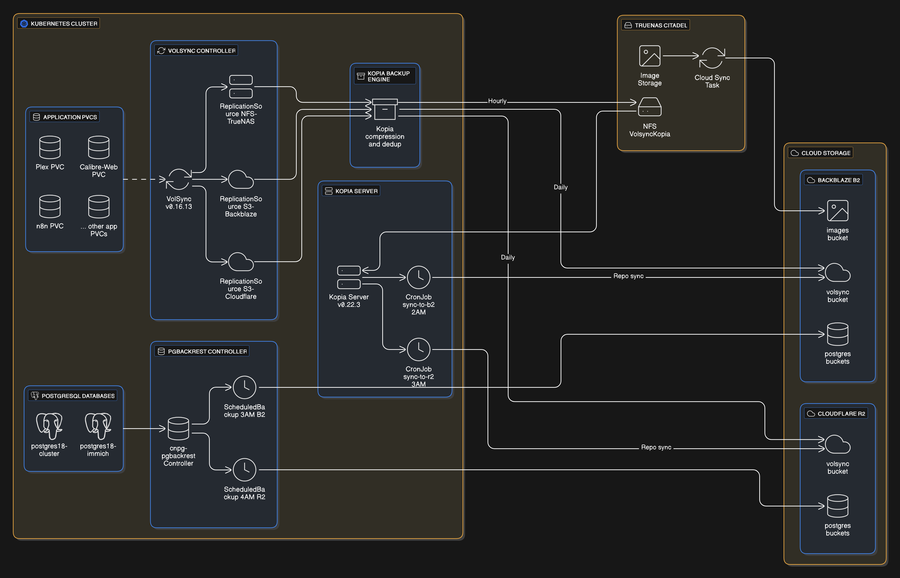

# Backup Strategy

This guide documents the comprehensive backup strategy for the homelab, covering application data, databases, and image storage.



## Overview

The backup strategy uses multiple tools and destinations to ensure data redundancy:

| Tool | Purpose | Destinations |
|------|---------|--------------|
| VolSync | Application PVC backups | NFS, B2, R2 |
| Kopia | Compression, deduplication, cloud sync | NFS, B2, R2 |
| pgBackRest | PostgreSQL database backups | B2, R2 |
| TrueNAS Cloud Sync | Image storage backups | B2 |

## Backup Flows

### 1. VolSync + Kopia (Application PVCs)

VolSync orchestrates backups for application PVCs (radarr, sonarr, bazarr, qbittorrent, etc.). All backups use Kopia as the backup engine for compression and deduplication.

**Components:**
- `kubernetes/components/volsync/nfs-truenas/` - NFS backup component
- `kubernetes/components/volsync/s3-backblaze/` - Backblaze B2 component
- `kubernetes/components/volsync/s3-cloudflare/` - Cloudflare R2 component

**How it works:**
1. VolSync creates ReplicationSource resources for each app
2. Kopia compresses and deduplicates the data
3. Data is written to three destinations:
   - **NFS (Hourly)**: `citadel.internal:/mnt/storage0/backups/VolsyncKopia`
   - **Backblaze B2 (Daily)**: Direct S3 upload
   - **Cloudflare R2 (Daily)**: Direct S3 upload

**Retention:**
- NFS: 24 hours + 7 days
- B2/R2: 14 days

### 2. Kopia Server Sync

The Kopia server provides an additional sync layer from the NFS repository to cloud storage.

**Components:**
- `kubernetes/apps/storage/kopia/app/helmrelease.yaml` - Kopia server
- `kubernetes/apps/storage/kopia/sync/cronjob-b2.yaml` - B2 sync job
- `kubernetes/apps/storage/kopia/sync/cronjob-r2.yaml` - R2 sync job

**Schedule:**
- Sync to B2: 2 AM daily
- Sync to R2: 3 AM daily

> **Note:** The sync CronJobs are currently suspended (`suspend: true`). Enable them to activate this backup layer.

### 3. pgBackRest (PostgreSQL Databases)

pgBackRest backs up CloudNative-PG PostgreSQL clusters directly to cloud storage.

**Components:**
- `kubernetes/apps/database/cloudnative-pg/pgbackrest/` - pgBackRest controller
- `kubernetes/apps/database/cloudnative-pg/postgres18-cluster/` - Main cluster
- `kubernetes/apps/database/cloudnative-pg/postgres18-immich/` - Immich cluster

**Clusters backed up:**
- `postgres18-cluster` - General-purpose PostgreSQL (3 instances)
- `postgres18-immich` - Immich with VectorChord extension (3 instances)

**Schedule:**
- B2: 3 AM daily
- R2: 4 AM daily

**Retention:**
- 14 full backups
- 30 differential backups
- 7 days of WAL archives
- 30 days of history metadata

### 4. TrueNAS Cloud Sync (Images)

Image storage is backed up directly from TrueNAS to Backblaze B2.

**Configuration:** TrueNAS UI (not managed in this repository)

**Source:** `/mnt/storage0/images` on Citadel

**Destination:** Backblaze B2

## Schedule Summary

| Component | Destination | Schedule | Retention |
|-----------|-------------|----------|-----------|
| VolSync NFS | TrueNAS Citadel | Hourly | 24h + 7 days |
| VolSync B2 | Backblaze | Daily (midnight) | 14 days |
| VolSync R2 | Cloudflare | Daily (midnight) | 14 days |
| Kopia sync B2 | Backblaze | 2 AM daily | Mirrors NFS |
| Kopia sync R2 | Cloudflare | 3 AM daily | Mirrors NFS |
| pgBackRest B2 | Backblaze | 3 AM daily | 14 full + 30 diff |
| pgBackRest R2 | Cloudflare | 4 AM daily | 14 full + 30 diff |
| TrueNAS Images | Backblaze | TrueNAS scheduled | TrueNAS configured |

## Cloud Storage

### Backblaze B2
- **Endpoint:** `s3.us-east-005.backblazeb2.com`
- **Buckets:** volsync, postgres-cluster, postgres-immich, images

### Cloudflare R2
- **Endpoint:** `${CLOUDFLARE_ACCOUNT_ID}.r2.cloudflarestorage.com`
- **Buckets:** volsync, postgres-cluster, postgres-immich

## Credentials

All credentials are managed via 1Password and synced to the cluster using ExternalSecrets:

- `kubernetes/apps/storage/kopia/app/externalsecret.yaml` - Kopia password
- `kubernetes/apps/storage/kopia/sync/externalsecret.yaml` - Cloud credentials
- `kubernetes/apps/database/cloudnative-pg/app/externalsecret.yaml` - pgBackRest credentials

## Restore Procedures

### VolSync Restore
```bash
# List available snapshots
task volsync:list app=<app-name> ns=<namespace>

# Restore from snapshot
task volsync:restore app=<app-name> ns=<namespace>
```

### pgBackRest Restore
Refer to the CloudNative-PG documentation for PITR (Point-in-Time Recovery) procedures.

## Monitoring

VolSync includes Prometheus alerts:
- `VolSyncComponentAbsent` - Fired when VolSync metrics disappear for 15 minutes
- `VolSyncVolumeOutOfSync` - Fired when a volume is out of sync for 15 minutes

See `kubernetes/apps/storage/volsync/app/prometheusrule.yaml` for alert definitions.

---

## Storage Class Requirements

> [!WARNING]
> **CephFS Sparse File Corruption**: Do not use `ceph-filesystem` for VolSync-backed PVCs. CephFS has issues with sparse file handling during restore operations that can silently zero out file contents. Use `ceph-block` for all backup/restore workloads.
>
> **Also disable** `csi.readAffinity.enabled` in your rook-ceph cluster—this setting can worsen CephFS data consistency issues.

| Use Case | Storage Class | Notes |
|----------|---------------|-------|
| App config/data (backed by VolSync) | `ceph-block` | Required for reliable restores |
| Shared working storage (media processing) | `ceph-filesystem` | ReadWriteMany, not backed up |
| Databases (backed by pgBackRest) | `ceph-block` | Block storage for performance |
| Temporary/cache data | `openebs-hostpath` | Node-local, ephemeral |
