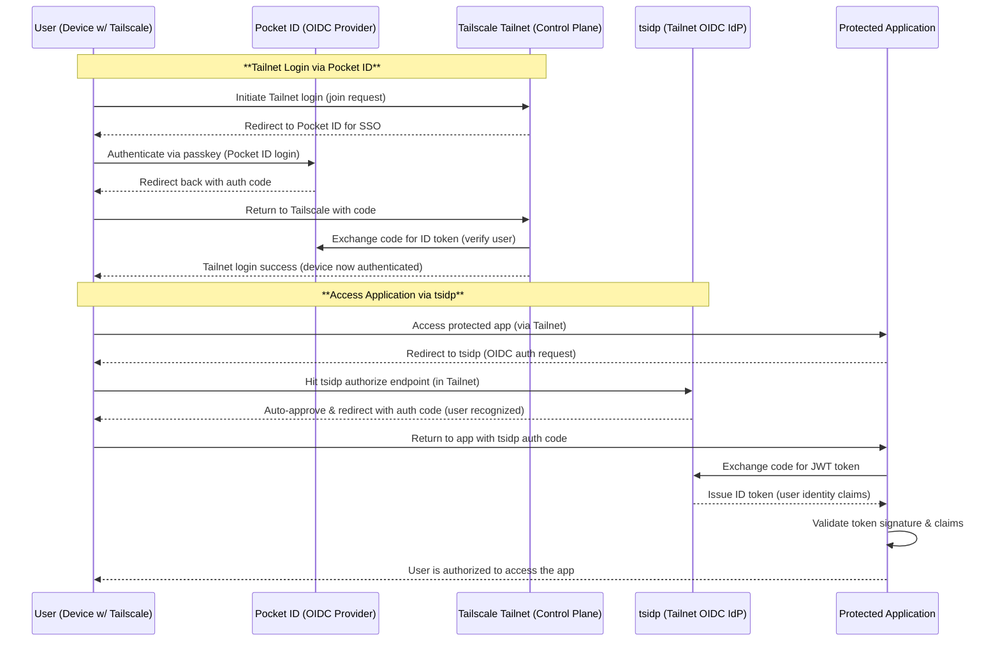

# Integrating Pocket ID with Tailscale tsidp - Step-by-Step Guide

## Overview: Pocket ID as the Source of Truth

Pocket ID is a simple self-hosted OpenID Connect (OIDC) identity provider that uses passkeys (e.g. device-stored credentials or YubiKeys) for passwordless authentication. In this integration, Pocket ID will serve as the single source of truth for user identities - all users and credentials are managed there (no local passwords in apps). We will leverage Tailscale's tsidp project to turn our Tailnet into an OIDC provider that uses those Pocket ID identities behind the scenes. In essence, your Tailnet becomes the SSO provider for homelab services, but Pocket ID is where users actually authenticate.

Tailscale tsidp (Tailscale Identity Provider) is an experimental IdP server that runs inside your Tailnet. It allows you to use your Tailscale identity to log into applications (like Grafana, Kubernetes, etc.) via OIDC, eliminating separate app-specific logins. In our setup, Tailscale itself is configured to use Pocket ID as its login provider, so the Tailnet identity is the Pocket ID identity. This means once a user has logged into Tailscale via Pocket ID, all services inside the Tailnet can trust that identity via tsidp.

Key components:

- **Pocket ID:** Primary Identity Provider (passkey-based) where user accounts live. All authentication (user sign-in) ultimately happens here.
- **Tailscale Tailnet:** Private network overlay; we configure it to use Pocket ID as its custom OIDC SSO. This ties Tailnet login to Pocket ID accounts.
- **tsidp:** An OIDC server running within the Tailnet. It issues JWT tokens asserting the user's identity (as known by Tailscale/Pocket ID) to applications. It acts as a bridge: apps trust tsidp, tsidp trusts the Tailnet (and by extension Pocket ID).
- **Homelab services:** Applications (or Kubernetes cluster) that offload authentication to tsidp. They will use OIDC to accept tokens from tsidp, thereby recognizing the Pocket ID user identity without each app needing its own login.

By integrating these, a user in your homelab only needs a Pocket ID account and passkey. Logging into Tailscale via Pocket ID lets them onto the Tailnet; once on the Tailnet, tsidp can seamlessly log them into internal services using that same identity. This yields a one-stop SSO experience (and passwordless via passkeys) across VPN access and applications.

## Identity and Authentication Flow

Let's break down how authentication flows from the initial user login to accessing an app:

1. **User Login via Pocket ID (Tailnet Access):** The user attempts to login to your Tailnet (for example, by signing in through the Tailscale client on their device). Tailscale is configured with a custom OIDC provider (Pocket ID), so instead of the usual Google/Microsoft login, the user is redirected to Pocket ID's login page. The user uses their passkey (e.g. FaceID, TouchID, YubiKey, etc.) to authenticate with Pocket ID. Pocket ID then sends an authorization code back, which Tailscale exchanges for the user's identity (OIDC ID token) and email claims. If successful, the user is now logged into the Tailnet under their Pocket ID identity (e.g. `alice@homelab.com`). Tailscale considers this user authenticated, and the device joins the Tailnet under that user.

2. **Deploy tsidp inside Tailnet:** We run tsidp on the Kubernetes cluster as a Tailnet-connected service (with a Tailnet IP and MagicDNS name). Think of tsidp as an internal OIDC server that knows who the Tailnet user is. At this point, tsidp is essentially idle but ready - it has registered itself on the Tailnet and can serve OIDC requests.

3. **User Accesses an Internal Application:** The user now tries to access a protected homelab service (for example, a Grafana dashboard or the Kubernetes API server) that is configured to use OIDC via tsidp. Because the service requires authentication, it triggers an OIDC flow - typically by redirecting the user's browser to the tsidp authorization URL (which is something like `https://idp.<your-tailnet>.ts.net/authorize`). This redirect includes an OIDC client ID and callback for the specific app.

4. **Seamless Authentication via tsidp:** When the user's browser hits the tsidp authorize endpoint, tsidp needs to authenticate the user. Since tsidp runs inside the Tailnet, it can determine who the incoming request is from (tsidp leverages the Tailnet context). The user's device is already connected to Tailnet and has a Tailscale IP; tsidp recognizes the Tailnet identity associated with that connection. No additional login prompt appears - tsidp can silently authenticate the user because the user's presence on the Tailnet (with a valid session) is proof of identity. Essentially, if you are coming from a trusted Tailnet device, you are assumed to be the Pocket ID user who logged into that device.

5. **tsidp Issues an ID Token:** tsidp immediately issues an OIDC authorization code (or token, if using implicit flow) back to the application via the user's browser redirect. The application then contacts tsidp's token endpoint to exchange this code for a JWT ID token (and potentially an access token) containing the user's identity claims. The ID token is signed by tsidp and includes claims like the user's email address, subject ID, etc.

6. **Application Authorizes User:** The application verifies the ID token using tsidp's public keys (from its `.well-known` OIDC metadata). It checks the signature, audience, and expiration. It sees the user identity (email/username) in the token claims. At this point, the user is considered authenticated as `alice@homelab.com`. The app then grants access.

All of this happens in a matter of seconds. The user did a one-time passkey login to Pocket ID when connecting Tailscale; after that, every app within the Tailnet trusted realm logs them in transparently via tsidp. There are no additional password prompts and no separate user management per app - everything hinges on the Pocket ID account that was used to get into the Tailnet.

> **Security Note:** This flow effectively requires two factors: possession of a trusted, Tailnet-enabled device and the passkey to the Pocket ID account. A malicious actor would need to both compromise the user's device (to be on Tailnet) and their biometric/passkey. Also, Tailnet ensures network-level access control - only devices in the Tailnet can even reach tsidp or the protected apps, adding an extra layer of protection.

Below is a high-level sequence diagram summarizing the above steps:


```
### Explanation
e sequence diagram above shows two phases of authentication. First the user joins the Tailnet by logging into Pocket ID via Tailscale. After they are in the Tailnet, each application initiates an OIDC flow with tsidp, which leverages the Tailnet context to identify the user without prompting for credentials again. The result is a seamless "zero click" single sign‑on experience.

## Configuring Pocket ID and Tailscale for Custom OIDC

1. **Create an OIDC client in Pocket ID** for Tailscale. Set the redirect URI provided by Tailscale (for example, `https://login.tailscale.com/oauth/callback` when using Tailscale Cloud). Make sure the `openid`, `profile` and `email` scopes are allowed. Pocket ID will issue a client ID and client secret.

2. **Configure Tailscale or Headscale** to use Pocket ID as the identity provider. For Tailscale Cloud you will need to set up WebFinger on your domain so that `https://<your-domain>/.well‑known/webfinger` points to your Pocket ID issuer URL. Domain ownership must be verified. For Headscale, set the OIDC issuer URL and client credentials in the headscale configuration.

3. **Test the login** by signing into Tailscale with an email address on your domain. You should be redirected to Pocket ID and asked for your passkey. Once complete, Tailscale shows the user in the admin console. From now on, Pocket ID is the source of truth for Tailnet identities.

## Deploying tsidp in the Kubernetes Cluster

1. **Obtain a pre‑auth key** from your Tailnet so that tsidp can join automatically. Store it in a Kubernetes secret.

2. **Deploy the tsidp container** (for example using the official `tailscale/tsidp` image). Set environment variables such as `TS_AUTHKEY` (your pre‑auth key), `TS_HOSTNAME` (e.g. `idp`), `TAILSCALE_USE_WIP_CODE=1`, and optionally `TSIDP_PORT` if you are not using port `443`. Mount a persistent volume at `/var/lib/tsidp` for state.

3. **Configure a Tailnet ACL** to allow the tsidp capability. The ACL entry should enable `allow_admin_ui` and `allow_dcr` so you can use the web UI and dynamic client registration if desired. Without this, tsidp will refuse to serve tokens.

4. **Access the tsidp admin UI** at `https://idp.<your-tailnet>.ts.net` from a device on the Tailnet. You should see a dashboard where you can register OIDC clients.

## Setting Up Applications (OIDC Clients) to Use tsidp

1. **Register each application** as an OIDC client in the tsidp UI. Provide the redirect URI that the app expects and copy the client ID and client secret.

2. **Configure the application** with the issuer URL (`https://idp.<your-tailnet>.ts.net`), client ID, client secret, and scopes (`openid email profile`). Many apps such as Grafana support OIDC directly. For example, configure Grafana’s generic OAuth provider with these values to enable Tailscale login.

3. **Use a proxy for apps without OIDC support.** Deploy oauth2-proxy or a similar proxy in front of the app. Configure the proxy to use tsidp as its OIDC provider and pass the user’s email or username to the backend in headers like `X-Forwarded-User`.

## JWT Claims and Identity Propagation to Services

When tsidp issues an ID token it includes claims drawn from your Pocket ID identity via Tailscale. Important fields include:

- `sub`: a stable identifier for the user in the Tailnet.
- `iss`: the tsidp issuer URL.
- `email`: the user’s email address (if the `email` scope was requested).
- `name` or `preferred_username`: the display name or username (requires the `profile` scope).
- Additional claims such as device IPs (`addresses`) and node names can also be included.

Applications validate the signature on these tokens using tsidp’s JWKS endpoint and extract the claims to identify the user. Proxies can forward the identity to pods via HTTP headers so that your services do not need to parse JWTs themselves.

## Conclusion

By integrating Pocket ID with Tailscale and tsidp you create a unified identity system for your homelab or Kubernetes cluster. Pocket ID manages user accounts and passkey authentication, Tailscale extends that identity into your private network, and tsidp allows your internal services to accept OIDC logins without asking the user to authenticate again. The result is a passwordless single sign‑on experience across all applications with Pocket ID as the single source of truth.

