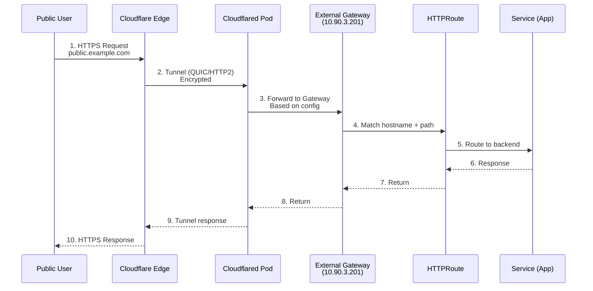
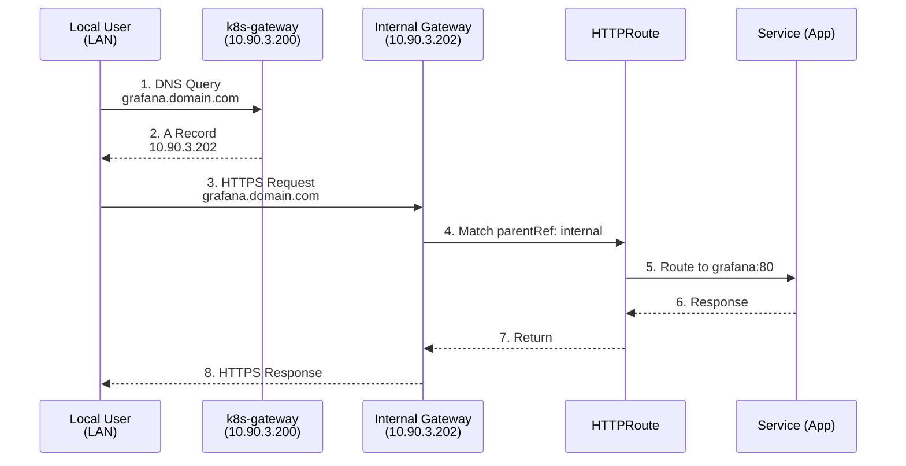
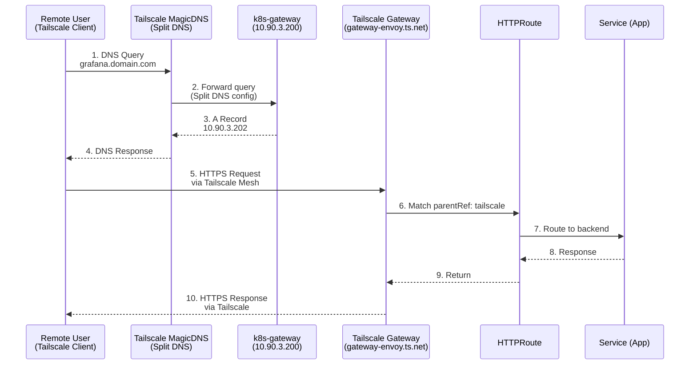
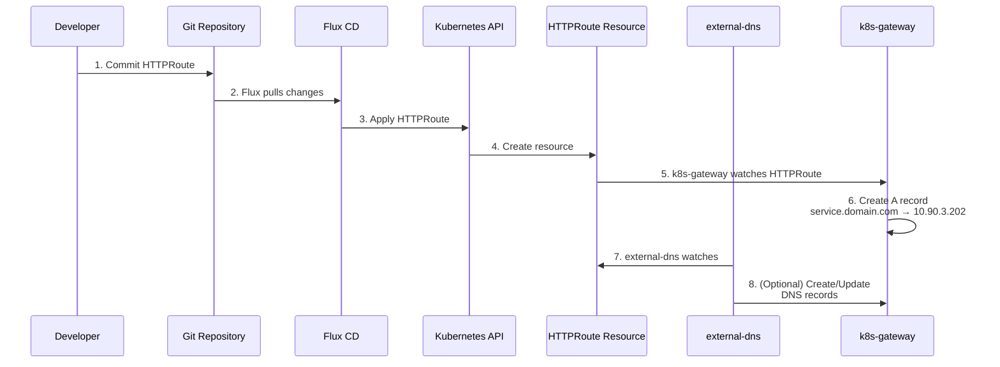
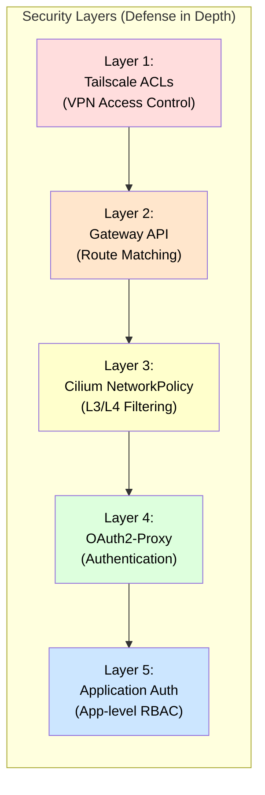
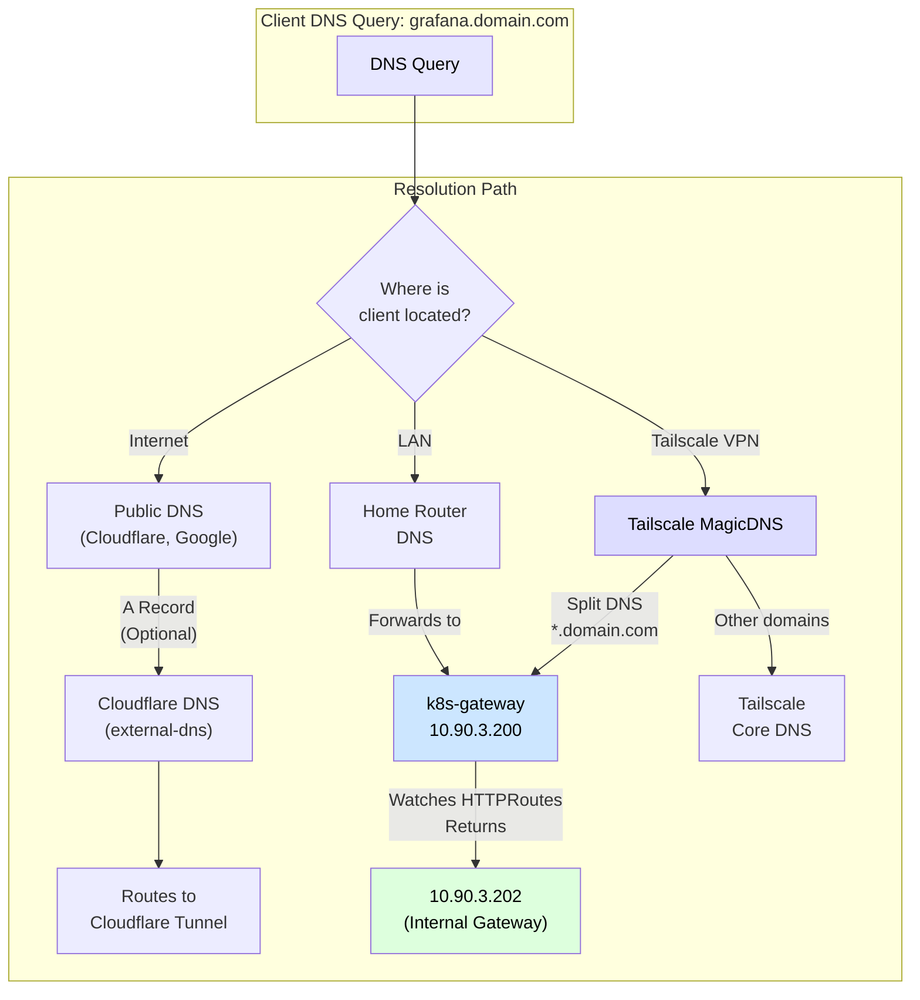
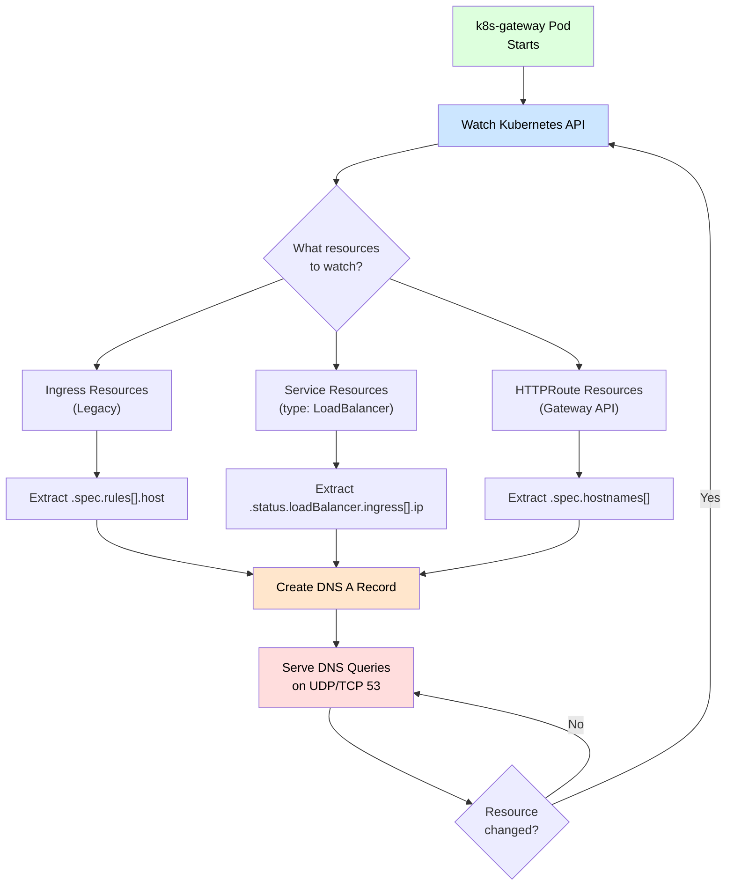
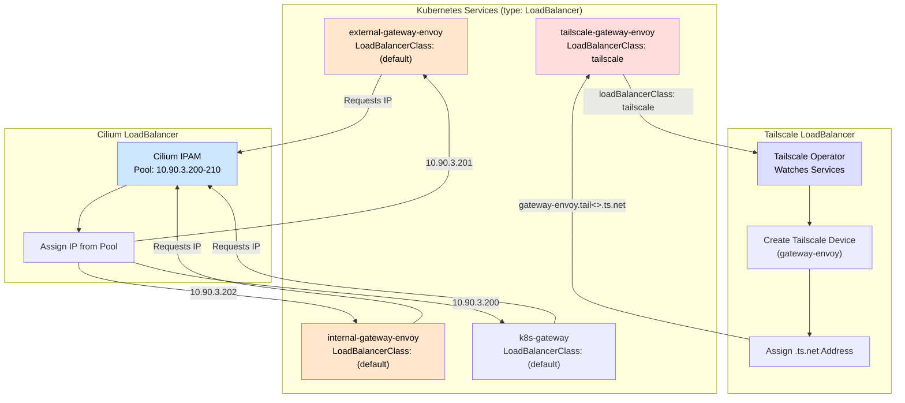
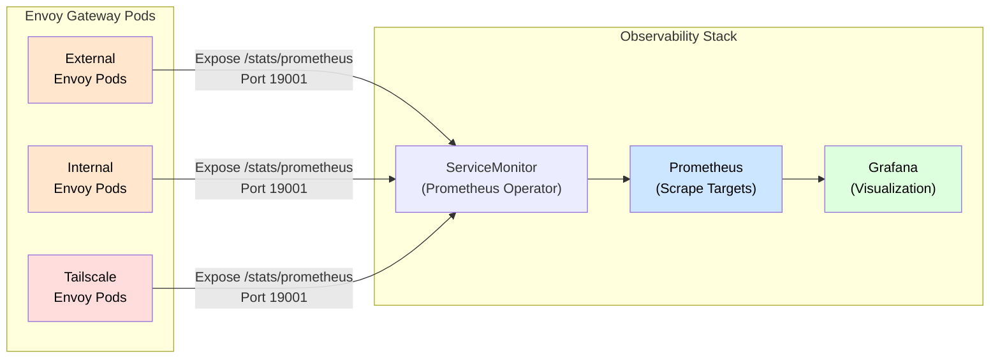

# Network Architecture Diagram - Post Tailscale Gateway Migration

**Document Version:** 1.0
**Last Updated:** 2025-11-24
**Reflects:** Three-Gateway Architecture (External, Internal, Tailscale)

---

## Complete Network Architecture

**Network Flow: Users → Entry Points → Infrastructure → Authentication → Services**


*Rendered with [Eraser.io](https://eraser.io) | [View Mermaid Source](MERMAID_SOURCE.md)*

---

## Traffic Flow Detailed Breakdown

### 1. Public Internet Access (via Cloudflare Tunnel)



### 2. Internal LAN Access



### 3. Tailscale VPN Access (NEW)



### 4. DNS Automation Flow



---

## Component IP Address Map

| Component | IP Address | Purpose | Load Balancer |
|-----------|-----------|---------|---------------|
| **k8s-gateway** | `10.90.3.200` | Internal DNS for `${SECRET_DOMAIN}` | Cilium IPAM |
| **External Gateway** | `10.90.3.201` | Public internet traffic (via Cloudflare) | Cilium IPAM |
| **Internal Gateway** | `10.90.3.202` | Local network traffic | Cilium IPAM |
| **Tailscale Gateway** | `gateway-envoy.tail<xxxx>.ts.net` | Remote VPN traffic | Tailscale |
| **CoreDNS** | `10.96.0.10` (ClusterIP) | Cluster-internal DNS | N/A (ClusterIP) |

---

## Gateway Comparison Matrix

| Feature | External Gateway | Internal Gateway | Tailscale Gateway |
|---------|-----------------|------------------|-------------------|
| **Purpose** | Public internet access | Local network access | Remote VPN access |
| **IP Address** | 10.90.3.201 | 10.90.3.202 | gateway-envoy.ts.net |
| **Load Balancer** | Cilium | Cilium | Tailscale |
| **DNS Target** | external.${SECRET_DOMAIN} | internal.${SECRET_DOMAIN} | gateway-envoy.tail<>.ts.net |
| **TLS Termination** | Yes (cert-manager) | Yes (cert-manager) | Yes (Tailscale or cert-manager) |
| **Access Control** | Public | LAN only | Tailscale auth required |
| **Typical Users** | Anonymous internet | Home devices | Authorized remote users |
| **Example Route** | CloudFlare Tunnel → Gateway | Direct connection | Tailscale Mesh → Gateway |

---

## HTTPRoute Multi-Gateway Pattern

### Single Gateway (Old Pattern)
```yaml
# Only accessible via one gateway
apiVersion: gateway.networking.k8s.io/v1
kind: HTTPRoute
metadata:
  name: grafana
spec:
  parentRefs:
    - name: internal      # Only LAN access
  hostnames:
    - grafana.domain.com
  rules:
    - backendRefs:
        - name: grafana
          port: 80
```

### Multi-Gateway (New Pattern)
```yaml
# Accessible via multiple gateways
apiVersion: gateway.networking.k8s.io/v1
kind: HTTPRoute
metadata:
  name: grafana
spec:
  parentRefs:
    - name: internal      # LAN access
      namespace: network
    - name: tailscale     # Tailscale VPN access
      namespace: network
  hostnames:
    - grafana.domain.com
  rules:
    - backendRefs:
        - name: grafana
          port: 80
```

**Result:**
- Same service accessible from **two different networks**
- Single configuration, multiple entry points
- Consistent routing rules across gateways

---

## Network Policy Considerations

### Current State
- **Cilium NetworkPolicies** control pod-to-pod communication
- **Gateway policies** (ClientTrafficPolicy, BackendTrafficPolicy) control HTTP-level behavior
- **Tailscale ACLs** control who can access the Tailscale network

### Security Layers



---

## DNS Resolution Hierarchy



---

## Service Discovery Flow

### How k8s-gateway Discovers Services



---

## Load Balancer Integration

### Cilium vs Tailscale LoadBalancer



---

## Monitoring & Observability

### Metrics Collection Flow



### Key Metrics to Monitor

**Gateway Health:**
- `envoy_server_live` - Gateway is alive
- `envoy_cluster_membership_healthy` - Backend health
- `envoy_http_downstream_rq_total` - Total requests per gateway

**Traffic Patterns:**
- `envoy_http_downstream_rq_time_bucket` - Request latency
- `envoy_http_downstream_cx_total` - Active connections
- `envoy_http_downstream_rq_xx` - Response codes (2xx, 4xx, 5xx)

**Resource Usage:**
- `container_memory_working_set_bytes` - Memory usage
- `container_cpu_usage_seconds_total` - CPU usage
- `kube_horizontalpodautoscaler_status_current_replicas` - HPA scaling

---

## Architecture Benefits

### Before Migration (Ingress + Gateway API)
```
✗ Two different APIs (Ingress for Tailscale, Gateway for internal/external)
✗ Duplicate configuration per service
✗ No unified observability
✗ Difficult to apply consistent policies
```

### After Migration (Gateway API Only)
```
✓ Single API (Gateway API) for all traffic types
✓ Multi-gateway HTTPRoutes (one config, multiple entry points)
✓ Unified metrics across all gateways
✓ Consistent policies (ClientTrafficPolicy, BackendTrafficPolicy)
✓ Centralized TLS management via cert-manager
✓ Better scalability with HPA per gateway
```

---

## Future Enhancements

### Potential Additions
1. **OAuth2-Proxy Integration**
   - Add authentication layer for sensitive services
   - Protect HTTPRoutes with OIDC/OAuth2

2. **Rate Limiting**
   - Apply RateLimitPolicy to gateways
   - Protect against abuse/DDoS

3. **Request Mirroring**
   - Mirror production traffic to staging
   - Test new versions safely

4. **Traffic Splitting**
   - Canary deployments via HTTPRoute weight
   - Blue/green deployments

5. **Custom Metrics**
   - Application-level metrics via EnvoyFilter
   - Custom dashboards per service

---

## Troubleshooting Quick Reference

### Gateway Not Ready
```bash
kubectl get gateway -n network
kubectl describe gateway <name> -n network
kubectl logs -n network -l control-plane=envoy-gateway
```

### HTTPRoute Not Routing
```bash
kubectl describe httproute <name> -n <namespace>
kubectl get gateway -n network -o yaml | grep -A10 listeners
```

### DNS Not Resolving
```bash
dig @10.90.3.200 service.domain.com
kubectl logs -n network -l app.kubernetes.io/name=k8s-gateway
```

### Tailscale Gateway No Address
```bash
kubectl get svc -n network | grep tailscale
kubectl logs -n network -l app.kubernetes.io/name=tailscale-operator
# Check Tailscale admin: https://login.tailscale.com/admin/machines
```

---

## Related Documentation

- [Migration Guide](./README.md) - Step-by-step migration instructions
- [Homelab Architecture](../Homelab/ARCHITECTURE.md) - Overall cluster design
- [Gateway API Docs](https://gateway-api.sigs.k8s.io/) - Upstream specification
- [Cilium Docs](https://docs.cilium.io/) - CNI and LoadBalancer IPAM
- [Tailscale Kubernetes Docs](https://tailscale.com/kb/1185/kubernetes) - VPN integration

---

