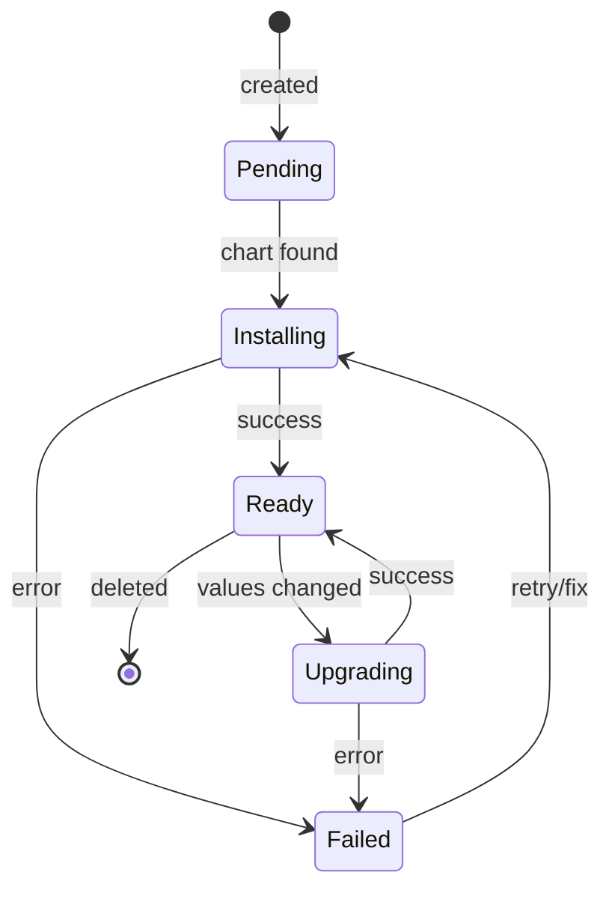
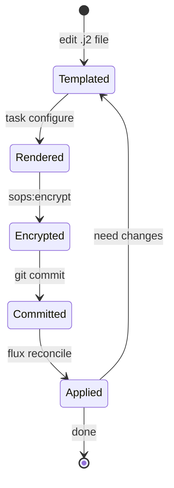

# Homelab Domain Model

## Core Rules

### Rule 1: GitOps is the authority

**Rule**: All changes flow through Git. Manual cluster changes revert.

**Enforced By**: Flux reconciliation loop (every 30m or on push).

**Violation**: `kubectl edit` changes are overwritten.

### Rule 2: Templates are source; generated files are output

**Rule**: Edit `bootstrap/templates/`, run `task configure`, commit the output.

**Enforced By**: Makejinja regenerates `kubernetes/` from templates.

**Violation**: Editing `kubernetes/apps/` directly loses changes on next `task configure`.

**Exception**: Apps without templates in `bootstrap/templates/` can be edited directly in `kubernetes/apps/`.

### Rule 3: Secrets stay encrypted

**Rule**: All secrets use SOPS encryption before committing.

**Enforced By**: `task configure` runs `sops:encrypt` automatically.

**Violation**: Unencrypted secrets in public repo expose credentials.

### Rule 4: Apps use app-template chart

**Rule**: Default to `bjw-s/app-template`; vendor charts only when necessary.

**Why**: Consistent structure, predictable patterns, easier maintenance.

**Exception**: Infrastructure components (cert-manager, cilium) use vendor charts.

---

## State Machines

### Flux HelmRelease Lifecycle

**Transitions**:
- `Pending -> Installing`: Chart and values resolved
- `Installing -> Ready`: All pods running
- `Ready -> Upgrading`: Git push with changed values
- `* -> Failed`: Chart error, missing secret, invalid values

### Template Generation Lifecycle

---

## Entity Relationships

### Deployment Flow

| Stage | Location | Format | Next |
|-------|----------|--------|------|
| Template | `bootstrap/templates/` | `.yaml.j2` | Makejinja |
| Generated | `kubernetes/apps/` | `.yaml` | Git |
| Applied | Cluster | Kubernetes resources | Running |

### Secret Flow

| Stage | State | Location |
|-------|-------|----------|
| Plain | Template variables | `config.yaml` (not committed) |
| Rendered | Unencrypted YAML | `*.sops.yaml` (pre-encrypt) |
| Encrypted | SOPS-wrapped | `*.sops.yaml` (committed) |
| Decrypted | Kubernetes Secret | Cluster (runtime) |

### Routing Flow

| Traffic Type | Gateway | Annotation |
|--------------|---------|------------|
| Public | `external` | `external-dns.alpha.kubernetes.io/target: external.${SECRET_DOMAIN}` |
| Private | `internal` | `internal-dns.alpha.kubernetes.io/target: internal.${SECRET_DOMAIN}` |
| VPN | Tailscale | `className: tailscale` |

---

## Value Objects

### HelmRelease Reference

**Properties**: namespace, name, chart, version, values

**Pattern**: `kubernetes/apps/<namespace>/<app>/app/helmrelease.yaml`

### Secret Reference

**Properties**: name, namespace, keys

**Pattern**: Referenced in HelmRelease via `secretRef`, created by SOPS or ExternalSecret

### Route Reference

**Properties**: hostname, gateway, section

**Pattern**: `route.app.parentRefs[].name` = `external` or `internal`

---

## Domain Events

### FluxReconciled
**Trigger**: Git push or 30m interval
**Contains**: Kustomization name, status, applied resources
**Consumers**: All HelmReleases in scope

### SecretDecrypted
**Trigger**: SOPS key available, encrypted secret in Git
**Contains**: Secret name, namespace
**Consumers**: Pods referencing the secret

### HelmReleaseReady
**Trigger**: All pods healthy, services available
**Contains**: Release name, version, status
**Consumers**: Dependent releases (via `dependsOn`)

---

## Temporal Rules

- **Flux reconciliation**: 30m default, immediate on webhook
- **HelmRelease retry**: 3 attempts with exponential backoff
- **Certificate renewal**: 30 days before expiry (cert-manager)
- **Secret rotation**: Manual, requires re-encryption

---

## Glossary

| Term | Definition |
|------|------------|
| **app-template** | bjw-s Helm chart providing consistent app deployment patterns |
| **Flux** | GitOps operator that syncs cluster to Git state |
| **Gateway API** | Kubernetes routing API replacing Ingress |
| **HelmRelease** | Flux resource managing Helm chart deployment |
| **Kustomization** | Flux resource defining what to apply from Git |
| **Makejinja** | Template engine rendering `.j2` files to YAML |
| **SOPS** | Mozilla tool for encrypting secrets in Git |
| **Taskfile** | Task runner orchestrating local operations |

---

## Evidence

| Claim | Source | Confidence |
|-------|--------|------------|
| Flux reconciles every 30m | `kubernetes/apps/*/ks.yaml` interval field | Verified |
| HelmRelease retries 3 times | `kubernetes/apps/*/helmrelease.yaml` remediation | Verified |
| SOPS encrypts secrets | `.sops.yaml`, `*.sops.yaml` files | Verified |
| Gateway API for routing | `kubernetes/apps/*/helmrelease.yaml` route section | Verified |
