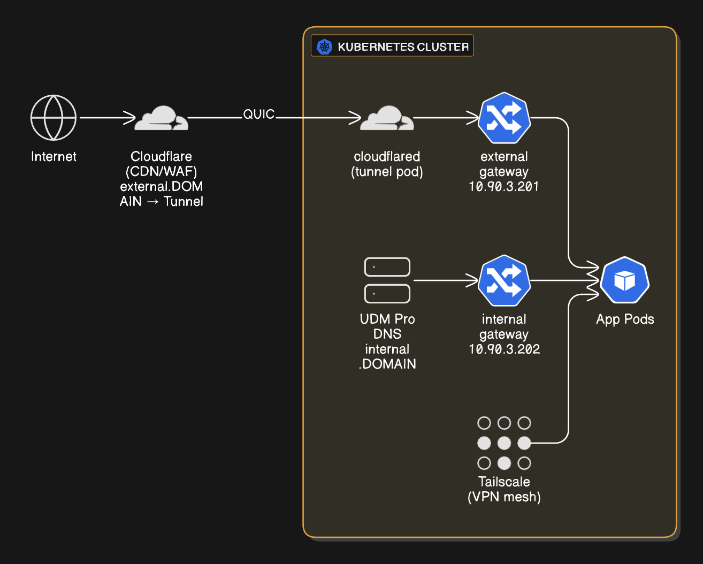
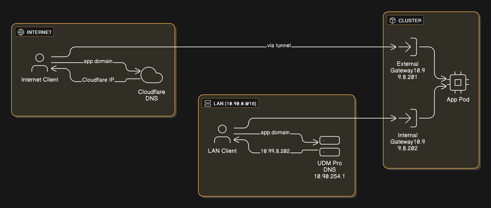
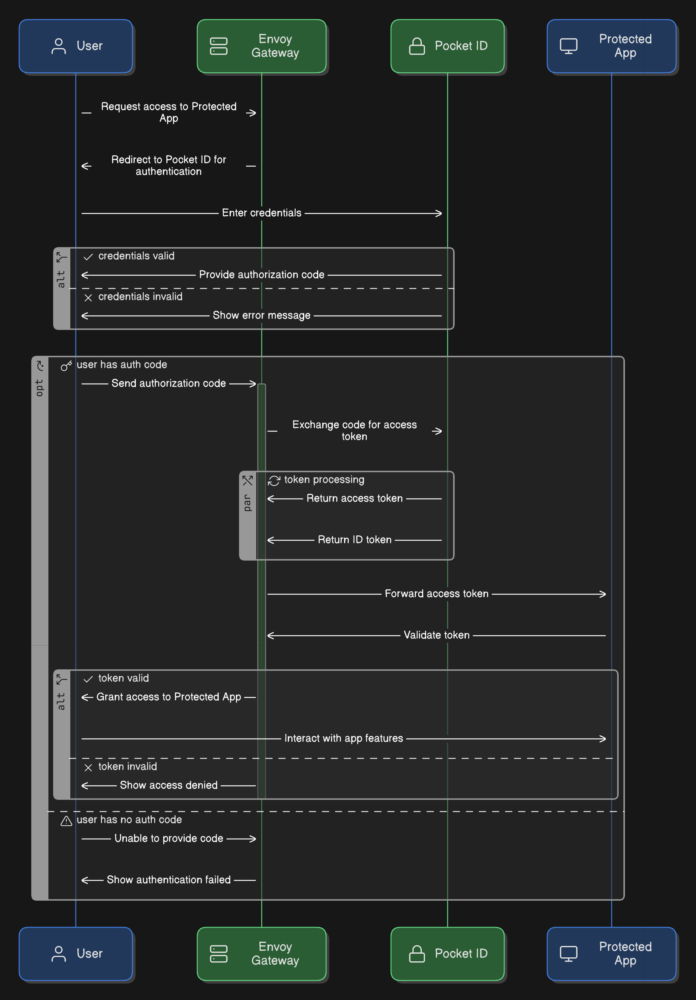
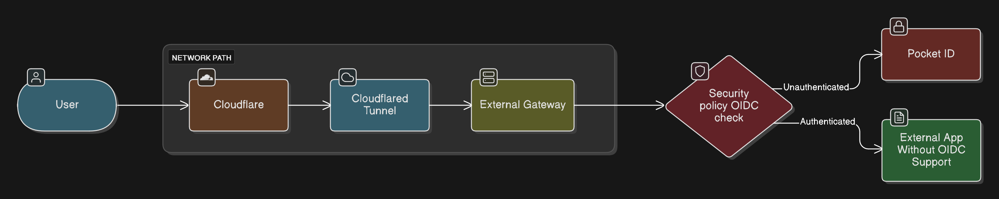
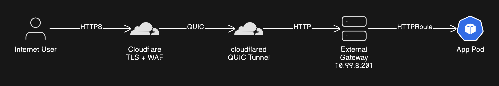
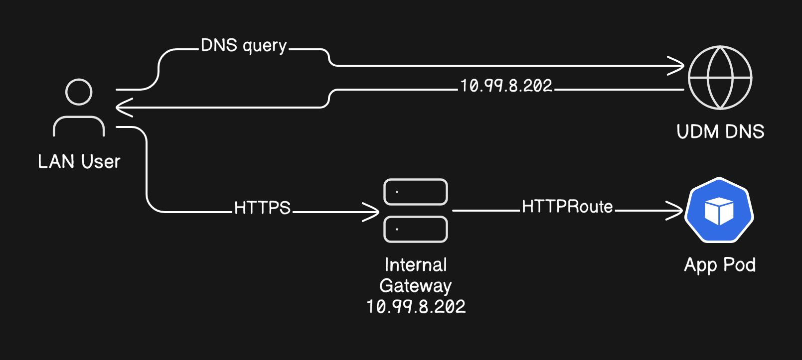

# Networking Architecture

## Network Overview



---

## IP Address Map

### Cluster LoadBalancer IPs (Cilium LB-IPAM via BGP)

| IP | Service | Purpose |
|----|---------|---------|
| 10.99.8.201 | external gateway | Public traffic ingress (via Cloudflare) |
| 10.99.8.202 | internal gateway | Private traffic ingress (LAN direct) |

### Node IPs

| IP | Hostname | Purpose |
|----|----------|---------|
| 10.90.3.101 | stanton-01 | Control plane node |
| 10.90.3.102 | stanton-02 | Control plane node |
| 10.90.3.103 | stanton-03 | Control plane node |

### Infrastructure IPs

| IP | Device | Purpose |
|----|--------|---------|
| 10.90.254.1 | UDM Pro | Router/DNS/Firewall |

---

## UDM Pro Manual DNS Records

These A records are manually configured in the UDM Pro:

| Record | IP | Purpose |
|--------|----|---------|
| `internal.${SECRET_DOMAIN}` | 10.99.8.202 | Points to internal gateway |
| `stanton-01.internal` | 10.90.3.101 | Node 1 direct access |
| `stanton-02.internal` | 10.90.3.102 | Node 2 direct access |
| `stanton-03.internal` | 10.90.3.103 | Node 3 direct access |

---

## Split-Horizon DNS

### Capsule: SplitHorizonDNS

**Invariant**: Same hostname resolves to different IPs based on client location. LAN clients get internal gateway IP; internet clients get Cloudflare IP. This eliminates hairpin NAT.

**How It Works**:



**Components**:

| Component | Creates Records In | What It Watches |
|-----------|-------------------|-----------------|
| external-dns | Cloudflare | HTTPRoutes with `external-dns.alpha.kubernetes.io/target` annotation |
| external-dns-unifi | UDM Pro | HTTPRoutes with `internal-dns.alpha.kubernetes.io/target` annotation |

**Why This Avoids Hairpin NAT**:
- Without split-horizon: LAN client → Cloudflare → tunnel → cluster (hairpin)
- With split-horizon: LAN client → UDM DNS → internal gateway → cluster (direct)

---

## App Exposure Patterns

### Pattern 1: External Only (Internet Access)

Apps with only `external-dns.alpha.kubernetes.io/target` annotation.

**Example**: bentopdf (pdf.${SECRET_DOMAIN})

```yaml
route:
  app:
    annotations:
      external-dns.alpha.kubernetes.io/target: external.${SECRET_DOMAIN}
    parentRefs:
      - name: external
        namespace: network
```

**LAN Access Path**:
```
LAN Client → UDM DNS (no record) → Cloudflare DNS → Cloudflare edge →
cloudflared tunnel → external gateway (10.99.8.201) → App
```

### Pattern 2: Internal Only (LAN Access)

Apps with only `internal-dns.alpha.kubernetes.io/target` annotation.

**Example**: `unifi.${SECRET_DOMAIN}`, `truenas.${SECRET_DOMAIN}`

```yaml
route:
  app:
    annotations:
      internal-dns.alpha.kubernetes.io/target: internal.${SECRET_DOMAIN}
    parentRefs:
      - name: internal
        namespace: network
```

**LAN Access Path**:
```
LAN Client → UDM DNS → 10.99.8.202 → internal gateway → App
```

**Internet Access**: Not available (no Cloudflare record)

### Pattern 3: Dual-Homed (Both Internal and External)

Apps with BOTH annotations. Same hostname, different paths based on client location.

**Example**: pocket-id (id.${SECRET_DOMAIN})

```yaml
route:
  external:
    annotations:
      external-dns.alpha.kubernetes.io/target: external.${SECRET_DOMAIN}
    hostnames:
      - id.${SECRET_DOMAIN}
    parentRefs:
      - name: external
        namespace: network
  internal:
    annotations:
      internal-dns.alpha.kubernetes.io/target: internal.${SECRET_DOMAIN}
    hostnames:
      - id.${SECRET_DOMAIN}
    parentRefs:
      - name: internal
        namespace: network
```

**Traffic Paths**:

| Client Location | DNS Response | Gateway | Path |
|-----------------|--------------|---------|------|
| Internet | Cloudflare IP | external (10.99.8.201) | Via tunnel |
| LAN | 10.99.8.202 | internal (10.99.8.202) | Direct |

---

## OIDC Authentication

### Capsule: EnvoyOIDC

**Invariant**: Envoy Gateway SecurityPolicy intercepts requests at the gateway, redirects to Pocket-ID for authentication, and only forwards authenticated requests to backends. Apps without native OIDC support get authentication for free.

### OIDC Flow



### Example: bentopdf OIDC Protection

bentopdf has no native authentication. Envoy Gateway adds OIDC in front of it.

**Required Resources**:

1. **Backend** - Points to Pocket-ID service:
```yaml
# kubernetes/apps/home/bentopdf/app/backend.yaml
apiVersion: gateway.envoyproxy.io/v1alpha1
kind: Backend
metadata:
  name: bentopdf-oidc-provider
spec:
  endpoints:
    - fqdn:
        hostname: pocket-id.security.svc.cluster.local
        port: 1411
```

2. **SecurityPolicy** - Configures OIDC for the HTTPRoute:
```yaml
# kubernetes/apps/home/bentopdf/app/securitypolicy.yaml
apiVersion: gateway.envoyproxy.io/v1alpha1
kind: SecurityPolicy
metadata:
  name: bentopdf-oidc
spec:
  targetRefs:
    - group: gateway.networking.k8s.io
      kind: HTTPRoute
      name: bentopdf
  oidc:
    provider:
      backendRefs:
        - group: gateway.envoyproxy.io
          kind: Backend
          name: bentopdf-oidc-provider
          port: 1411
      issuer: "https://id.${SECRET_DOMAIN}"
      authorizationEndpoint: "https://id.${SECRET_DOMAIN}/authorize"
      tokenEndpoint: "https://id.${SECRET_DOMAIN}/api/oidc/token"
    clientIDRef:
      name: "bentopdf-oidc"
    clientSecret:
      name: "bentopdf-oidc"
    redirectURL: "https://pdf.${SECRET_DOMAIN}/oauth2/callback"
    scopes: ["openid", "profile", "email"]
```

3. **ExternalSecret** - Provides client credentials from Pocket-ID
4. **ReferenceGrant** - Allows SecurityPolicy to reference Pocket-ID service cross-namespace

**Traffic Flow with OIDC**:



---

## Cilium CNI Features

### Capsule: CiliumNetworking

**Invariant**: Cilium replaces kube-proxy with eBPF, provides LoadBalancer IPs via BGP route advertisements to the UDM Pro, and uses Direct Server Return (DSR) mode for optimal performance.

### Key Features Enabled

| Feature | Config | Purpose |
|---------|--------|---------|
| **kubeProxyReplacement** | `true` | eBPF-based service routing, replaces iptables |
| **bgpControlPlane** | `enabled: true` | BGP route advertisements to upstream router |
| **loadBalancer.mode** | `dsr` | Direct Server Return - preserves client IP, lower latency |
| **LB-IPAM** | Pool: `10.99.8.0/24` | Automatic IP allocation for LoadBalancer services |
| **bandwidthManager** | `enabled: true, bbr: true` | TCP BBR congestion control |
| **bpf.masquerade** | `true` | eBPF-based SNAT for pod egress |
| **bpf.datapathMode** | `netkit` | Modern eBPF datapath for better performance |

### BGP Configuration

The cluster uses BGP to advertise LoadBalancer IPs to the UDM Pro router, eliminating hairpin routing issues that occurred with L2 announcements.

```yaml
# kubernetes/apps/kube-system/cilium/app/networking.yaml
---
apiVersion: cilium.io/v2
kind: CiliumBGPAdvertisement
metadata:
  name: lb-services
spec:
  advertisements:
    - advertisementType: "Service"
      service:
        addresses:
          - LoadBalancerIP
---
apiVersion: cilium.io/v2
kind: CiliumBGPPeerConfig
metadata:
  name: udm-peer
spec:
  timers:
    holdTimeSeconds: 90
    keepAliveTimeSeconds: 30
  gracefulRestart:
    enabled: true
---
apiVersion: cilium.io/v2
kind: CiliumBGPClusterConfig
metadata:
  name: bgp-cluster
spec:
  nodeSelector:
    matchLabels:
      kubernetes.io/os: linux
  bgpInstances:
    - name: "home-cluster"
      localASN: 65010
      peers:
        - name: "udm-pro"
          peerAddress: "10.90.254.1"
          peerASN: 65001
---
apiVersion: cilium.io/v2
kind: CiliumLoadBalancerIPPool
metadata:
  name: lb-pool
spec:
  allowFirstLastIPs: "No"
  blocks:
    - cidr: "10.99.8.0/24"
```

### Why BGP Instead of L2

With L2 announcements, one node "owned" a LoadBalancer IP via ARP. This caused hairpin routing issues when pods on the same node tried to reach the LoadBalancer IP.

**BGP solves L2-level hairpin**: The UDM Pro learns routes to LoadBalancer IPs and handles routing at L3. Traffic always goes through the router, so pods on any node can reach any LoadBalancer IP regardless of where the backend runs.

### DSR Same-Node Hairpin Limitation

> **Important**: BGP fixes L2 hairpin but DSR mode has its own limitation. When a pod tries to reach a LoadBalancer VIP and the backend is on the *same node*, traffic fails. This is a known Cilium limitation ([GitHub #39198](https://github.com/cilium/cilium/issues/39198)).

**Workaround**: CoreDNS template plugin rewrites internal service DNS queries to return ClusterIP instead of LoadBalancer VIP:

```yaml
# kubernetes/apps/kube-system/coredns/app/helm-values.yaml
servers:
  # Internal gateway rewrite - resolves internal services to ClusterIP
  - zones:
      - zone: ${SECRET_DOMAIN}
        scheme: dns://
    port: 53
    plugins:
      - name: template
        parameters: IN A
        configBlock: |-
          match (^internal\.|^id\.)nerdz\.cloud\.$
          answer "{{ .Name }} 60 IN A ${ENVOY_INTERNAL_CLUSTERIP}"
          fallthrough
```

The `ENVOY_INTERNAL_CLUSTERIP` variable is defined in `cluster-settings.yaml` (currently `10.96.9.253`). If the envoy-internal service is recreated with a different ClusterIP, update the variable there.

This ensures pods reach internal services via ClusterIP (which always works) rather than LoadBalancer VIP (which fails with DSR same-node hairpin).

**How IPs are assigned**:
1. Service created with `type: LoadBalancer`
2. Annotation `io.cilium/lb-ipam-ips: "10.99.8.XXX"` requests specific IP
3. Cilium assigns IP from pool, advertises via BGP to UDM Pro
4. UDM Pro adds route to its routing table
5. Traffic routes through UDM to the correct node

---

## DNS Architecture

### DNS Components

| Component | IP | Role |
|-----------|-----|------|
| CoreDNS | 10.96.0.10 | Cluster DNS, forwards non-cluster queries to upstream (UDM) |
| external-dns | N/A | Watches HTTPRoutes with external annotation, creates CNAME in Cloudflare |
| external-dns-unifi | N/A | Watches HTTPRoutes with internal annotation, creates A records in UDM |
| Cloudflare DNS | N/A | Public authoritative DNS, returns Cloudflare edge IPs (proxied) |
| UDM Pro DNS | 10.90.254.1 | Local DNS resolver for LAN, pods, and Tailscale clients |

### DNS Record Creation Flow

When an app is deployed with routing annotations, DNS records are created automatically:

- **external-dns-unifi** watches HTTPRoutes with `internal-dns.alpha.kubernetes.io/target` annotation and creates A records in UDM pointing to the internal gateway (10.99.8.202)
- **external-dns** watches HTTPRoutes with `external-dns.alpha.kubernetes.io/target` annotation and creates CNAMEs in Cloudflare

Apps without the internal annotation have no UDM record, so LAN clients fall through to Cloudflare DNS and access via the tunnel.

### DNS Resolution by Client Location

#### Internet Client → External App

```
1. Client queries: app.${SECRET_DOMAIN}
2. Cloudflare DNS responds: Cloudflare edge IP (proxied)
3. Client connects to Cloudflare edge
4. Cloudflare routes via tunnel to cluster
```

#### LAN Client → Any App

```
1. Client queries: app.${SECRET_DOMAIN}
2. UDM DNS responds: 10.99.8.202 (internal gateway)
   └── Record created by external-dns-unifi
3. Client connects directly to internal gateway
4. No hairpin, no tunnel traversal
```

#### Pod → App in Cluster

```
1. Pod queries: app.${SECRET_DOMAIN}
2. CoreDNS forwards to /etc/resolv.conf (UDM: 10.90.254.1)
3. UDM DNS responds: 10.99.8.202 (internal gateway)
4. Pod connects to gateway → service
```

#### Tailscale Client → Internal App

```
1. Client queries: app.${SECRET_DOMAIN}
2. Tailscale Split DNS forwards to UDM (10.90.254.1)
3. UDM DNS responds: 10.99.8.202 (internal gateway)
4. Client connects via WireGuard mesh to internal gateway
```

### CoreDNS Configuration

CoreDNS has two server blocks:

1. **Internal gateway rewrite** - Intercepts queries for internal services and returns ClusterIP (workaround for DSR hairpin):

```yaml
servers:
  # Internal gateway rewrite - resolves internal services to ClusterIP
  - zones:
      - zone: ${SECRET_DOMAIN}
        scheme: dns://
    port: 53
    plugins:
      - name: template
        parameters: IN A
        configBlock: |-
          match (^internal\.|^id\.)nerdz\.cloud\.$
          answer "{{ .Name }} 60 IN A ${ENVOY_INTERNAL_CLUSTERIP}"
          fallthrough
      - name: forward
        parameters: . /etc/resolv.conf
```

2. **Default server** - Handles cluster DNS and forwards external queries to UDM:

```yaml
  # Default server
  - zones:
      - zone: .
        scheme: dns://
        use_tcp: true
    port: 53
    plugins:
      - name: kubernetes
        parameters: cluster.local in-addr.arpa ip6.arpa
      - name: forward
        parameters: . /etc/resolv.conf  # Forwards to UDM (10.90.254.1)
      - name: cache
        parameters: 30
```

The internal gateway rewrite ensures pods reach `internal.${SECRET_DOMAIN}` and `id.${SECRET_DOMAIN}` via ClusterIP instead of LoadBalancer VIP, working around the DSR same-node hairpin limitation.

---

## Traffic Flow Summary

### External Traffic (Internet → App)



1. User requests `app.${SECRET_DOMAIN}`
2. Cloudflare DNS returns Cloudflare edge IP
3. Cloudflare terminates TLS, applies WAF rules
4. Traffic tunneled via QUIC to cloudflared pod
5. cloudflared forwards to external gateway (10.99.8.201)
6. Gateway terminates TLS, routes via HTTPRoute

### Internal Traffic (LAN → App)



1. User requests `app.${SECRET_DOMAIN}`
2. UDM DNS returns 10.99.8.202 (if internal route exists)
3. Direct HTTPS to internal gateway
4. Gateway terminates TLS, routes via HTTPRoute

---

## Gateway Configuration

### External Gateway

```yaml
# kubernetes/apps/network/envoy-gateway/app/external/gateway.yaml
apiVersion: gateway.networking.k8s.io/v1
kind: Gateway
metadata:
  name: external
spec:
  gatewayClassName: envoy-external
  addresses:
    - value: "${ENVOY_EXTERNAL_LBIP}"  # 10.99.8.201
  infrastructure:
    annotations:
      io.cilium/lb-ipam-ips: "${ENVOY_EXTERNAL_LBIP}"
  listeners:
    - name: https
      port: 443
      protocol: HTTPS
      tls:
        mode: Terminate
        certificateRefs:
          - name: envoy-gateway-${SECRET_DOMAIN/./-}-tls
```

### Internal Gateway

```yaml
# kubernetes/apps/network/envoy-gateway/app/internal/gateway.yaml
apiVersion: gateway.networking.k8s.io/v1
kind: Gateway
metadata:
  name: internal
spec:
  gatewayClassName: envoy-internal
  addresses:
    - value: "${ENVOY_INTERNAL_LBIP}"  # 10.99.8.202
  infrastructure:
    annotations:
      io.cilium/lb-ipam-ips: "${ENVOY_INTERNAL_LBIP}"
  listeners:
    - name: https
      port: 443
      protocol: HTTPS
      tls:
        mode: Terminate
```

---

## External Services

Non-cluster services (TrueNAS, UDM, printers) are exposed via headless Service + Endpoints:

```yaml
# Service (no selector)
apiVersion: v1
kind: Service
metadata:
  name: unifi
spec:
  type: ClusterIP
  ports:
    - name: https
      port: 443

# Endpoints (manual IP)
apiVersion: v1
kind: Endpoints
metadata:
  name: unifi
subsets:
  - addresses:
      - ip: "${SECRET_UNIFI_IP}"
    ports:
      - name: https
        port: 443

# HTTPRoute (internal only)
apiVersion: gateway.networking.k8s.io/v1
kind: HTTPRoute
metadata:
  name: unifi
  annotations:
    internal-dns.alpha.kubernetes.io/target: internal.${SECRET_DOMAIN}
spec:
  parentRefs:
    - name: internal
      namespace: network
  hostnames:
    - unifi.${SECRET_DOMAIN}
```

**External Services Deployed**:
- `truenas.${SECRET_DOMAIN}` → TrueNAS web UI
- `unifi.${SECRET_DOMAIN}` → UDM Pro controller
- `voron.${SECRET_DOMAIN}` → 3D printer

---

## Troubleshooting

### Check Gateway Status

```bash
kubectl get gateways -n network
kubectl get httproutes -A
kubectl logs -n network -l app.kubernetes.io/name=envoy-gateway
```

### Check DNS Resolution

```bash
# From internet perspective
dig app.${SECRET_DOMAIN} @1.1.1.1

# From cluster (should return internal gateway IP via UDM)
kubectl run -it --rm debug --image=alpine -- nslookup app.${SECRET_DOMAIN} 10.90.254.1

# Check what external-dns created
kubectl logs -n network -l app.kubernetes.io/name=external-dns
kubectl logs -n network -l app.kubernetes.io/name=external-dns-unifi
```

### Check Cilium LB-IPAM

```bash
kubectl get ciliumloadbalancerippool
kubectl get services -A -o wide | grep LoadBalancer
cilium status
```

### Check Cloudflare Tunnel

```bash
kubectl logs -n network -l app.kubernetes.io/name=cloudflared
kubectl get pods -n network -l app.kubernetes.io/name=cloudflared
```

---

## Evidence

| Claim | Source | Namespace | Confidence |
|-------|--------|-----------|------------|
| External gateway at 10.99.8.201 | [`envoy-gateway/app/external/gateway.yaml:19`](../../kubernetes/apps/network/envoy-gateway/app/external/gateway.yaml#L19) | network | Verified |
| Internal gateway at 10.99.8.202 | [`envoy-gateway/app/internal/gateway.yaml:19`](../../kubernetes/apps/network/envoy-gateway/app/internal/gateway.yaml#L19) | network | Verified |
| Cilium LB-IPAM pool 10.99.8.0/24 | [`cilium/app/networking.yaml:68`](../../kubernetes/apps/kube-system/cilium/app/networking.yaml#L68) | kube-system | Verified |
| Cilium BGP config | [`cilium/app/networking.yaml`](../../kubernetes/apps/kube-system/cilium/app/networking.yaml) | kube-system | Verified |
| external-dns filters by annotation | [`external-dns/app/helmrelease.yaml`](../../kubernetes/apps/network/external-dns/app/helmrelease.yaml) | network | Verified |
| external-dns-unifi filters by internal annotation | [`external-dns-unifi/app/helmrelease.yaml`](../../kubernetes/apps/network/external-dns-unifi/app/helmrelease.yaml) | network | Verified |
| CoreDNS forwards to upstream (UDM) | [`coredns/app/helm-values.yaml`](../../kubernetes/apps/kube-system/coredns/app/helm-values.yaml) | kube-system | Verified |
| CoreDNS DSR hairpin workaround | [`coredns/app/helm-values.yaml`](../../kubernetes/apps/kube-system/coredns/app/helm-values.yaml) | kube-system | Verified |
| bentopdf OIDC via SecurityPolicy | [`bentopdf/app/securitypolicy.yaml`](../../kubernetes/apps/home/bentopdf/app/securitypolicy.yaml) | home | Verified |
| Pocket-ID dual-homed (both gateways) | [`pocket-id/app/helmrelease.yaml`](../../kubernetes/apps/security/pocket-id/app/helmrelease.yaml) | security | Verified |

