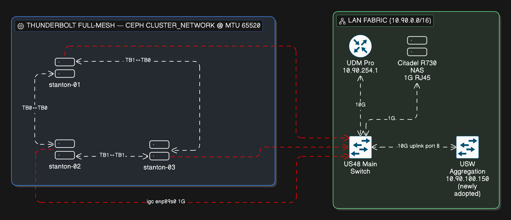
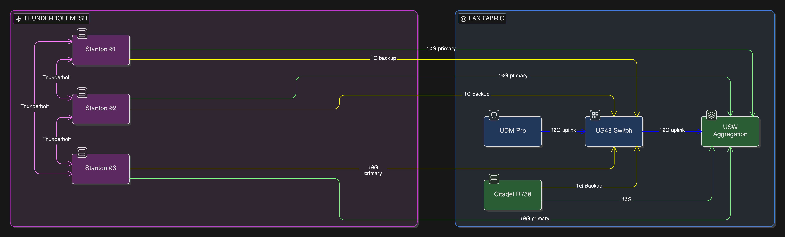

# Physical Connectivity Profile — V2 (Draft)

**Status**:
- **V2 connectivity (bond0 X710 primary + igc backup, Citadel SFP+):** *Draft for review. Cables on hand 2026-05-09 (6× 1m SFP+ DACs); no Talos config or physical cabling changes applied yet.*
- **Thunderbolt host_reset=0 fix:** *Applied 2026-05-05 at commit `413b3ccea` via custom factory.talos.dev schematic (NOT via modules-list — that path doesn't work on UKI Talos; see "Thunderbolt reliability fix" below for the corrected mechanism).*

**Purpose**: Document current physical connectivity and propose V2 migration that puts a 10G path between cluster nodes and the Citadel NAS without touching the Thunderbolt mesh that carries Ceph replication.

---

## TL;DR

- **Keep**: TB full-mesh as Ceph `cluster_network`.
- **Change**: Each stanton node's `bond0` gains an X710 SFP+ primary member pointing at the USW Aggregation. The existing `igc` (2.5G, negotiating 1G on US48) stays as an active-backup fallback.
- **Add**: Citadel (Dell R730) gains a 10G SFP+ NIC into the Aggregation.
- **Fix**: Apply `thunderbolt.host_reset=0` kernel arg to stop the USB4 host-router reset that wedges TB NICs after warm reboot (per onedr0p, 2026-04-25; well-known Proxmox MS-01 community fix).
- **Result**: 10G between nodes + NAS; 1G survival path if the Agg ever fails; TB mesh that comes back cleanly across reboots.

---

## Hardware Inventory

### Compute Nodes (MS-01, 3x Control Plane)

| Host | i40e SFP+0 (primary) | i40e SFP+1 (spare) | igc 2.5G (active) | igc 2.5G (spare) |
|------|----------------------|---------------------|-------------------|------------------|
| stanton-01 | `enp2s0f0np0` — `58:47:ca:76:16:cf` | `enp2s0f1np1` — `58:47:ca:76:16:d0` | `enp89s0` — `58:47:ca:76:16:d2` | `enp87s0` — `58:47:ca:76:16:d1` |
| stanton-02 | `enp2s0f0np0` — `58:47:ca:76:0b:fb` | `enp2s0f1np1` — `58:47:ca:76:0b:fc` | `enp89s0` — `58:47:ca:76:0b:fe` | `enp87s0` — `58:47:ca:76:0b:fd` |
| stanton-03 | `enp2s0f0np0` — `58:47:ca:76:0e:db` | `enp2s0f1np1` — `58:47:ca:76:0e:dc` | `enp89s0` — `58:47:ca:76:0e:de` | `enp87s0` — `58:47:ca:76:0e:dd` |

Each MS-01 also has 2x Thunderbolt 4 controllers used for the Ceph replication mesh.

### Storage Node

| Host | OS | Current NIC (stays as bond backup) | Proposed addition (bond primary) |
|------|-----|------------------------------------|----------------------------------|
| Citadel (Dell R730) | TrueNAS | On-board RJ45 1G → US48 | Intel X520-DA2 or X710-DA2, low-profile, PCIe 3.0 x8 — 10G DAC/fibre → Agg |

### Switches

| Device | Model code | Purpose | Notes |
|--------|------------|---------|-------|
| Dream Machine Pro | `UDMPRO` | Router, DNS, BGP peer | 10.90.254.1 |
| Main Switch | `US48` | Primary L2 backbone | 48x 1G + 4x SFP+ uplinks |
| PoE Switch | `US24P250` | PoE distribution | — |
| USW Aggregation | `USL8A` | 8x SFP+ 10G switch — NEW, adopted 2026-04-20 | 10.90.100.150, firmware 7.4.1 |
| USW Lite 8 / USW Flex Mini x2 | `USL8A`/`USMINI` | Edge/IoT | Not in scope |

---

## Current Topology (V1)




**Characteristics**:
- Single 1G management path per node (igc @ enp89s0). Second igc (enp87s0) and both X710 ports per node are **unused**.
- Ceph replication over TB, delivers ~20G per link. "Soft flakiness" on warm reboot (devices show authorized in `boltctl list` but the link doesn't come up — needs a physical replug) traced upstream to the USB4 host-router reset that the kernel performs during driver init. Mitigated by `thunderbolt.host_reset=0` (see "Thunderbolt reliability fix" below).
- Citadel on 1G; workload-to-NAS traffic (VolSync Kopia backups etc.) is a bottleneck.

---

## Proposed Topology (V2)

### Core idea

**Every 10G-connected host** (stanton-01/02/03 AND Citadel) becomes a **2-member active-backup** bond:

```
Stanton nodes — bond0 (active-backup):
  primary: X710 SFP+0 (enp2s0f0np0) → USW Aggregation @ 10G
  backup:  igc        (enp89s0)     → US48            @ 1G

Citadel (TrueNAS) — link aggregation, failover mode:
  primary: new X520/X710 SFP+ NIC   → USW Aggregation @ 10G
  backup:  on-board RJ45            → US48            @ 1G
```

All members land in the same broadcast domain (Agg trunks to US48). Same subnet `10.90.0.0/16`. Kernel/FreeBSD bonding handles MAC migration on failover via gratuitous ARP.



### Traffic outcomes

| Flow | Path | Speed |
|------|------|-------|
| Node ↔ Node (Ceph cluster_network / replication) | TB mesh | ~20G per link |
| Node ↔ Node (Ceph public_network, pod↔pod, apiserver) | Agg | 10G |
| Node ↔ Citadel (NFS, VolSync backups, Kopia) | Agg | 10G |
| Node ↔ LAN (UDM, clients, printers) | Agg → US48 uplink | 10G shared uplink |
| Node ↔ internet (egress) | Agg → US48 → UDM | 10G shared |
| **If Agg dies**: any of the above except TB | Stanton igc → US48, Citadel on-board → US48 | 1G each side |
| **If a single SFP+/DAC dies on one host**: | that host's bond fails over to 1G backup; others unaffected | 1G for the affected host only |

### USW Aggregation port allocation

| Port | Use | Member | Notes |
|------|-----|--------|-------|
| 1 | stanton-01 primary | X710 SFP+0 (`58:47:ca:76:16:cf`) | DAC or fibre |
| 2 | stanton-02 primary | X710 SFP+0 (`58:47:ca:76:0b:fb`) | DAC or fibre |
| 3 | stanton-03 primary | X710 SFP+0 (`58:47:ca:76:0e:db`) | DAC or fibre |
| 4 | Citadel | New SFP+ card | DAC preferred (skip 10G-T) |
| 5 | — | reserved | future LAG expansion (X710 SFP+1) |
| 6 | — | reserved | future |
| 7 | — | reserved | future |
| 8 | Uplink to US48 | existing | 10G, keep as-is |

**Switch config**: standard LAN port profile (native VLAN = default), MTU 1500. No LAG, no tagging. Jumbo frames would need switch-wide enable on Agg AND US48 to benefit — not proposed here.

---

## Talos Patch Draft (not applied)

Replace the existing `bond0` block on each stanton node in `kubernetes/bootstrap/talos/talconfig.yaml` (lines 30-45 for stanton-01; 87-102 for stanton-02; 144-159 for stanton-03).

### stanton-01

```yaml
- interface: bond0
  bond:
    mode: active-backup
    miimon: 100
    deviceSelectors:
      - driver: i40e
        hardwareAddr: "58:47:ca:76:16:cf"   # X710 SFP+0 → Agg port 1 (primary)
      - driver: igc
        hardwareAddr: "58:47:ca:76:16:d2"   # enp89s0 → US48 (backup, existing)
  dhcp: false
  addresses:
    - "10.90.3.101/16"
  routes:
    - network: 0.0.0.0/0
      gateway: "10.90.254.1"
  mtu: 1500
  vip:
    ip: "10.90.3.100"
```

### stanton-02

```yaml
- interface: bond0
  bond:
    mode: active-backup
    miimon: 100
    deviceSelectors:
      - driver: i40e
        hardwareAddr: "58:47:ca:76:0b:fb"   # X710 SFP+0 → Agg port 2 (primary)
      - driver: igc
        hardwareAddr: "58:47:ca:76:0b:fe"   # enp89s0 → US48 (backup)
  dhcp: false
  addresses:
    - "10.90.3.102/16"
  routes:
    - network: 0.0.0.0/0
      gateway: "10.90.254.1"
  mtu: 1500
  vip:
    ip: "10.90.3.100"
```

### stanton-03

```yaml
- interface: bond0
  bond:
    mode: active-backup
    miimon: 100
    deviceSelectors:
      - driver: i40e
        hardwareAddr: "58:47:ca:76:0e:db"   # X710 SFP+0 → Agg port 3 (primary)
      - driver: igc
        hardwareAddr: "58:47:ca:76:0e:de"   # enp89s0 → US48 (backup)
  dhcp: false
  addresses:
    - "10.90.3.103/16"
  routes:
    - network: 0.0.0.0/0
      gateway: "10.90.254.1"
  mtu: 1500
  vip:
    ip: "10.90.3.100"
```

**Notes on the bond config**:
- First `deviceSelector` in the list becomes primary under Talos/kernel ordering. X710 listed first.
- `miimon: 100` = link-state check every 100ms. Good general default.
- No explicit `primary:` field needed; if future behaviour shifts, add `primary: enp2s0f0np0` (MS-01 hostnames are deterministic).
- Thunderbolt and VIP blocks below bond0 in each node stanza are **unchanged**.

### Citadel (TrueNAS) side

Configured through the TrueNAS web UI — not GitOps. Record the steps here for parity:

1. Install the new SFP+ NIC (X520-DA2 or X710-DA2) with Citadel powered down. Boot.
2. **Network → Interfaces**: confirm new interface (e.g. `ix0`) appears at 10G once cabled to Agg.
3. **Network → Interfaces → Add → Link Aggregation**:
   - Type: `Failover`
   - Member interfaces: `<new SFP+ iface>` (primary), `<on-board RJ45 iface>` (backup)
   - Assign Citadel's existing LAN IP to the `lagg0` interface (not to the members).
4. Remove the standalone IP config from the previous RJ45-only interface (it moves to the lagg).
5. Verify after apply: `ping` Citadel continuously while you physically unplug the 10G DAC — failover to RJ45 should be sub-second.

**Note**: TrueNAS SCALE (Debian) supports `lagg0` via `bonding`; CORE (FreeBSD) via `lagg(4)`. Failover mode works on both; active-backup semantics are equivalent.

---

## Thunderbolt reliability fix (kernel arg)

**Status**: **Applied 2026-05-05 at commit `413b3ccea` ("feat(talos): bake thunderbolt.host_reset=0 into stanton schematic")**. Verified live: all 3 stanton nodes show `host_reset=N` at runtime and `thunderbolt.host_reset=0` on `/proc/cmdline`.

**What**: pass `host_reset=0` to the in-tree `thunderbolt` kernel module so the USB4 host router is **not** reset during driver init.

**Why**: kernel default is `host_reset=true` (`drivers/thunderbolt/nhi.c`). On MS-01-class hardware that reset is what wedges TB NIC adapters across warm reboots — the device re-authorizes but link never comes up, requiring a physical cable replug. This is the community-accepted fix on Proxmox MS-01 + TB-ring + Ceph clusters.

**Origin** (verbatim, onedr0p, 2026-04-25): *"I had to add that to my kernel args so my 10Gb thunderbolt NIC adapters worked without problems. Maybe it helps you too, and if it does nice to know there is a fix for the ceph TB ring problems."*

### What we tried first (and why both didn't work)

The original V1 of this section proposed two paths:

```yaml
# Approach 1 — modules-list parameters (TRIED, DID NOT WORK)
machine:
  kernel:
    modules:
      - name: thunderbolt
        parameters:
          - host_reset=0
      - name: thunderbolt_net

# Approach 2 — extraKernelArgs fallback (TRIED, REJECTED BY TALHELPER)
machine:
  install:
    extraKernelArgs:
      - thunderbolt.host_reset=0
```

- **Modules-list parameters didn't take effect.** Talos has no `/etc/modprobe.d` and the `thunderbolt` module loads from the initramfs before any modprobe.d-equivalent mechanism is consulted. After applying with `--mode=reboot`, `/sys/module/thunderbolt/parameters/host_reset` still read `Y`.
- **`machine.install.extraKernelArgs` was rejected by talhelper:** `error: install.extraKernelArgs and install.grubUseUKICmdline can't be used together`. Talos uses UKI (Unified Kernel Image) with `grubUseUKICmdline: true` by default, which bakes the cmdline into the signed UKI binary — `extraKernelArgs` only works with grub-style boot, not UKI.

### What actually worked

Bake `thunderbolt.host_reset=0` into a custom **factory.talos.dev schematic** and update `talosImageURL` for each control-plane node. The schematic builds a UKI with our extra arg appended to the existing kernel cmdline.

**Procedure (verified 2026-05-05):**

```bash
# 1. Fetch existing schematic to preserve all current kernel args + extensions
curl -s https://factory.talos.dev/schematics/d009fe7b4f1bcd11a45d6ffd17e59921b0a33bc437eebb53cffb9a5b3b9e2992 \
  > /tmp/current-schematic.yaml

# 2. Edit /tmp/new-schematic.yaml — append thunderbolt.host_reset=0 to extraKernelArgs.
#    Preserve every existing arg + extension; do NOT regenerate from scratch.

# 3. POST the new schematic to get a new ID
curl -sX POST --data-binary @/tmp/new-schematic.yaml https://factory.talos.dev/schematics
# Returns: {"id":"786a10aa2924e5caf00392a569de037cec138416143517e618d151b8176af7f3"}

# 4. Update the 3 stanton talosImageURL entries in talconfig.yaml (pyro keeps its own NVIDIA schematic)
sed -i "s|d009fe7b4f1bcd11a45d6ffd17e59921b0a33bc437eebb53cffb9a5b3b9e2992|786a10aa2924e5caf00392a569de037cec138416143517e618d151b8176af7f3|g" \
  kubernetes/bootstrap/talos/talconfig.yaml

# 5. Regenerate clusterconfig
cd kubernetes/bootstrap/talos
talhelper genconfig

# 6. Per-node: apply-config (stages new install.image), then upgrade (re-bakes UKI with new cmdline)
kubectl -n rook-ceph exec deploy/rook-ceph-tools -- ceph osd set noout
talosctl apply-config --nodes 10.90.3.103 --file clusterconfig/home-kubernetes-stanton-03.yaml
talosctl --nodes 10.90.3.103 upgrade \
  --image=factory.talos.dev/metal-installer/786a10aa2924e5caf00392a569de037cec138416143517e618d151b8176af7f3:v1.12.6 \
  --wait=true --timeout=15m --preserve=true
# repeat for stanton-01, then stanton-02; unset noout at end.
```

The `talosctl apply-config` alone is **not enough** — it stages the new `install.image` but the running OS keeps the existing UKI until `talosctl upgrade` re-runs the installer.

### Verification

```bash
# host_reset took effect (runtime)
talosctl --nodes <ip> read /sys/module/thunderbolt/parameters/host_reset
# expected output: N

# kernel cmdline contains the arg (UKI)
talosctl --nodes <ip> read /proc/cmdline | tr ' ' '\n' | grep host_reset
# expected output: thunderbolt.host_reset=0

# TB ring formed cleanly — each stanton node should show 2x 169.254.255.x addresses
talosctl --nodes <ip> get addresses | grep 169.254
```

### What the fix did and didn't fix

**Fixed:** boot-init enumeration. New-UKI nodes booted cleanly with both TB ports enumerated. The "second TB port doesn't come up after warm reboot" failure mode is gone for nodes on the new schematic.

**Did NOT fix:** runtime peer-disconnect wedges. During the rolling upgrade itself, when one node rebooted, the *running* TB stack on the other nodes (which had loaded the driver before the kernel arg was active) hit `failed request link state change, aborting` on the lost-peer port and stayed wedged. Required manual cable hot-plug to recover. Once all 3 nodes were on the new schematic, the issue stopped recurring. Plan for one cable-replug per peer-reboot during any future maintenance, until/unless this regression resolves at the kernel level.

### Side effects observed

- `nvme nvme1: using unchecked data buffer` warning appeared once on stanton-02 post-upgrade. Single occurrence, no functional impact, attributed to NVMe driver quirk on UKI rebake. Documented for future reference.
- Talos OS jumped from v1.12.3 → v1.12.6 as a free upgrade (the new schematic only ships a v1.12.6 installer). All 3 stantons now on v1.12.6; pyro still on v1.12.3.

---

## Migration Plan

**Pre-reqs** (buy/stage first):
1. 3x SFP+ DACs (or fibre + transceivers) for stanton ↔ Agg — 1m–3m each.
2. 1x dual-port SFP+ NIC for Citadel — **Intel X520-DA2** (cheap used, ~$30–50) or **X710-DA2** (newer, ~$80–150).
3. 1x DAC for Citadel ↔ Agg.

**Cutover strategy — one node at a time** to keep quorum intact:

1. Cable stanton-01 X710 SFP+0 → Agg port 1 (link will come up, no traffic yet).
2. Edit `talconfig.yaml` for stanton-01 only — update the bond0 stanza to add the X710 deviceSelector as primary, keep igc as backup (see "Talos Patch Draft" above).
3. Re-render: `cd kubernetes/bootstrap/talos && talhelper genconfig`. Diff vs live config to confirm only bond0 changed: `talosctl apply-config --nodes 10.90.3.101 --file clusterconfig/home-kubernetes-stanton-01.yaml --dry-run`.
4. Apply for real (no `--dry-run`). Talos will reboot the node automatically because `machine.network.interfaces` changes are reboot-required. Wait for `talosctl --nodes 10.90.3.101 health --wait-timeout=10m --server=false`.
5. Verify:
   - `talosctl -n 10.90.3.101 get links` shows bond0 with both members, X710 active.
   - `kubectl get node stanton-01` Ready.
   - `ceph -s` shows mon.a healthy.
6. Physically unplug the X710 DAC on stanton-01 briefly to verify failover to igc. Re-plug. Confirm no traffic interruption beyond the failover window (~1s).
7. Repeat for stanton-02 and stanton-03, one at a time, waiting for Ceph HEALTH_OK between each.

**There is no `task talos:apply-config` task in this repo** — the workflow is `talhelper genconfig` to render per-node configs into `clusterconfig/`, then `talosctl apply-config --nodes <ip> --file <rendered-file>` per node. See `~/.claude/projects/-home-gavin-home-ops/memory/reference_talos_config_workflow.md` for the full procedure.

**Citadel** can go in any order — it's not in the control plane. Install the new NIC, cable to Agg port 4, configure a `lagg0` in TrueNAS (see "Citadel (TrueNAS) side" above), move the existing LAN IP onto `lagg0`.

**Total downtime**: none if done sequentially. Each node takes ~5 minutes end-to-end.

---

## Rollback

If the patch misbehaves on a given node:

1. Talos node still has its previous machine config accessible on disk.
2. Physical fallback: the igc path is already wired to US48. If the X710 path is broken, the bond fails over automatically — you stay reachable.
3. Worst case: `talosctl -n <node> reset --graceful=false` and re-apply the pre-V2 config from git (revert the commit).

The TB mesh is completely untouched — Ceph replication continues regardless.

---

## Open Decisions (need user confirmation)

1. **Keep igc as backup vs. drop entirely.** Draft assumes **keep** for switch-level redundancy. If you want pure 10G per node, I'll remove the igc selector. *Trade-off*: a failed DAC/Agg port = offline node with no remote recovery.
2. **MTU 1500 vs jumbo (9000).** Draft uses 1500 (matches current). Jumbo needs switch-wide enable on both Agg and US48; benefit is small at home scale, and backup path at 1G tolerates 1500 better.
3. **Citadel NIC choice**: X520-DA2 (cheap) vs X710-DA2 (consistent with MS-01s). User decides.

---

## Evidence

| Claim | Source | Confidence |
|-------|--------|------------|
| Current bond0 is single-member igc active-backup | [`kubernetes/bootstrap/talos/talconfig.yaml:31-45`](../../kubernetes/bootstrap/talos/talconfig.yaml#L31) | Verified from repo |
| X710 and igc MACs per node | `talosctl get links` output 2026-04-20 | Verified live |
| USW Aggregation adopted 2026-04-20 at 10.90.100.150 | UDM Pro mongo `db.device.find` | Verified |
| TB mesh config unchanged in this proposal | [`talconfig.yaml:61-78, 118-135, 175-192`](../../kubernetes/bootstrap/talos/talconfig.yaml#L61) | Proposal scope |
| Ceph quorum flap 2026-04-20 was NVMe, not TB | `talosctl dmesg` forensics (not network) | Verified via subagent |
| `thunderbolt.host_reset` defaults to `true` and is `0444` (read-only after load) | [`drivers/thunderbolt/nhi.c`](https://github.com/torvalds/linux/blob/master/drivers/thunderbolt/nhi.c) — `MODULE_PARM_DESC(host_reset, "reset USB4 host router (default: true)")` | Verified upstream |
| TB-after-reboot fix is `thunderbolt.host_reset=false` on MS-01 / NUC13 + TB SFP+ NICs | [Proxmox forum thread](https://forum.proxmox.com/threads/thunderbolt-connected-adapter-not-active-after-reboot-shutdown.168553/), kernel 6.8.12-11-pve | Verified via independent report |
| All four nodes ran kernel 6.18.8-talos with no `thunderbolt.host_reset` arg in `/proc/cmdline` | `talosctl -n 10.90.3.101 read /proc/cmdline` 2026-04-25 | Verified live (pre-fix) |
| 3× stanton nodes now run kernel 6.18.18-talos (Talos v1.12.6) with `thunderbolt.host_reset=0` baked into UKI cmdline | `talosctl --nodes <ip> read /proc/cmdline` 2026-05-05 | Verified live (post-fix) |
| `machine.kernel.modules.parameters` doesn't reach early-loaded modules on UKI Talos; `extraKernelArgs` mutex with `grubUseUKICmdline: true` | Direct test 2026-05-05: applied modules-list, observed `host_reset=Y` runtime; talhelper rejected extraKernelArgs with explicit error | Verified live |
| Custom factory.talos.dev schematic is the working path for kernel cmdline args on Talos UKI | Schematic POST → new ID `786a10aa...` → `talosctl upgrade --image=...` re-bakes UKI with new cmdline | Verified 2026-05-05 |
