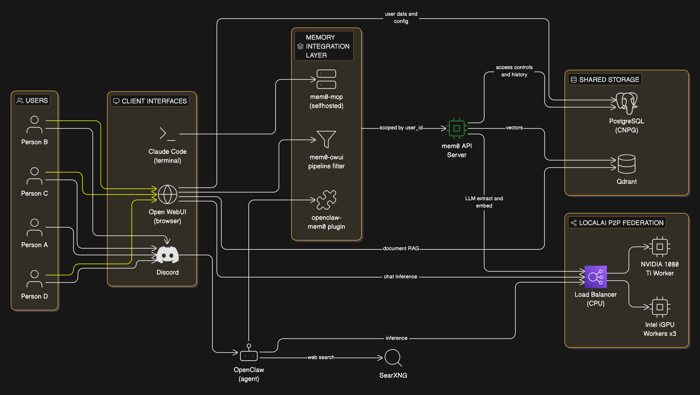

# Cortex Stack Architecture

## Overview

mem0 serves as the universal memory layer across all client interfaces (Discord, Open WebUI, Claude Code), with user_id scoping ensuring per-person memory isolation. All inference routes through LocalAI's P2P federated cluster.

## Architecture Diagram

*Green = mem0 (central connective tissue across all interfaces)*

## Components

| Component | Role | K8s Namespace |
|-----------|------|---------------|
| LocalAI (LB + Workers) | Inference engine, P2P federated | cortex |
| Qdrant | Vector storage for mem0 memories and Open WebUI RAG | cortex |
| mem0 | Universal memory layer, fact extraction and retrieval | cortex |
| OpenClaw | Discord agent, uses openclaw-mem0 plugin | cortex |
| Open WebUI | Browser chat UI, mem0-owui pipeline filter | cortex |
| SearXNG | Web search for agent queries | cortex |
| Claude Code | CLI agent on local PC, mem0-mcp via MCP | N/A (local) |

## Deploy Order

1. LocalAI (inference engine — manifests exist)
2. Qdrant (vector DB — Helm repo registered, needs HelmRelease)
3. SearXNG (web search)
4. mem0 (memory layer — new app-template deployment)
5. OpenClaw (agent — rewire to LocalAI, add mem0 plugin)
6. Open WebUI (chat UI — connects to LocalAI + Qdrant + mem0 pipeline)

## Memory Scoping

All mem0 operations are scoped by `user_id`. A single Qdrant instance hosts separate collections for:
- **mem0 memories**: Extracted facts from conversations (shared across interfaces per user)
- **Open WebUI RAG**: Uploaded documents and knowledge bases

Cross-interface memory sharing means a fact learned via Discord is available in Open WebUI and Claude Code for the same user.
