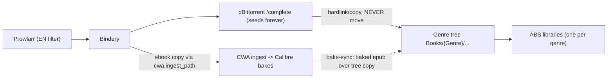

# Nerdz Reading Stack

The family ebook + audiobook platform: four services around one NFS folder tree. **Bindery** acquires, **qBittorrent** downloads and seeds forever, **CWA/Calibre** is the metadata workbench, **Audiobookshelf (ABS)** serves readers/listeners (13+ per-genre libraries, multi-user incl. children with restricted library access). The disk tree — not any app database — is the integration contract: every service reads or writes `Books/{Genre}/{Author}/{Series}/{NN - Title}/` and they compose only because they all respect that shape.

**Working docs, scripts, decision history**: `G:\code\Projects\nerdz-reading` (see `docs/download-workflow-design.md`, `docs/abs-bindery-room-migration.md`). This file is the cluster-side gestalt; that repo holds the depth.

## Components

| Service | Role | Namespace | Manifest |
|---|---|---|---|
| Bindery | Acquisition + organizer (Readarr replacement; dual ebook/audiobook) | downloads | [bindery](../../kubernetes/apps/downloads/bindery/) |
| Prowlarr | Indexer proxy; MAM indexers carry the English-only filter (`searchLanguages=[1]`) | downloads | [prowlarr](../../kubernetes/apps/downloads/prowlarr/) |
| qBittorrent | Download client; seeds from `/media/Downloads/qbittorrent/complete/` indefinitely | downloads | [qbittorrent](../../kubernetes/apps/downloads/qbittorrent/) |
| tqm | Torrent cleanup CronJob — flat 30-day-minimum seed rule for ALL trackers | downloads | [tqm](../../kubernetes/apps/downloads/tqm/) |
| CWA (calibre-web-automated) | Calibre library of record + ingest watcher + metadata-baking tool. Sees ONLY `.calibre/ingest` + `.calibre/library`, never the genre tree | home | [calibre-web-automated](../../kubernetes/apps/home/calibre-web-automated/) |
| Audiobookshelf | Reader/listener serving layer; one library per genre folder; kids' accounts restricted to fixed library lists | entertainment | [audiobookshelf](../../kubernetes/apps/entertainment/audiobookshelf/) |

## Key Concepts

### Capsule: TwoLayerMetadata

**Invariant**
A book's metadata lives in two independent layers: the catalog sidecar (`metadata.json` + `cover.jpg`, read by ABS) and the file-embedded layer (OPF inside the epub, tags inside the m4b, rendered by the actual reader/player).

**Example**
Fixing a cover in ABS edits only the sidecar — opening the epub still shows the old cover, because ABS cannot write inside book files.
//BOUNDARY: Never propose "fix it in ABS only". Only Calibre (`ebook-meta`) / an m4b tagger can fix the file layer, and doing so REWRITES the file.

**Depth**
- Sidecar schema: `{title,subtitle,authors[],narrators[],series["Name #seq"],genres[],tags[],publishedYear,publisher,description,isbn,asin,language,explicit,abridged}`
- `genres` = the curated 12-genre set (drives folders + ABS dropdown); `tags` = richer scraped arrays (Hardcover)
- Workflow is FIX-FIRST: correct metadata in calibre-web (Calibre bakes it into the file), then bake-sync the corrected epub over the genre-tree copy + regen sidecar + ABS rescan

### Capsule: HardlinkEconomy

**Invariant**
Library placement must hardlink or copy, never move; any tool that rewrites a file mints a new inode and silently divorces the library copy from the seeding copy.

**Example**
An m4b hardlinked from `/complete` into the genre tree stays one file (nlink=2, zero duplicate bytes). The same epub imported into Calibre becomes a second, different file — Calibre re-zips to bake `metadata.opf`.
//BOUNDARY: Hit-and-run penalties on the private tracker (MAM) are the stakes: a moved or deleted `/complete` file kills the seed. Library-side deletion is always safe.

**Depth**
- Ebooks therefore exist as 2-3 copies (seed, Calibre-baked, genre-tree); audiobooks as 1 hardlinked file
- tqm enforces 30-day-minimum seeding before any automated removal, all trackers
- MAM 429 cooldowns COMPOUND: retrying a disabled indexer extends the ban ~24h per attempt — wait out the stated expiry, then probe with ONE search

### Capsule: GenreTree

**Invariant**
Folders encode only single-valued facts — `{Genre}/{Author}/{Series}/{NN - Title}/`; everything multi-valued (extra genres, multi-series, tags) lives in metadata, never in paths.

**Example**
`Books/Romantasy/Carissa Broadbent/The War of Lost Hearts/01 - Daughter of the Serpent/` — one ABS library per top-level genre folder; genre is set in Bindery at the SERIES level and drives its `{Genre}` naming token.
//BOUNDARY: Never run a global Bindery reorganize-apply — existing books carry stale genres and a library-wide apply reshuffles everything. Templates are for NEW grabs.

**Depth**
- Audiobook layout is state-dependent: dual-format = ebook at title root + audio in `Audiobook/` subfolder (one ABS item, Read+Listen); audio-ONLY = audio at title root (sidecars alone do not anchor an ABS item); dramatized = own sibling folder `NN - Title (Dramatized Adaptation)/`
- When the ebook later arrives for an audio-only book, nest the audio into `Audiobook/`
- Bindery naming templates are cached at pod boot — restart the pod after changing them

### Capsule: SeedSafetyGates

**Invariant**
Grabbing is manual and user-triggered; every automation that can fetch or delete is fenced off by an explicit gate.

**Example**
`autoGrab.enabled=false` (Bindery setting) keeps ~2k monitored+wanted books from mass-grabbing the moment a download client is enabled.
//BOUNDARY: The kill-switch is read ONCE when Bindery's 12h wanted-sweep starts — after setting it, restart the Bindery pod before enabling any client, or an in-flight sweep will still grab.

**Depth**
- Authors/series are added unmonitored by default; grabs go through the Wanted page or `POST /api/v1/wanted/bulk {ids,action:'search'}` (paced, bounded)
- English-only lives on the Prowlarr MAM indexers (`searchLanguages=[1]`) — without it, loose title matches grab foreign editions
- Dual-format grab gotchas (upstream Bindery issues): audiobook import into an existing ebook folder collides → `Title (2)/` needs manual consolidation; last import wins on `mediaType` → restore with `PUT /api/v1/book/{id} {"mediaType":"both"}`

## mp3→m4b Conversion

ABS's built-in encoder (`POST /api/tools/item/{id}/encode-m4b`) driven by a sequential, resumable script — one encode at a time, then poll tasks. Rules learned the hard way:

1. **Verify on DISK, never from the API** — success = exactly 1 `.m4b` and 0 `.mp3/.m4a` in the folder; the item record lags right after an encode.
2. **Purge `/config/metadata/cache/items/{id}` per verified book** — ABS stashes originals there (safety net) and batch scale fills the config PVC.
3. **Sequential everything** — parallel encodes or library scans OOMKill the ABS container; scan libraries one at a time.
4. Encoder output lands at the title-folder root; dual-format books need the m4b filed into `Audiobook/` afterward, then rescan.

## Constraints That Shape Everything

- ABS never moves files and cannot embed metadata into them; it renders what the disk + sidecar say.
- CWA cannot see the genre tree — the bake-sync copy step is the only bridge from Calibre-fixed files back to the tree.
- Kids' ABS accounts have fixed library lists; new genre libraries are invisible to them unless explicitly granted (used deliberately for age-gating, e.g. Romantasy).
- Cluster changes go through this repo (Git → Flux PR), never live kubectl edits.

## Keeping This Evergreen

This file is the **canonical cross-session context** for the reading stack. Rules:

1. **Update this doc in the same change** that alters pipeline behavior (naming templates, new services, layout conventions, safety gates). A stale gestalt misleads every future session.
2. Depth lives in `G:\code\Projects\nerdz-reading` (designs, runbooks, scripts, incident history) — link it, don't duplicate it. If detail here starts growing, move it there and leave a pointer.
3. Session-scoped state (batch progress, cooldown timers, port-forwards) never belongs here — that goes in the project repo's session journal/memory.
4. If you (an AI session) discover this doc contradicts observed cluster reality, treat reality as truth, verify, and fix the doc — don't silently work around it.
