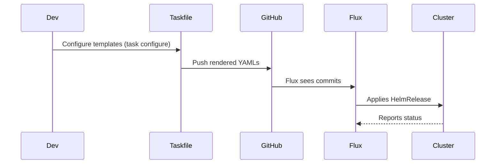

# Homelab Workflows

## Deploying a new HelmRelease-based app
### Overview
Bring up new functionality by adding a HelmRelease to `kubernetes/apps/<namespace>/app` and wiring it into the area's `kustomization`.

### Flow Diagram

### Steps
1. **Create area folder** – add `kustomization.yaml`, `app/helmrelease.yaml`, and optional `externalsecret.yaml`.
2. **Pin chart/tag** – choose Helm chart/image tags and configure env placeholders (`${SECRET_DOMAIN}`, `${DB_URI}`) and any storage sections (`persistence`).
3. **Render templates** – run `task configure` to produce the Flux-ready YAML under `kubernetes/apps/<namespace>/app`.
4. **Validate and push** – run `task kubernetes:kubeconform` and `flux diff kustomization <namespace>`, then open a PR.
5. **Monitor Flux** – after merge, `flux get helmrelease <name>` should reach `Ready`; address errors via `flux logs`.

### Error Handling
| Step | Failure Mode | Response | Recovery |
|------|--------------|----------|----------|
| 3 | Template rendering fails | `task configure` exits with missing placeholder | Add the variable to `bootstrap/config.yaml` or document it in `TEMPLATE_GUIDE.md`. |
| 4 | HelmRelease stuck in `Reconciling` | Chart values invalid or secrets missing | Check `flux logs` and ensure ExternalSecrets exist/refreshed. |
| 5 | Storage not bound | PVC/NFS missing | Create PVC `romm-data` or adjust `media` section before rerunning `flux diff`. |

## Rolling updates via Taskfile
### Overview
Use Taskfile commands to rerender configs, validate them, and keep Talos/Flux aligned.

### Steps
1. Update config sources (`bootstrap/`, `scripts/`, or `makejinja.toml`).
2. Run `task configure` → `task kubernetes:kubeconform` to validate.
3. Inspect diffs with `flux diff kustomization <namespace>`.
4. Merge the PR, then watch Flux (`flux get helmrelease` / `flux get kustomizations`).

### Code Entry Points
- `Taskfile.yaml` organizes the tasks.
- `scripts/` and `bootstrap/` provide helper scripts used during rendering.
- `kubernetes/apps/*/app/*.yaml` hold the rendered HelmRelease values.

## Evidence
| Claim | Source | Confidence | Details |
|-------|:------:|:----------:|---------|
| Taskfile orchestrates rendering | `Taskfile.yaml` | 🟢 | Task definitions include `.template`, `.validate`, `kubernetes:kubeconform`. |
| HelmRelease storage pattern documented | `kubernetes/apps/games/romm/app/helmrelease.yaml:102-140` | 🟢 | Complex `persistence` sections illustrate mount expectations. |
