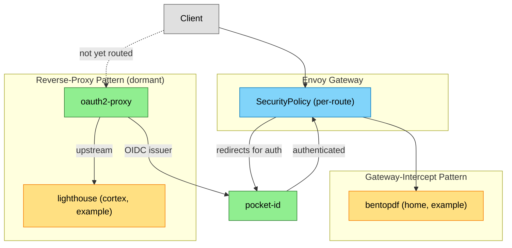

# Authentication & Identity — Context

<!-- generated:start section=apps -->
## Apps

| App | Namespace | Source | Route | Storage | Backup | Secrets | DependsOn |
|---|---|---|---|---|---|---|---|
| [oauth2-proxy](../../../kubernetes/apps/security/oauth2-proxy) | security | app-template / quay.io/oauth2-proxy/oauth2-proxy | none | none | none | onepassword-connect | none |
| [pocket-id](../../../kubernetes/apps/security/pocket-id) | security | app-template / ghcr.io/pocket-id/pocket-id | id.${SECRET_DOMAIN} · external + internal (dual-homed) | ceph-block 1Gi | VolSync | onepassword-connect | rook-ceph/cluster-apps-rook-ceph, storage/volsync |
<!-- generated:end -->

<!-- generated:start section=dataflow -->
## Data Flow

<!-- generated:end -->

<!-- generated:start section=integration -->
## Integration Points

- downloads (inbound): [dashbrr](../../../kubernetes/apps/downloads/dashbrr) and [qui](../../../kubernetes/apps/downloads/qui) authenticate against pocket-id (`OIDC_ISSUER`/`QUI__OIDC_ISSUER` env pointing at `id.${SECRET_DOMAIN}`) per their ExternalSecret templates (see [downloads domain](../downloads/context.md)).
- observability (inbound): [grafana](../../../kubernetes/apps/observability/grafana) authenticates against pocket-id via generic OAuth (`auth_url`/`token_url`/`api_url` pointing at `id.${SECRET_DOMAIN}`) per its HelmRelease (see [observability domain](../observability/context.md)).
- reading (inbound): [bookorbit](../../../kubernetes/apps/entertainment/bookorbit) enables OIDC login against pocket-id (`OIDC_ALLOW_LOCAL_ISSUERS` lets pocket-id's internal-gateway issuer through the SSRF guard) per its HelmRelease env (see [reading domain](../reading/context.md)).
- reading (inbound): [shelfmark](../../../kubernetes/apps/downloads/shelfmark) authenticates via pocket-id OIDC (`OIDC_DISCOVERY_URL` points at `id.${SECRET_DOMAIN}`) per its HelmRelease env (see [reading domain](../reading/context.md)).
<!-- generated:end -->

<!-- curated -->
## Capsules

### EnvoyOIDC

Envoy Gateway's `SecurityPolicy` resource intercepts requests at the gateway, redirects unauthenticated clients to pocket-id, and only forwards authenticated requests to the backend. This gives apps with no native authentication (e.g. bentopdf) SSO for free — the pattern needs an `EndpointSlice` pointing at `pocket-id.security.svc.cluster.local:1411`, a `SecurityPolicy`, an `ExternalSecret` for client credentials, and a `ReferenceGrant` letting the consuming namespace's `SecurityPolicy` reference the `pocket-id` Service cross-namespace. See `docs/ai-context/NETWORKING.md`'s OIDC Authentication section for the full bentopdf example.
<!-- seeded: review -->

### tsidp + Tailscale SSO Guide Is Not Deployed

`docs/Guides/Security/Pocket ID + Tailscale SSO/README.md` walks through pairing pocket-id with Tailscale's `tsidp` bridge for Tailnet-wide SSO, but it is a generic, domain-agnostic tutorial (placeholder hostnames like `yourdomain.com`, pocket-id image pinned to `v1.16.0` against Postgres 17) rather than a description of this cluster. No `kubernetes/apps/security/tsidp/` directory exists, and the live pocket-id deployment runs `v2.11.0` against `postgres18-cluster`. Treat this guide as reference material for a possible future pattern, not current state.
<!-- seeded: review -->

<!-- Add capsules per docs/ai-context/writing-capsules.md. Skill never edits below. -->
<!-- /curated -->
