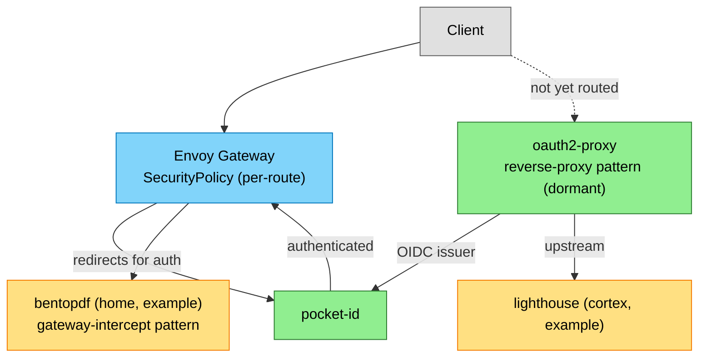

# Authentication & Identity

<!-- generated:start section=summary -->
The Authentication & Identity domain runs 2 apps across the security namespace.

## Components

| App | What it does | UI |
|---|---|---|
| oauth2-proxy | Reverse-proxy auth gate that authenticates against pocket-id and forwards identity headers to an upstream; currently dormant pending the lighthouse cutover | internal (no route yet) |
| pocket-id | Self-hosted OIDC identity provider — issues SSO logins consumed across the cluster | https://id.${SECRET_DOMAIN} |
<!-- generated:end -->

<!-- generated:start section=dataflow -->
## How It Fits Together

<!-- generated:end -->

<!-- curated -->
## Operating Notes

pocket-id is dual-homed (both the external and internal gateways) — one of the few apps allowed to break the internal-or-external rule, since both LAN clients and Cloudflare-facing clients need to reach the same login page. Most other apps get OIDC "for free" through Envoy Gateway's `SecurityPolicy` pattern rather than talking to pocket-id directly; see the EnvoyOIDC capsule in [context.md](context.md).
<!-- seeded: review -->

<!-- Human-authored: family workflows, runbook pointers, quirks. Skill never edits below. -->
<!-- /curated -->

## Related

- [Context (LLM)](context.md) · [Decisions](decisions.md)
