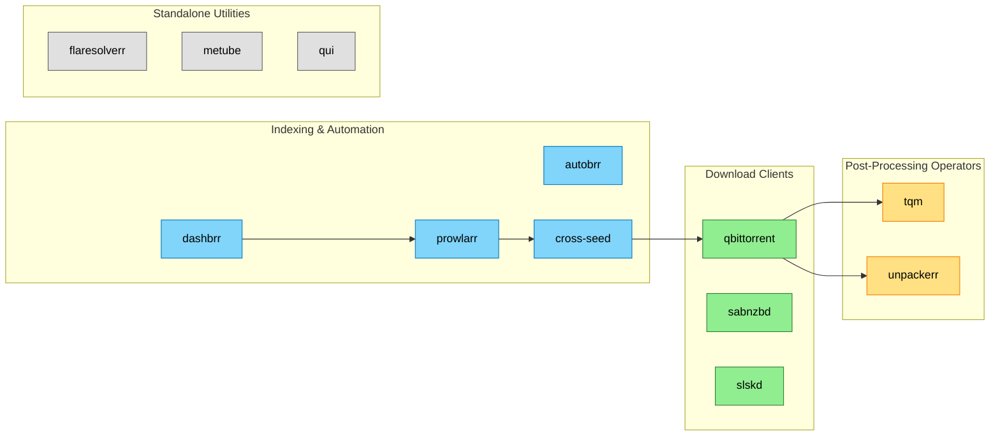

# Downloads Infrastructure — Context

<!-- generated:start section=apps -->
## Apps

| App | Namespace | Source | Route | Storage | Backup | Secrets | DependsOn |
|---|---|---|---|---|---|---|---|
| [autobrr](../../../kubernetes/apps/downloads/autobrr) | downloads | app-template / ghcr.io/autobrr/autobrr | autobrr.${SECRET_DOMAIN} · internal | none | none | onepassword-connect | database/cloudnative-pg-postgres18-cluster, external-secrets/external-secrets-stores |
| [cross-seed](../../../kubernetes/apps/downloads/cross-seed) | downloads | app-template / ghcr.io/cross-seed/cross-seed | none | ceph-block 5Gi | none | onepassword-connect | rook-ceph/cluster-apps-rook-ceph-cluster |
| [dashbrr](../../../kubernetes/apps/downloads/dashbrr) | downloads | app-template / ghcr.io/autobrr/dashbrr | dashbrr.${SECRET_DOMAIN} · internal | none | none | onepassword-connect | database/cloudnative-pg-postgres18-cluster, external-secrets/external-secrets-stores |
| [flaresolverr](../../../kubernetes/apps/downloads/flaresolverr) | downloads | app-template / ghcr.io/flaresolverr/flaresolverr | none | none | none | none | none |
| [metube](../../../kubernetes/apps/downloads/metube) | downloads | app-template / ghcr.io/alexta69/metube | metube.${SECRET_DOMAIN} · internal | ceph-block 2Gi | VolSync | none | storage/volsync |
| [prowlarr](../../../kubernetes/apps/downloads/prowlarr) | downloads | app-template / ghcr.io/home-operations/prowlarr | prowlarr.${SECRET_DOMAIN} · internal | none | none | onepassword-connect | database/cloudnative-pg-postgres18-cluster, external-secrets/external-secrets-stores |
| [qbittorrent](../../../kubernetes/apps/downloads/qbittorrent) | downloads | app-template / ghcr.io/home-operations/qbittorrent | qb.${SECRET_DOMAIN} · internal | ceph-block 2Gi | VolSync | onepassword-connect | storage/volsync |
| [qui](../../../kubernetes/apps/downloads/qui) | downloads | app-template / ghcr.io/autobrr/qui | qui.${SECRET_DOMAIN} · internal | ceph-block 5Gi | VolSync | onepassword-connect | external-secrets/external-secrets-stores, storage/volsync |
| [sabnzbd](../../../kubernetes/apps/downloads/sabnzbd) | downloads | app-template / ghcr.io/home-operations/sabnzbd | sab.${SECRET_DOMAIN} · internal | ceph-block 1Gi | VolSync | onepassword-connect | external-secrets/external-secrets-stores, storage/volsync |
| [slskd](../../../kubernetes/apps/downloads/slskd) | downloads | app-template / ghcr.io/slskd/slskd | slskd.${SECRET_DOMAIN} · internal | ceph-block 2Gi | VolSync | onepassword-connect | external-secrets/external-secrets-stores, storage/volsync |
| [tqm](../../../kubernetes/apps/downloads/tqm) | downloads | app-template / ghcr.io/home-operations/tqm | none | none | none | onepassword-connect | downloads/qbittorrent |
| [unpackerr](../../../kubernetes/apps/downloads/unpackerr) | downloads | app-template / ghcr.io/unpackerr/unpackerr | none | none | none | onepassword-connect | external-secrets/external-secrets-stores |
<!-- generated:end -->

<!-- generated:start section=dataflow -->
## Data Flow

<!-- generated:end -->

<!-- generated:start section=integration -->
## Integration Points

- auth (outbound): [dashbrr](../../../kubernetes/apps/downloads/dashbrr) and [qui](../../../kubernetes/apps/downloads/qui) authenticate against pocket-id (`OIDC_ISSUER`/`QUI__OIDC_ISSUER` env pointing at `id.${SECRET_DOMAIN}`) per their ExternalSecret templates.
- media (outbound): [cross-seed](../../../kubernetes/apps/downloads/cross-seed) injects cross-seed matches into [radarr](../../../kubernetes/apps/downloads/radarr)/[radarr-uhd](../../../kubernetes/apps/downloads/radarr-uhd)/[sonarr](../../../kubernetes/apps/downloads/sonarr)/[sonarr-uhd](../../../kubernetes/apps/downloads/sonarr-uhd)/[sonarr-foreign](../../../kubernetes/apps/downloads/sonarr-foreign) via its ExternalSecret-templated `config.js`.
- media (outbound): [dashbrr](../../../kubernetes/apps/downloads/dashbrr) dashboards [radarr](../../../kubernetes/apps/downloads/radarr), [radarr-uhd](../../../kubernetes/apps/downloads/radarr-uhd), [sonarr](../../../kubernetes/apps/downloads/sonarr), [sonarr-uhd](../../../kubernetes/apps/downloads/sonarr-uhd), [sonarr-foreign](../../../kubernetes/apps/downloads/sonarr-foreign), [seerr](../../../kubernetes/apps/entertainment/seerr), and [plex](../../../kubernetes/apps/entertainment/plex) via API keys pulled into its ExternalSecret.
- media (outbound): [unpackerr](../../../kubernetes/apps/downloads/unpackerr) notifies [sonarr](../../../kubernetes/apps/downloads/sonarr), [sonarr-uhd](../../../kubernetes/apps/downloads/sonarr-uhd), [sonarr-foreign](../../../kubernetes/apps/downloads/sonarr-foreign), [radarr](../../../kubernetes/apps/downloads/radarr), and [radarr-uhd](../../../kubernetes/apps/downloads/radarr-uhd) after extracting completed archives, per its HelmRelease env.
- observability (outbound): [autobrr](../../../kubernetes/apps/downloads/autobrr) ships an `autobrr-loki-rules` ConfigMap labeled `loki_rule: "true"` containing LogQL alerting rules, per its Kustomization `configMapGenerator`.
- reading (inbound): [flaresolverr](../../../kubernetes/apps/downloads/flaresolverr) is used by [suwayomi](../../../kubernetes/apps/downloads/suwayomi) and [tranga](../../../kubernetes/apps/downloads/tranga) to solve Cloudflare/DDoS-Guard challenges (`server.flareSolverrUrl`/`FLARESOLVERR_URL` pointing at `flaresolverr.downloads.svc.cluster.local:8191`), per their HelmRelease (see [reading domain](../reading/context.md)).
<!-- generated:end -->

<!-- curated -->
## Capsules

<!-- Add capsules per docs/ai-context/writing-capsules.md. Skill never edits below. -->
<!-- /curated -->
