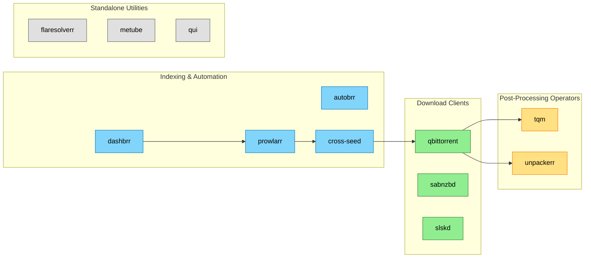

# Downloads Infrastructure

<!-- generated:start section=summary -->
The Downloads Infrastructure domain runs 12 apps across the downloads namespace.

## Components

| App | What it does | UI |
|---|---|---|
| autobrr | IRC/RSS release automation — filters torrent/usenet announces and pushes matching releases to download clients | https://autobrr.${SECRET_DOMAIN} |
| cross-seed | Cross-seeds releases across trackers by matching new torrents against the existing library | internal (no route) |
| dashbrr | Unified dashboard aggregating status from Prowlarr, Radarr, Sonarr, Seerr, and Plex | https://dashbrr.${SECRET_DOMAIN} |
| flaresolverr | Proxy that solves Cloudflare/DDoS-Guard challenges on behalf of indexers | internal (LoadBalancer IP, no route) |
| metube | Web UI front-end for yt-dlp video downloads | https://metube.${SECRET_DOMAIN} |
| prowlarr | Torrent/NZB Indexer Management | https://prowlarr.${SECRET_DOMAIN} |
| qbittorrent | Torrent Client, routed through gluetun/ProtonVPN | https://qb.${SECRET_DOMAIN} |
| qui | Web UI for managing multiple qBittorrent instances | https://qui.${SECRET_DOMAIN} |
| sabnzbd | NZB Download Client | https://sab.${SECRET_DOMAIN} |
| slskd | Soulseek Client, routed through gluetun/ProtonVPN | https://slskd.${SECRET_DOMAIN} |
| tqm | Scheduled qBittorrent queue manager — retags and removes torrents per tracker rules | internal (CronJob, no UI) |
| unpackerr | Extracts completed archive downloads and notifies Sonarr/Radarr | internal (headless, metrics only) |
<!-- generated:end -->

<!-- generated:start section=dataflow -->
## How It Fits Together

<!-- generated:end -->

<!-- curated -->
## Operating Notes

<!-- Human-authored: family workflows, runbook pointers, quirks. Skill never edits below. -->
<!-- /curated -->

## Related

- [Context (LLM)](context.md) · [Decisions](decisions.md)
