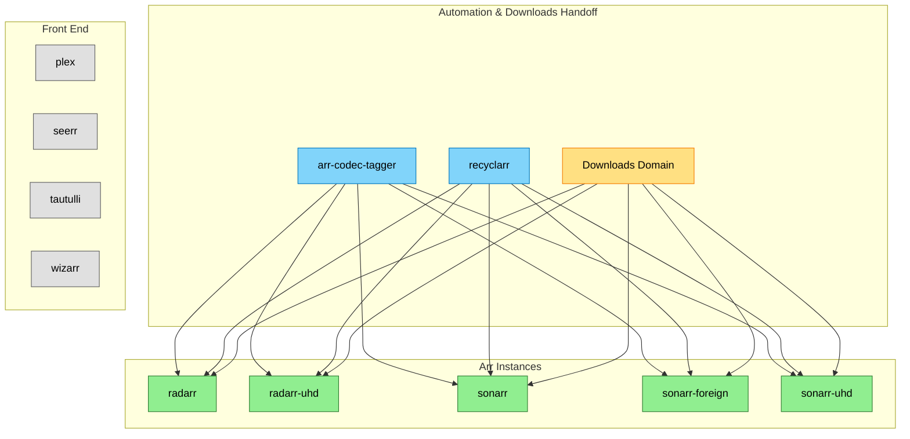
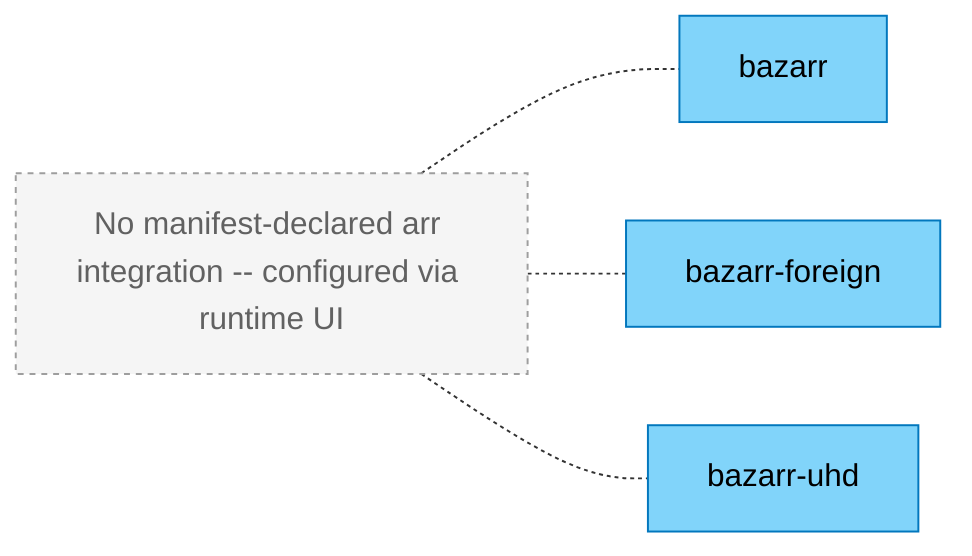

# Movies & TV — Context

<!-- generated:start section=apps -->
## Apps

| App | Namespace | Source | Route | Storage | Backup | Secrets | DependsOn |
|---|---|---|---|---|---|---|---|
| [arr-codec-tagger](../../../kubernetes/apps/downloads/arr-codec-tagger) | downloads | app-template / ghcr.io/gavinmcfall/kait | none | none | none | onepassword-connect | external-secrets/external-secrets-stores |
| [bazarr](../../../kubernetes/apps/downloads/bazarr) | downloads | app-template / ghcr.io/gavinmcfall/bazarr | bazarr.${SECRET_DOMAIN} · internal | ceph-block 5Gi | VolSync | onepassword-connect | external-secrets/external-secrets-stores, storage/volsync |
| [bazarr-foreign](../../../kubernetes/apps/downloads/bazarr-foreign) | downloads | app-template / ghcr.io/gavinmcfall/bazarr | bazarr-foreign.${SECRET_DOMAIN} · internal | ceph-block 5Gi | VolSync | onepassword-connect | external-secrets/external-secrets-stores, storage/volsync |
| [bazarr-uhd](../../../kubernetes/apps/downloads/bazarr-uhd) | downloads | app-template / ghcr.io/gavinmcfall/bazarr | bazarr-uhd.${SECRET_DOMAIN} · internal | ceph-block 5Gi | VolSync | onepassword-connect | external-secrets/external-secrets-stores, storage/volsync |
| [plex](../../../kubernetes/apps/entertainment/plex) | entertainment | app-template / ghcr.io/home-operations/plex | plex.${SECRET_DOMAIN} · external | ceph-block 60Gi + ceph-block 75Gi (cache) | VolSync (config only) | onepassword-connect | external-secrets/external-secrets-stores, storage/volsync |
| [radarr](../../../kubernetes/apps/downloads/radarr) | downloads | app-template / ghcr.io/home-operations/radarr | radarr.${SECRET_DOMAIN} · internal | ceph-block 2Gi | VolSync | onepassword-connect | database/cloudnative-pg-postgres18-cluster, external-secrets/external-secrets-stores, storage/volsync |
| [radarr-uhd](../../../kubernetes/apps/downloads/radarr-uhd) | downloads | app-template / ghcr.io/home-operations/radarr | radarr-uhd.${SECRET_DOMAIN} · internal | ceph-block 2Gi | VolSync | onepassword-connect | database/cloudnative-pg-postgres18-cluster, external-secrets/external-secrets-stores, storage/volsync |
| [recyclarr](../../../kubernetes/apps/downloads/recyclarr) | downloads | app-template / ghcr.io/recyclarr/recyclarr | none | ceph-block 1Gi | VolSync | onepassword-connect | external-secrets/external-secrets-stores, storage/volsync |
| [seerr](../../../kubernetes/apps/entertainment/seerr) | entertainment | app-template / ghcr.io/seerr-team/seerr | requests.${SECRET_DOMAIN} · external | ceph-block 2Gi | VolSync | none | storage/volsync |
| [sonarr](../../../kubernetes/apps/downloads/sonarr) | downloads | app-template / ghcr.io/home-operations/sonarr | sonarr.${SECRET_DOMAIN} · internal | ceph-block 2Gi | VolSync | onepassword-connect | database/cloudnative-pg-postgres18-cluster, external-secrets/external-secrets-stores, storage/volsync |
| [sonarr-foreign](../../../kubernetes/apps/downloads/sonarr-foreign) | downloads | app-template / ghcr.io/home-operations/sonarr | sonarr-foreign.${SECRET_DOMAIN} · internal | ceph-block 2Gi | VolSync | onepassword-connect | database/cloudnative-pg-postgres18-cluster, external-secrets/external-secrets-stores, storage/volsync |
| [sonarr-uhd](../../../kubernetes/apps/downloads/sonarr-uhd) | downloads | app-template / ghcr.io/home-operations/sonarr | sonarr-uhd.${SECRET_DOMAIN} · internal | ceph-block 2Gi | VolSync | onepassword-connect | database/cloudnative-pg-postgres18-cluster, external-secrets/external-secrets-stores, storage/volsync |
| [tautulli](../../../kubernetes/apps/entertainment/tautulli) | entertainment | app-template / ghcr.io/tautulli/tautulli | tautulli.${SECRET_DOMAIN} · external | ceph-block 2Gi + ceph-block 15Gi (cache) | VolSync (config only) | none | storage/volsync |
| [wizarr](../../../kubernetes/apps/entertainment/wizarr) | entertainment | app-template / ghcr.io/wizarrrr/wizarr | join.${SECRET_DOMAIN} · external | ceph-block 2Gi | VolSync | none | entertainment/plex, entertainment/seerr, storage/volsync |
<!-- generated:end -->

<!-- generated:start section=dataflow -->
## Data Flow

### Subtitle Instances

<!-- generated:end -->

<!-- generated:start section=integration -->
## Integration Points

<!-- no manifest-evidenced outbound reference from a media app to an app in another domain -->
<!-- generated:end -->

<!-- curated -->
## Capsules

### Plex/Arr Metrics Pipeline

Prometheus scrapes plex, tautulli, sonarr (3 instances), and radarr (2 instances) via dedicated exporters that live in the observability domain (`plex-exporter`, `tautulli-exporter`, `exportarr-sonarr`, `exportarr-radarr`), not built into these apps' own images. See the [observability domain](../observability/context.md) for exporter details. TechnoTim's `prometheus-plex-exporter` fork was chosen over the generic Grafana registry Plex dashboard because the generic dashboard's metrics didn't reliably match.
<!-- seeded: review -->

<!-- Add capsules per docs/ai-context/writing-capsules.md. Skill never edits below. -->
<!-- /curated -->
