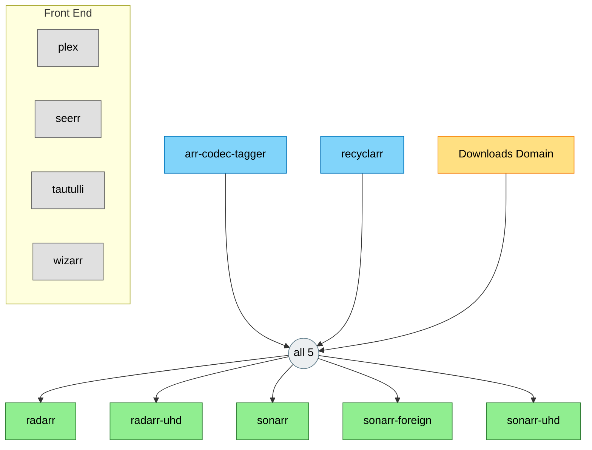
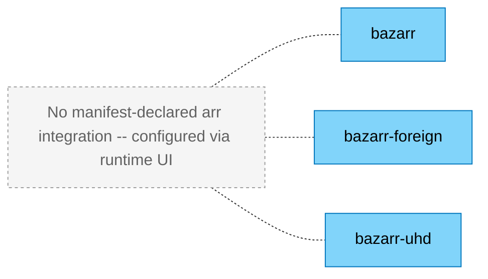

# Movies & TV

<!-- generated:start section=summary -->
The Movies & TV domain runs 14 apps across the downloads and entertainment namespaces.

## Components

| App | What it does | UI |
|---|---|---|
| arr-codec-tagger | Weekly CronJob that tags Sonarr/Radarr libraries with codec metadata via the kait image | internal (CronJob, no UI) |
| bazarr | Subtitle Downloads | https://bazarr.${SECRET_DOMAIN} |
| bazarr-foreign | Subtitle Downloads (Foreign) | https://bazarr-foreign.${SECRET_DOMAIN} |
| bazarr-uhd | Subtitle Downloads (UHD) | https://bazarr-uhd.${SECRET_DOMAIN} |
| plex | Media Player | https://plex.${SECRET_DOMAIN} |
| radarr | Movie Downloads | https://radarr.${SECRET_DOMAIN} |
| radarr-uhd | UHD Movie Downloads | https://radarr-uhd.${SECRET_DOMAIN} |
| recyclarr | Daily CronJob that syncs TRaSH Guides quality profiles and custom formats into Sonarr/Radarr | internal (CronJob, no UI) |
| seerr | Media Request Management | https://requests.${SECRET_DOMAIN} |
| sonarr | TV Downloads | https://sonarr.${SECRET_DOMAIN} |
| sonarr-foreign | Foreign TV Downloads | https://sonarr-foreign.${SECRET_DOMAIN} |
| sonarr-uhd | UHD TV Downloads | https://sonarr-uhd.${SECRET_DOMAIN} |
| tautulli | Plex Stream Monitoring | https://tautulli.${SECRET_DOMAIN} |
| wizarr | Plex Invite Management | https://join.${SECRET_DOMAIN} |
<!-- generated:end -->

<!-- generated:start section=dataflow -->
## How It Fits Together

### Subtitle Instances

<!-- generated:end -->

<!-- curated -->
## Operating Notes

Plex, Tautulli, and the arr instances are scraped for metrics by dedicated exporters in the observability domain (`plex-exporter`, `tautulli-exporter`, `exportarr-sonarr`, `exportarr-radarr`) — not built into these apps. See the [observability domain](../observability/overview.md) for the monitoring stack.
<!-- seeded: review -->

<!-- Human-authored: family workflows, runbook pointers, quirks. Skill never edits below. -->
<!-- /curated -->

## Related

- [Context (LLM)](context.md) · [Decisions](decisions.md)
