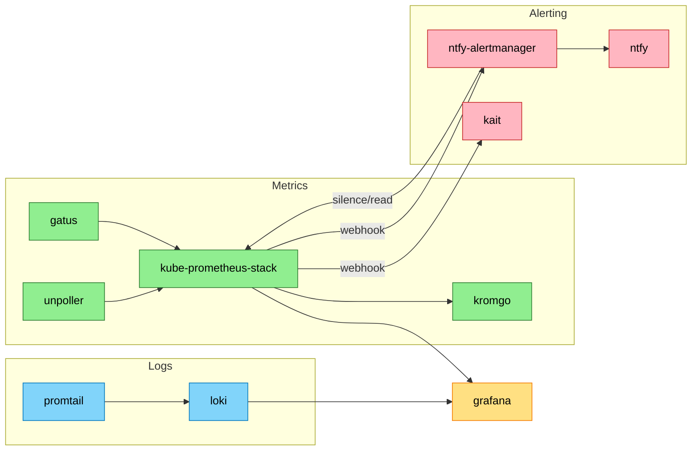
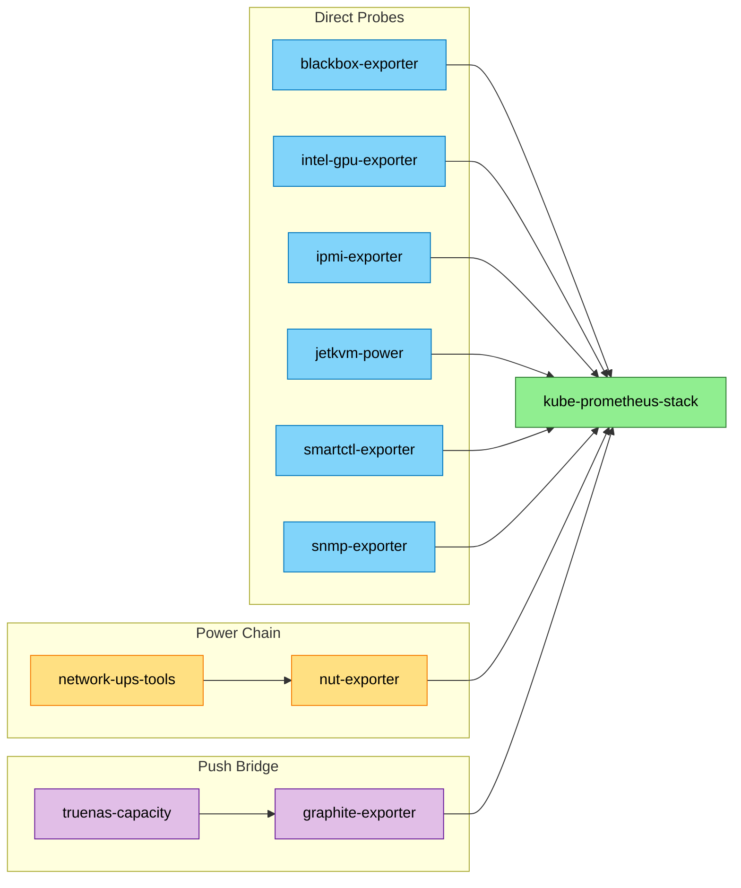
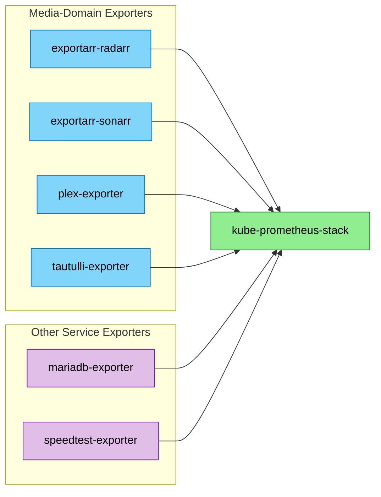

# Observability — Context

<!-- generated:start section=apps -->
## Apps

| App | Namespace | Source | Route | Storage | Backup | Secrets | DependsOn |
|---|---|---|---|---|---|---|---|
| [blackbox-exporter](../../../kubernetes/apps/observability/exporters/blackbox-exporter) | observability | prometheus-blackbox-exporter (community chart) | none | none | none | none | none |
| [discord-message-scheduler](../../../kubernetes/apps/observability/discord-message-scheduler) | observability | app-template / ghcr.io/gavinmcfall/discord-message-scheduler | none | ceph-block 1Gi | none | onepassword-connect | external-secrets/external-secrets-stores |
| [exportarr-radarr](../../../kubernetes/apps/observability/exporters/exportarr-radarr) | observability | app-template / ghcr.io/onedr0p/exportarr | none | none | none | onepassword-connect | downloads/radarr |
| [exportarr-sonarr](../../../kubernetes/apps/observability/exporters/exportarr-sonarr) | observability | app-template / ghcr.io/onedr0p/exportarr | none | none | none | onepassword-connect | downloads/sonarr |
| [gatus](../../../kubernetes/apps/observability/gatus) | observability | app-template / ghcr.io/twin/gatus | status.${SECRET_DOMAIN} · external | none | none | onepassword-connect | database/cloudnative-pg-postgres18-cluster, external-secrets/external-secrets-stores |
| [grafana](../../../kubernetes/apps/observability/grafana) | observability | grafana (official chart) / grafana/grafana | grafana.${SECRET_DOMAIN} · external | none | none | onepassword-connect | external-secrets/external-secrets-stores |
| [graphite-exporter](../../../kubernetes/apps/observability/exporters/graphite-exporter) | observability | app-template / prom/graphite-exporter | none | none | none | none | none |
| [intel-gpu-exporter](../../../kubernetes/apps/observability/exporters/intel-gpu-exporter) | observability | app-template / ghcr.io/onedr0p/intel-gpu-exporter | none | none | none | none | none |
| [ipmi-exporter](../../../kubernetes/apps/observability/exporters/ipmi-exporter) | observability | app-template / quay.io/prometheuscommunity/ipmi-exporter | none | none | none | onepassword-connect | none |
| [jetkvm-power](../../../kubernetes/apps/observability/exporters/jetkvm-power) | observability | raw manifests / external (JetKVM native metrics, no in-cluster pod) | none | none | none | none | none |
| [kait](../../../kubernetes/apps/observability/kait) | observability | OCIRepository / ghcr.io/gavinmcfall/kait | none | none | none | onepassword-connect | observability/kube-prometheus-stack |
| [keda](../../../kubernetes/apps/observability/keda) | observability | OCIRepository (keda chart) | none | none | none | none | none |
| [kromgo](../../../kubernetes/apps/observability/kromgo) | observability | app-template / ghcr.io/kashalls/kromgo | kromgo.${SECRET_DOMAIN} · external | none | none | none | none |
| [kube-prometheus-stack](../../../kubernetes/apps/observability/kube-prometheus-stack) | observability | kube-prometheus-stack (community chart) / prompp/prompp (Prometheus image override) | alertmanager.${SECRET_DOMAIN}, prometheus.${SECRET_DOMAIN} · internal | openebs-hostpath 75Gi (prometheus) + openebs-hostpath 1Gi (alertmanager) | none | onepassword-connect | observability/prometheus-operator-crds, openebs-system/openebs |
| [loki](../../../kubernetes/apps/observability/loki) | observability | loki (grafana chart) | none | openebs-hostpath 50Gi | none | none | openebs-system/openebs |
| [mariadb-exporter](../../../kubernetes/apps/observability/exporters/mariadb-exporter) | database | raw manifests / docker.io/bitnami/mysqld-exporter | none | none | none | none | database/mariadb |
| [network-ups-tools](../../../kubernetes/apps/observability/network-ups-tools) | observability | app-template / ghcr.io/jr0dd/network-ups-tools | none | none | none | none | none |
| [notifiarr](../../../kubernetes/apps/observability/notifiarr) | observability | app-template / ghcr.io/notifiarr/notifiarr | notifiarr.${SECRET_DOMAIN} · internal | ceph-block 1Gi | VolSync | onepassword-connect | external-secrets/external-secrets-stores |
| [ntfy](../../../kubernetes/apps/observability/ntfy) | observability | OCIRepository / binwiederhier/ntfy | ntfy.${SECRET_DOMAIN} · external | none | none | none | external-secrets/external-secrets-stores |
| [ntfy-alertmanager](../../../kubernetes/apps/observability/ntfy-alertmanager) | observability | OCIRepository / codeberg.org/xenrox/ntfy-alertmanager | none | none | none | none | observability/ntfy |
| [nut-exporter](../../../kubernetes/apps/observability/exporters/nut-exporter) | observability | app-template / ghcr.io/druggeri/nut_exporter | none | none | none | none | none |
| [otel-collector](../../../kubernetes/apps/observability/otel-collector) | observability | opentelemetry-collector (chart) / otel/opentelemetry-collector-contrib | otel.${SECRET_DOMAIN} · external + LoadBalancer IP (OTLP gRPC/HTTP, in-cluster/LAN) | none | none | onepassword-connect | database/influxdb3 |
| [plex-exporter](../../../kubernetes/apps/observability/exporters/plex-exporter) | observability | app-template / ghcr.io/timothystewart6/prometheus-plex-exporter | none | none | none | onepassword-connect | entertainment/plex |
| [prometheus-operator-crds](../../../kubernetes/apps/observability/prometheus-operator-crds) | observability | prometheus-operator-crds (community chart, CRDs only) | none | none | none | none | none |
| [promtail](../../../kubernetes/apps/observability/promtail) | observability | promtail (grafana chart) | none | none | none | none | none |
| [redisinsight](../../../kubernetes/apps/observability/redisinsight) | observability | app-template / redis/redisinsight | redisinsight.${SECRET_DOMAIN} · internal | ceph-block 1Gi | VolSync | none | database/dragonfly-operator, storage/volsync |
| [smartctl-exporter](../../../kubernetes/apps/observability/exporters/smartctl-exporter) | observability | prometheus-smartctl-exporter (community chart) | none | none | none | none | none |
| [snmp-exporter](../../../kubernetes/apps/observability/exporters/snmp-exporter) | observability | prometheus-snmp-exporter (community chart) | none | none | none | onepassword-connect | none |
| [speedtest-exporter](../../../kubernetes/apps/observability/exporters/speedtest-exporter) | observability | app-template / ghcr.io/miguelndecarvalho/speedtest-exporter | none | none | none | none | none |
| [tautulli-exporter](../../../kubernetes/apps/observability/exporters/tautulli-exporter) | observability | app-template / nwalke/tautulli_exporter | none | none | none | none | entertainment/tautulli |
| [truenas-capacity](../../../kubernetes/apps/observability/exporters/truenas-capacity) | observability | raw CronJob / alpine:3.24 (curl+jq push script) | none | none | none | sops | none |
| [unpoller](../../../kubernetes/apps/observability/unpoller) | observability | app-template / ghcr.io/unpoller/unpoller | none | none | none | onepassword-connect | observability/kube-prometheus-stack |
<!-- generated:end -->

<!-- generated:start section=dataflow -->
## Data Flow

32 apps in this domain exceed the 12-node diagram limit, so the data flow is split into three diagrams: Core Platform & Alerting, Hardware Exporters, and App & Service Exporters. `kube-prometheus-stack` is the shared hub and appears in all three.

### Core Platform & Alerting

### Hardware Exporters

### App & Service Exporters

<!-- generated:end -->

<!-- generated:start section=integration -->
## Integration Points

- auth: [grafana](../../../kubernetes/apps/observability/grafana) authenticates against pocket-id via generic OAuth (`auth_url`/`token_url`/`api_url` pointing at `id.${SECRET_DOMAIN}`) per its HelmRelease.
- downloads: [notifiarr](../../../kubernetes/apps/observability/notifiarr) monitors [qbittorrent](../../../kubernetes/apps/downloads/qbittorrent), [sabnzbd](../../../kubernetes/apps/downloads/sabnzbd), and [prowlarr](../../../kubernetes/apps/downloads/prowlarr) via API keys pulled into its ExternalSecret.
- media: [exportarr-radarr](../../../kubernetes/apps/observability/exporters/exportarr-radarr) polls [radarr](../../../kubernetes/apps/downloads/radarr) and [radarr-uhd](../../../kubernetes/apps/downloads/radarr-uhd) via their `URL`/`APIKEY` env.
- media: [exportarr-sonarr](../../../kubernetes/apps/observability/exporters/exportarr-sonarr) polls [sonarr](../../../kubernetes/apps/downloads/sonarr), [sonarr-uhd](../../../kubernetes/apps/downloads/sonarr-uhd), and [sonarr-foreign](../../../kubernetes/apps/downloads/sonarr-foreign) via their `URL`/`APIKEY` env.
- media: [notifiarr](../../../kubernetes/apps/observability/notifiarr) monitors [plex](../../../kubernetes/apps/entertainment/plex), [tautulli](../../../kubernetes/apps/entertainment/tautulli), [sonarr](../../../kubernetes/apps/downloads/sonarr), [sonarr-uhd](../../../kubernetes/apps/downloads/sonarr-uhd), [sonarr-foreign](../../../kubernetes/apps/downloads/sonarr-foreign), [radarr](../../../kubernetes/apps/downloads/radarr), and [radarr-uhd](../../../kubernetes/apps/downloads/radarr-uhd) via API keys pulled into its ExternalSecret.
- media: [plex-exporter](../../../kubernetes/apps/observability/exporters/plex-exporter) polls [plex](../../../kubernetes/apps/entertainment/plex) via `PLEX_SERVER` env.
- media: [tautulli-exporter](../../../kubernetes/apps/observability/exporters/tautulli-exporter) polls [tautulli](../../../kubernetes/apps/entertainment/tautulli) via `TAUTULLI_URI` env.
<!-- generated:end -->

<!-- curated -->
## Capsules

### KSM Collector Expansion & GPU Exporter Swap (2026-05 audit)

`docs/observability-audit-2026-05.md` expanded kube-state-metrics from 3 to 17 collector families (adding PVC/PV/StatefulSet/DaemonSet/ReplicaSet/Service/Endpoint/Namespace/Job/CronJob/Ingress/StorageClass/HPA/PDB), fixed node-exporter and promtail to tolerate the GPU node's taint so pyro-01 is covered, and fixed a kromgo staleness bug (`last_over_time(...[2h])` wrapper) caused by Prometheus's 5-minute instant-query lookback outrunning speedtest-exporter's hourly scrape. It also swapped a crash-looping `dcgm-exporter` (actually OOMKilled at a too-tight 256Mi limit, not a Pascal-incompatibility as first suspected) for `nvidia-gpu-exporter` (NVML-based, ~30MiB idle).
<!-- seeded: review -->

### Live-Repo Discrepancy: nvidia-gpu-exporter Not Present

The audit above documents deploying `kubernetes/apps/observability/exporters/nvidia-gpu-exporter/`, but no such directory exists in the current tree — only `intel-gpu-exporter` (for the stantons' Intel iGPUs) does. Treat the nvidia-gpu-exporter section of the audit as historical/reverted rather than current state; verify against the live manifest tree before assuming pyro-01 NVIDIA GPU metrics are flowing.
<!-- seeded: review -->

### OTel Telemetry Backbone (spec 1 of 3)

`otel-collector` is a separate, push-based ingestion plane from kube-prometheus-stack, not a replacement for it — Prometheus stays the Kubernetes-infra (node/cAdvisor/KSM/exporter-wall) pull-based plane; otel-collector carries application, AI-CLI, and (later) trace telemetry into InfluxDB 3 (database domain), which persists Parquet directly to an in-cluster Ceph RGW bucket rather than Backblaze B2 (B2 is deferred to cold-archive-only, to avoid egress/latency on the hot compaction/query path). InfluxDB 3 Enterprise was chosen over Core specifically because Core caps query windows at 72 hours.
<!-- seeded: review -->

<!-- Add capsules per docs/ai-context/writing-capsules.md. Skill never edits below. -->
<!-- /curated -->
