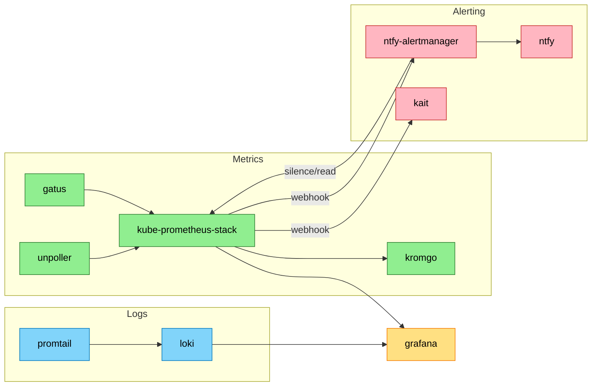
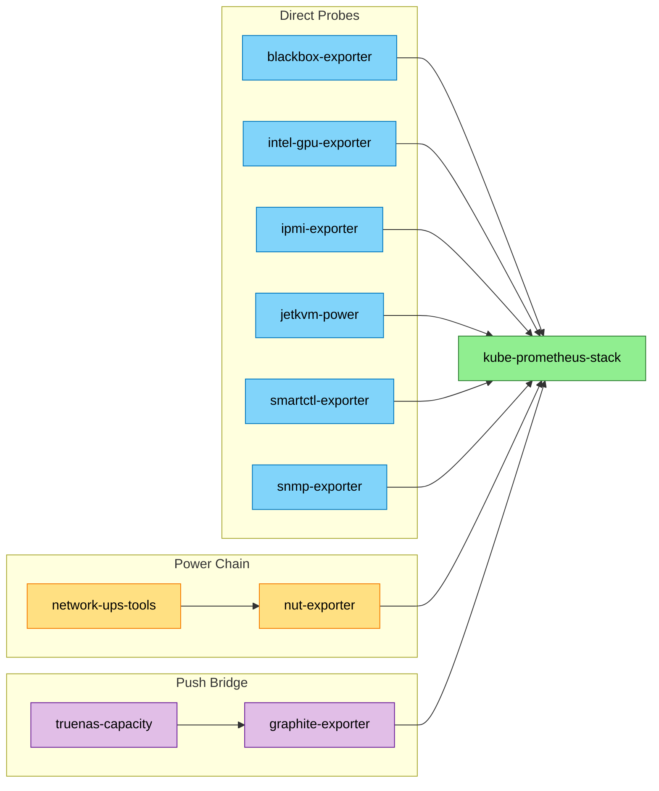
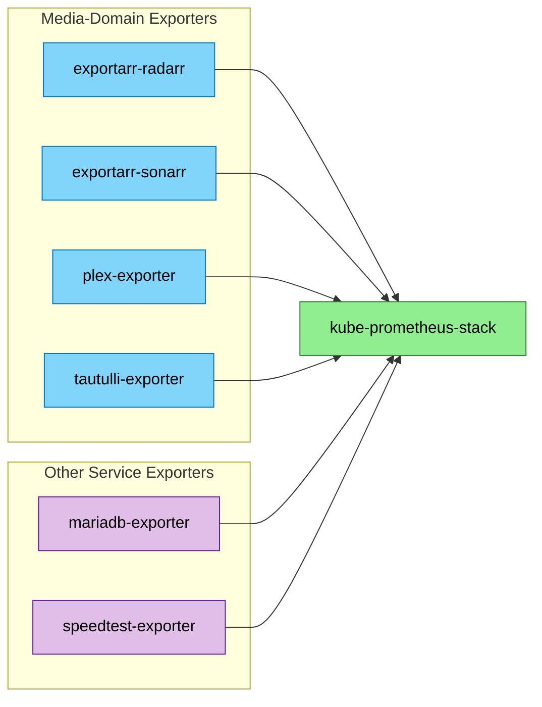

# Observability

<!-- generated:start section=summary -->
The Observability domain runs 32 apps owned by the observability directory tree; mariadb-exporter deploys into the database namespace.

## Components

| App | What it does | UI |
|---|---|---|
| blackbox-exporter | Probes ICMP/TCP/HTTP endpoints (NAS, NFS port) for reachability | internal (no route) |
| discord-message-scheduler | Discord bot for scheduling recurring messages | internal (no route) |
| exportarr-radarr | Prometheus exporter for the radarr/radarr-uhd Radarr instances | internal (no route) |
| exportarr-sonarr | Prometheus exporter for the sonarr/sonarr-uhd/sonarr-foreign Sonarr instances | internal (no route) |
| gatus | Status Page | https://status.${SECRET_DOMAIN} |
| grafana | Monitoring Dashboards | https://grafana.${SECRET_DOMAIN} |
| graphite-exporter | Receives pushed Graphite-protocol gauges and re-exposes them as Prometheus metrics | internal (LoadBalancer IP, no route) |
| intel-gpu-exporter | Prometheus exporter for Intel iGPU metrics on the stanton nodes | internal (no route) |
| ipmi-exporter | Prometheus exporter that polls BMC/IPMI sensors over the network | internal (no route) |
| jetkvm-power | Scrapes native Prometheus metrics from 3 JetKVM DC power-monitoring devices | internal (no route, no in-cluster pod) |
| kait | Webhook receiver that auto-fails the Ceph cluster network over to LAN when Thunderbolt connectivity is lost | internal (no route) |
| keda | Kubernetes event-driven autoscaling controller | internal (no route) |
| kromgo | Public-facing metrics API that queries Prometheus and re-exposes curated values | https://kromgo.${SECRET_DOMAIN} |
| kube-prometheus-stack | Monitoring Scrape Service | https://alertmanager.${SECRET_DOMAIN}, https://prometheus.${SECRET_DOMAIN} |
| loki | Log aggregation backend for promtail-shipped cluster logs | internal (no route) |
| mariadb-exporter | Prometheus exporter for the database-domain MariaDB instance | internal (no route) |
| network-ups-tools | NUT server exposing UPS status over the network | internal (LoadBalancer IP, no route) |
| notifiarr | Notification Service | https://notifiarr.${SECRET_DOMAIN} |
| ntfy | Self-hosted push notification server | https://ntfy.${SECRET_DOMAIN} |
| ntfy-alertmanager | Bridges Alertmanager webhooks into ntfy push notifications | internal (no route) |
| nut-exporter | Prometheus exporter that polls network-ups-tools for UPS metrics | internal (no route) |
| otel-collector | OpenTelemetry Collector -- ingests OTLP telemetry and exports it to InfluxDB 3 | https://otel.${SECRET_DOMAIN} |
| plex-exporter | Prometheus exporter for Plex library/server metrics (TechnoTim's fork) | internal (no route) |
| prometheus-operator-crds | Prometheus Operator CustomResourceDefinitions (Probe, ServiceMonitor, PrometheusRule, etc.) | internal (no route, CRDs only) |
| promtail | Ships container logs to Loki | internal (no route) |
| redisinsight | Developer GUI for Redis | https://redisinsight.${SECRET_DOMAIN} |
| smartctl-exporter | Prometheus exporter for disk S.M.A.R.T. health, auto-scanning each node's drives | internal (no route) |
| snmp-exporter | Prometheus exporter that polls UniFi network gear (UDM Pro, switches) over SNMP | internal (no route) |
| speedtest-exporter | Runs periodic internet speed tests and exposes results as Prometheus metrics | internal (no route) |
| tautulli-exporter | Prometheus exporter for Tautulli (Plex stream monitoring) metrics | internal (no route) |
| truenas-capacity | CronJob that pushes TrueNAS storage capacity gauges into graphite-exporter | internal (no route, CronJob) |
| unpoller | Prometheus exporter for UniFi controller metrics | internal (no route) |
<!-- generated:end -->

<!-- generated:start section=dataflow -->
## How It Fits Together

32 apps in this domain exceed the 12-node diagram limit, so the data flow is split into three diagrams: Core Platform & Alerting, Hardware Exporters, and App & Service Exporters. `kube-prometheus-stack` is the shared hub and appears in all three.

### Core Platform & Alerting

### Hardware Exporters

### App & Service Exporters

<!-- generated:end -->

<!-- curated -->
## Operating Notes

`kube-prometheus-stack` is the hub nearly everything in this domain feeds into or reads from — check it first when metrics, dashboards, or alerts look wrong. Alertmanager's `ceph-network-failover` receiver drives `kait`'s automatic Ceph-network failover to LAN on Thunderbolt isolation; it currently runs in `DRY_RUN` mode. The 2026-05 audit's `dcgm-exporter` → `nvidia-gpu-exporter` swap does not appear to be live in the current manifest tree — see the capsule flagging this in [context.md](context.md) before assuming pyro-01 GPU metrics are flowing.
<!-- seeded: review -->

<!-- Human-authored: family workflows, runbook pointers, quirks. Skill never edits below. -->
<!-- /curated -->

## Related

- [Context (LLM)](context.md) · [Decisions](decisions.md)
