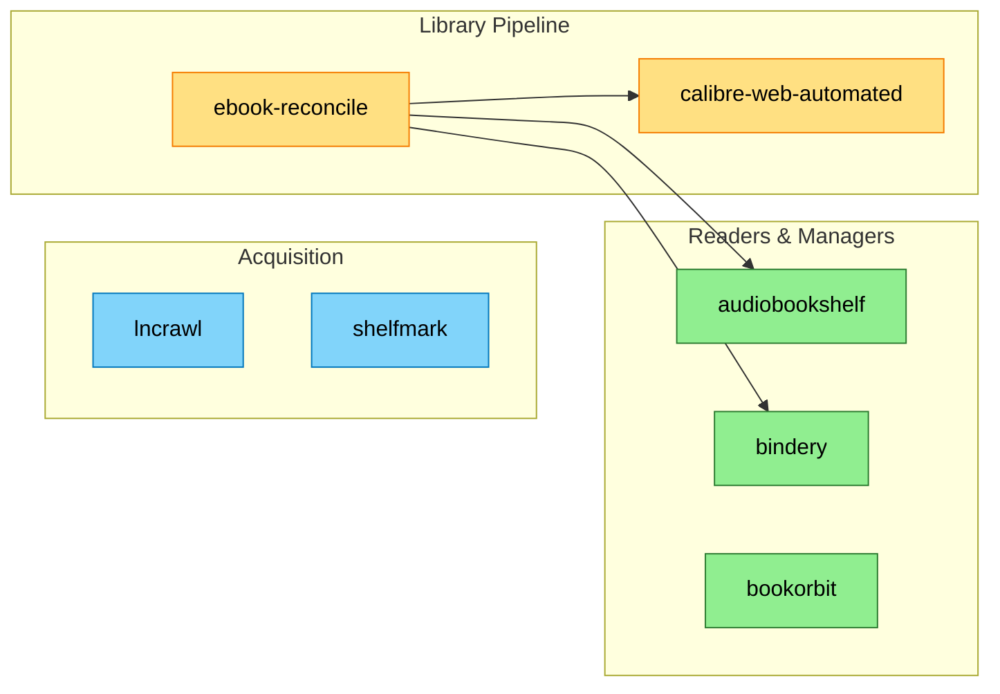
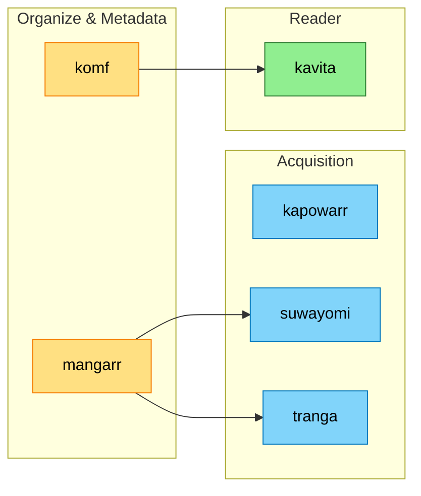

# Books, Audiobooks, Comics & Manga — Context

<!-- generated:start section=apps -->
## Apps

| App | Namespace | Source | Route | Storage | Backup | Secrets | DependsOn |
|---|---|---|---|---|---|---|---|
| [audiobookshelf](../../../kubernetes/apps/entertainment/audiobookshelf) | entertainment | app-template / ghcr.io/advplyr/audiobookshelf | books.${SECRET_DOMAIN} · external | ceph-block 20Gi | VolSync | none | storage/volsync |
| [bindery](../../../kubernetes/apps/downloads/bindery) | downloads | app-template / ghcr.io/vavallee/bindery | bindery.${SECRET_DOMAIN} · internal | ceph-block 5Gi | none | none | none |
| [bookorbit](../../../kubernetes/apps/entertainment/bookorbit) | entertainment | app-template / ghcr.io/bookorbit/bookorbit | read.${SECRET_DOMAIN} · external | ceph-block 10Gi | none | onepassword-connect | database/cloudnative-pg-postgres18-bookorbit, external-secrets/external-secrets-stores |
| [calibre-web-automated](../../../kubernetes/apps/home/calibre-web-automated) | home | app-template / ghcr.io/crocodilestick/calibre-web-automated | calibre.${SECRET_DOMAIN} · internal | ceph-block 5Gi | none | onepassword-connect | none |
| [ebook-reconcile](../../../kubernetes/apps/home/ebook-reconcile) | home | app-template / ghcr.io/crocodilestick/calibre-web-automated | none | ceph-block 128Mi | none | none | home/calibre-web-automated |
| [kapowarr](../../../kubernetes/apps/downloads/kapowarr) | downloads | app-template / mrcas/kapowarr | kapowarr.${SECRET_DOMAIN} · internal | ceph-block 2Gi | VolSync | none | storage/volsync |
| [kavita](../../../kubernetes/apps/entertainment/kavita) | entertainment | app-template / ghcr.io/kareadita/kavita | manga.${SECRET_DOMAIN} · external | ceph-block 4Gi | VolSync | none | storage/volsync |
| [komf](../../../kubernetes/apps/entertainment/komf) | entertainment | app-template / docker.io/sndxr/komf | komf.${SECRET_DOMAIN} · internal | ceph-block 1Gi | VolSync | onepassword-connect | external-secrets/external-secrets-stores, storage/volsync |
| [lncrawl](../../../kubernetes/apps/downloads/lncrawl) | downloads | app-template / ghcr.io/lncrawl/lightnovel-crawler | lncrawl.${SECRET_DOMAIN} · internal | ceph-block 5Gi | VolSync | none | storage/volsync |
| [mangarr](../../../kubernetes/apps/entertainment/mangarr) | entertainment | app-template / ghcr.io/gavinmcfall/mangarr | mangarr.${SECRET_DOMAIN} · internal | ceph-block 2Gi | VolSync | none | storage/volsync |
| [shelfmark](../../../kubernetes/apps/downloads/shelfmark) | downloads | app-template / ghcr.io/calibrain/shelfmark | shelfmark.${SECRET_DOMAIN} · internal | ceph-block 2Gi | VolSync | onepassword-connect | external-secrets/external-secrets-stores, storage/volsync |
| [suwayomi](../../../kubernetes/apps/downloads/suwayomi) | downloads | app-template / ghcr.io/suwayomi/tachidesk | tachi.${SECRET_DOMAIN} · internal | ceph-block 2Gi | VolSync | onepassword-connect | database/cloudnative-pg-postgres18-cluster, external-secrets/external-secrets-stores, storage/volsync |
| [tranga](../../../kubernetes/apps/downloads/tranga) | downloads | app-template / docker.io/glax/tranga-api | tranga.${SECRET_DOMAIN} · internal | ceph-block 1Gi | VolSync | onepassword-connect | database/cloudnative-pg-postgres18-cluster, external-secrets/external-secrets-stores, storage/volsync |
<!-- generated:end -->

<!-- generated:start section=dataflow -->
## Data Flow

### Books & Audio

### Comics & Manga

<!-- generated:end -->

<!-- generated:start section=integration -->
## Integration Points

- auth: [bookorbit](../../../kubernetes/apps/entertainment/bookorbit) enables OIDC login against pocket-id (`OIDC_ALLOW_LOCAL_ISSUERS` lets pocket-id's internal-gateway issuer through the SSRF guard) per its HelmRelease env.
- auth: [shelfmark](../../../kubernetes/apps/downloads/shelfmark) authenticates via pocket-id OIDC (`OIDC_DISCOVERY_URL` points at `id.${SECRET_DOMAIN}`) per its HelmRelease env.
<!-- generated:end -->

<!-- curated -->
## Capsules

### Genre-Tree Contract

The disk tree, not any app database, is the integration contract for the books/audio side of this domain: every service reads or writes `Books/{Genre}/{Author}/{Series}/{NN - Title}/` on the shared NFS export (`citadel.internal:/mnt/storage0/media`), and they compose only because they all respect that shape. Folders encode only single-valued facts; anything multi-valued (extra genres, multi-series, tags) lives in metadata, never in the path. AudiobookShelf runs one library per top-level genre folder, which is also how kids' restricted accounts are age-gated (a genre folder is invisible to a kid account unless explicitly granted). calibre-web-automated cannot see the genre tree at all — it's scoped to `.calibre/ingest` + `.calibre/library` only — so ebook-reconcile's nightly hardlink step is the sole bridge from Calibre-fixed files back into the tree.
<!-- seeded: review -->

### Two-Layer Metadata

A book's metadata lives in two independent layers: the catalog sidecar (`metadata.json` + `cover.jpg`, read by AudiobookShelf) and the file-embedded layer (OPF inside the epub, tags inside the m4b, rendered by the actual reader/player). Fixing a cover in AudiobookShelf edits only the sidecar — the epub itself still shows the old cover, because AudiobookShelf cannot write inside book files. Only Calibre (`ebook-meta`, or the UI which bakes on edit) can fix the file layer, and `calibredb set_metadata` bulk sessions bypass CWA's UI-triggered baking — which is exactly the gap ebook-reconcile's `embed-nightly` CronJob closes by re-baking every DB edit into the file within a day. BookOrbit reads the embedded (file) layer only, so its view of an un-baked book is stale by design.
<!-- seeded: review -->

### Seed-Safety Rules

Library placement must hardlink or copy, never move: any tool that rewrites a file mints a new inode and silently divorces the library copy from the seeding copy held open by qBittorrent in the downloads domain (a moved or deleted `/complete` file kills the seed on the private tracker). ebook-reconcile's `embed-nightly` CronJob is scoped with `advancedMounts` to touch ONLY the Calibre library subpath — it structurally cannot reach the genre tree, so a bug there cannot corrupt AudiobookShelf's library. The `ebook-reconcile` (hardlink) CronJob itself ships **suspended** (`suspend: true`) pending a controlled first run before it's allowed to touch the shared tree.
<!-- seeded: review -->

<!-- Add capsules per docs/ai-context/writing-capsules.md. Skill never edits below. -->
<!-- /curated -->
