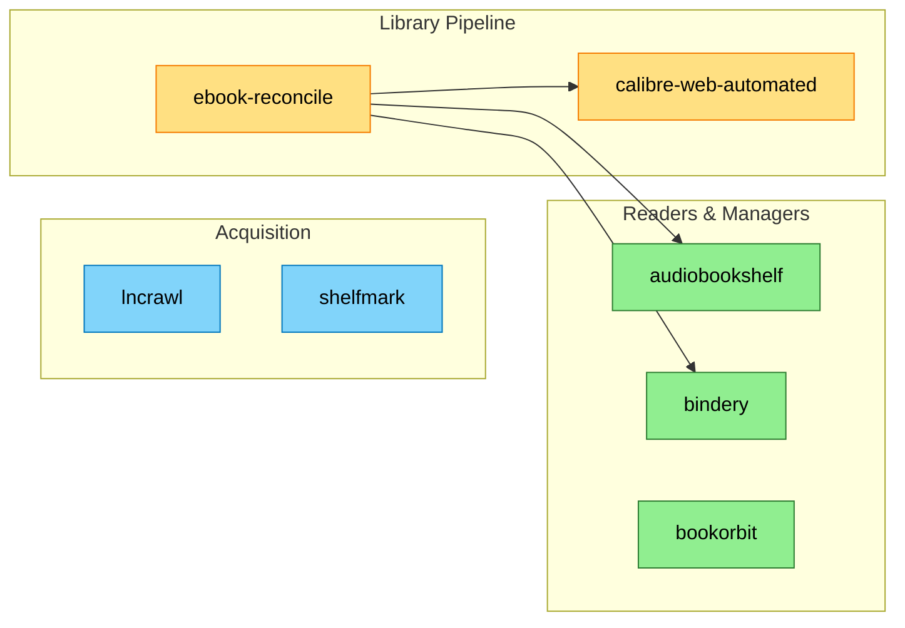
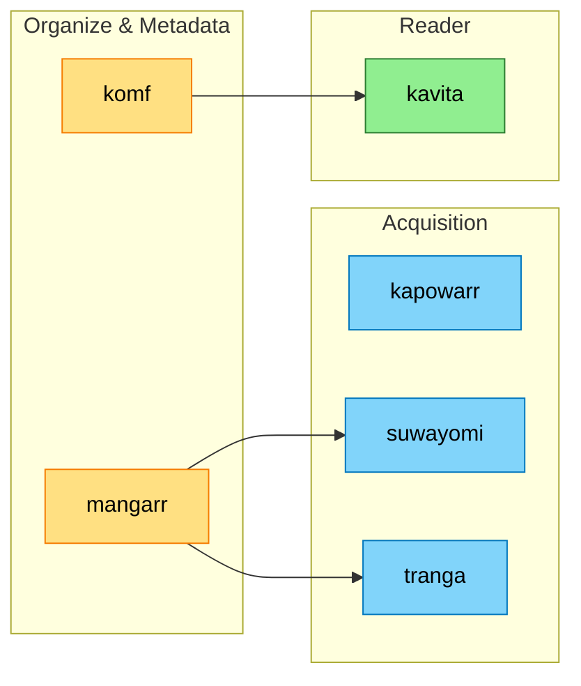

# Books, Audiobooks, Comics & Manga

<!-- generated:start section=summary -->
The Books, Audiobooks, Comics & Manga domain runs 13 apps across the downloads, entertainment, and home namespaces.

## Components

| App | What it does | UI |
|---|---|---|
| audiobookshelf | Audiobook Library | https://books.${SECRET_DOMAIN} |
| bindery | Readarr replacement — book/audiobook manager backed by SQLite, imports metadata-first without moving files | https://bindery.${SECRET_DOMAIN} |
| bookorbit | Family reading hub — library + web readers, OPDS server, KOSync/Kobo sync, Hardcover/StoryGraph sync (trial) | https://read.${SECRET_DOMAIN} |
| calibre-web-automated | Web-based Calibre library manager with automated metadata/format conversion; also runs a headless Calibre Content Server | https://calibre.${SECRET_DOMAIN} |
| ebook-reconcile | Nightly CronJobs that embed Calibre metadata into library files and reconcile hardlinks into the AudiobookShelf tree | internal (CronJob, no UI) |
| kapowarr | Comic Downloads | https://kapowarr.${SECRET_DOMAIN} |
| kavita | Comic/Ebook Web Reader | https://manga.${SECRET_DOMAIN} |
| komf | Kavita metadata fetcher | https://komf.${SECRET_DOMAIN} |
| lncrawl | Fan-translated web novels -> EPUB | https://lncrawl.${SECRET_DOMAIN} |
| mangarr | Manga organiser (the missing *arr tier) | https://mangarr.${SECRET_DOMAIN} |
| shelfmark | Anna's Archive / IRC book downloader | https://shelfmark.${SECRET_DOMAIN} |
| suwayomi | Mihon/Tachiyomi self-hosted server | https://tachi.${SECRET_DOMAIN} |
| tranga | Manga monitor + downloader | https://tranga.${SECRET_DOMAIN} |
<!-- generated:end -->

<!-- generated:start section=dataflow -->
## How It Fits Together

### Books & Audio

### Comics & Manga

<!-- generated:end -->

<!-- curated -->
## Operating Notes

The books/audio side of this domain is one NFS folder tree (`Books/{Genre}/{Author}/{Series}/{NN - Title}/`), not app databases — every service composes because it respects that shape. AudiobookShelf's kids' accounts are age-gated by which genre folders/libraries they're granted, not a separate permission system. See the Genre-Tree Contract and Two-Layer Metadata capsules in [context.md](context.md) before changing any book-pipeline manifest.
<!-- seeded: review -->

<!-- Human-authored: family workflows, runbook pointers, quirks. Skill never edits below. -->
<!-- /curated -->

## Related

- [Context (LLM)](context.md) · [Decisions](decisions.md)
